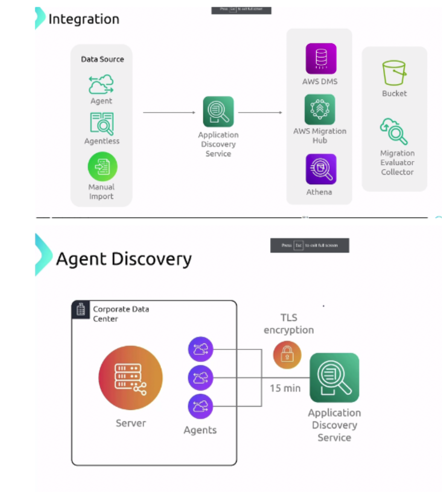
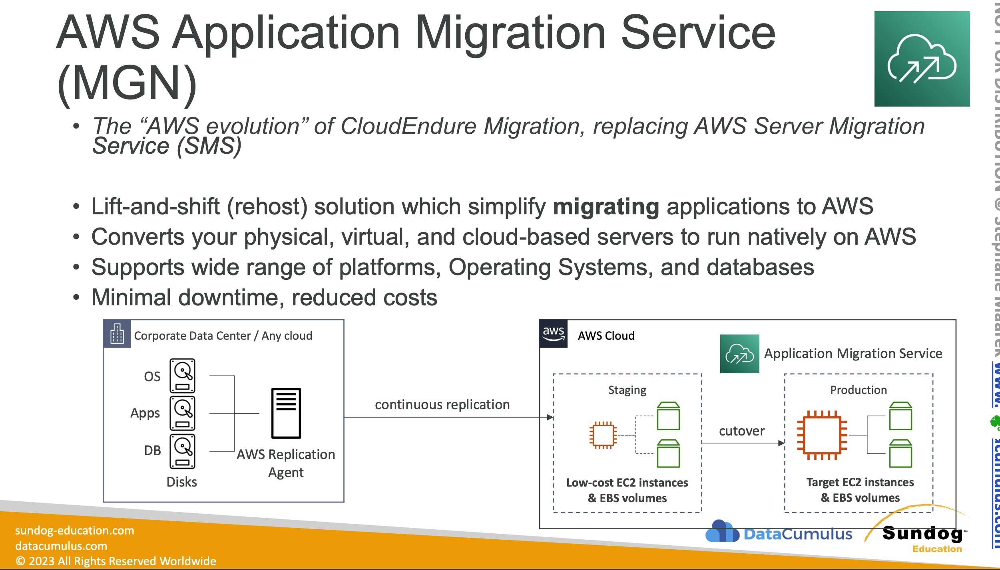

- Data can be visualized by ATHENA.
## Types

### Agentless Discovery
- Get VM inventory, configuration and performance history.
- Open virtual Appliance is deployed.
- Works with `only with VMWare`.
- Does work only on Virtual machine of VMWare and `not physical servers`.
- Agentless collector in the VMVare Vcenter server and then this VM actually collects the data.
- Database utilization metrics can be collected by the agentless collector only

### Agent Based Discovery
- System configuration, system performance, running processes and detail aof the network connections between systems.
- Resulting Data Can be viewed in AWS Migrations hub

### AWS Migration Service
- Is a service similar to [[DMS]] but it migrates Applications instead.
- Lift and shift solution.
- This does not check the app usage etc for that we need application discvoery
- Automate the application modernization to run directly on the AWS Cloud regardless of the platform. 
    - They can be physical servers, Azure servers, VM Ware etc
- Allows to move on-prem, containers or other cloud-based solutions to AWS easily and with little manual work
- Free for 90 days.

