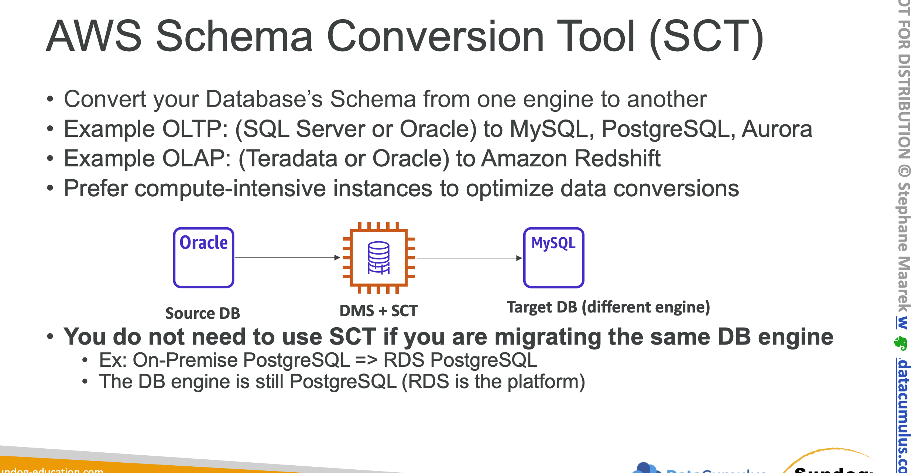
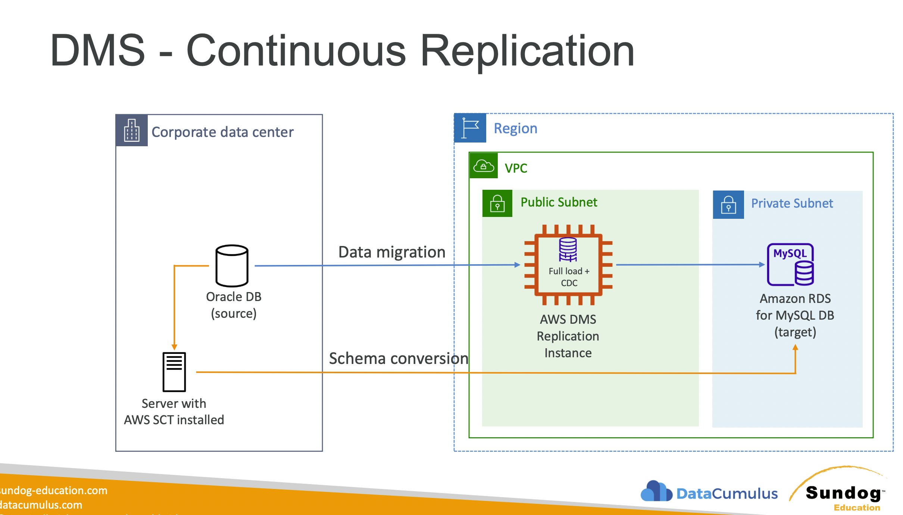
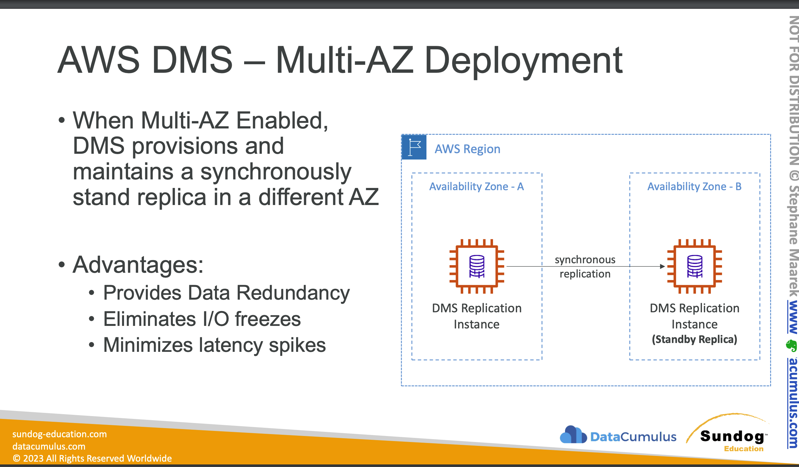

- Migrate an existing database into another one.
- Can also do DB schema conversion.
### Features
- seamlessly migrate
- full set
- self healing
- data change capture
- no code needed
- replication instances for scaling workloads
- support continuous replication
- uses an `[[EC2]]` instance to run dms software
- if target is `[[S3]]` it generates csv
- can use in transit encrypt by add ca cert to endpoint
### Components:
- DMS Fleet Advisor: Collect data from multiple database environments.
    - Install it on DB Server and it captures the information
    - Export it to CSV Format and this is not data but just information of the DB Server and analytics.
### DMS Schema Conversion Tool:
- Can convert to multiple DB Schema.
- Evaluate the complexity of the DB Schema Conversion
- Automatic Conversion to New DB Schema Server.

### Replication Instance:
- It is EC2 Instance, it access the source and copies the information.
- Provide server name, encryption, DB Server type etc
#### Replication Task:
- To start the execution on the DMS Replication Instance we need to create a task first
- Mention the server IP of the replication instance.
- Specify the source endpoint
- Specify the target endpoint.
## Migration Types:
- `Full Load Migration` : If outage is an option for sometime, this is the recommended option to use.
- `Full Load + CDC`: When the Full load data is completed, it keeps analysing for new data or changes in the source and after full load it copies those changes also.
- `CDC Only` : Changes only copied in the data during the data migration process.
### Types:
- Homogenous: oracle to oracle instance
- Heterogenous: oracle to mongo db or document db

#### Sources
- on premise databases
- [[EC2]] instances
- azure
- [[S3]]
- [[Aurora]]
- [[RDS]]

#### Limitations
    - Transfer from Aws service to aws service.
    - Sometimes but not always (e.g. RDS) needs to be in the same region and same account
#### Ways to migrate a database:
[[RDS]] to [[Aurora]] MySQL
##### Option 1
- DB Snapshot from [[RDS]] restore as new [[Aurora]]
##### Option 2
- Create an [[Aurora]] read replica from [[RDS]]
- when replication lag is 0 promote the replica to own DB cluster
##### Option 3 external to aws
- Use percona xtrabackup and upload to [[S3]]
- Create [[Aurora]] from [[S3]]
#### Option4 external to aws
- Create [[Aurora]]
- Use mysqldump to migrate into [[Aurora]] (slower than s3 method)
##### Option 5
- use [[DMS]]
