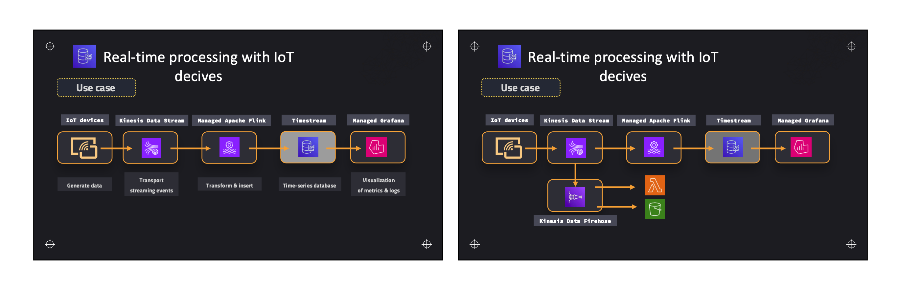

- Traditional Database cannot keep up with the `IOT Data` that is being pushed to the database so we need a solution for this
- Data Generated by IOT has a `small shelf life`, it is difficult to manage the this type of data with traditional databases.
- AWS Timestream is `1000` Times faster
- Used for `real-time analytics`
- `Serverless` nature
- `Data Partition is done using time`
- It automatically fetches the data and transfers it to the memory store(old-data).
- Built in analytics and custom query engine which is very fast.

#### Storage Types:
- In Memory store for recent data
- Memory store for old data.

Applications:
- Health in Devops
- IOT Applications
- Robotics
- Meteorology

