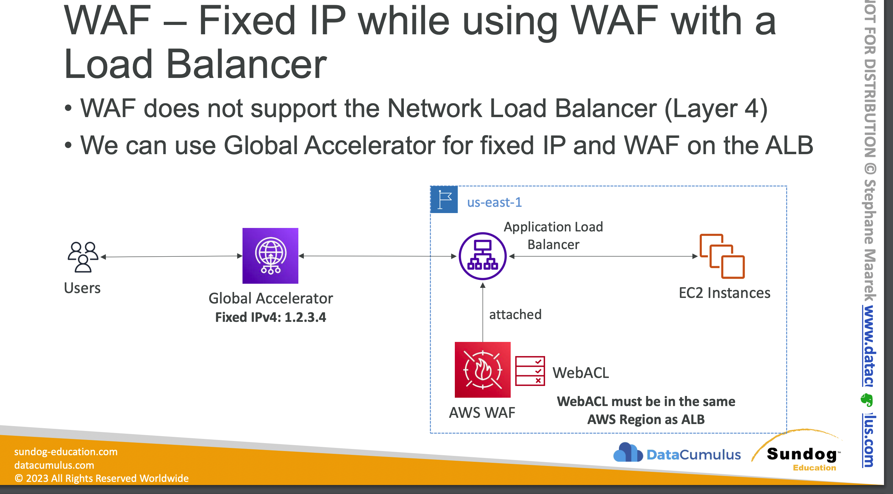

AWS WAF is a web application firewall that helps protect your web applications or APIs against common web exploits and bots that may affect availability, compromise security, or consume excessive resources.
- AWS Layer 7 Firewall
- Network load balancer works on layer 4 and not layer 7.
- Layer 7 is HTTP not TCP or UDP Protocol
Can be Deployed on
- APPLICATION Load balancer not network load balancer.
- Cloud front(DEFINED GLOBALLY FOR THIS) because this is not in the same region
- Api gateway
- COGNITO WEB POOL
- APP SYNC GRAPH QL

### Web ACL:
- To filter based on IP sets(One set has 10k IP)
- Filter on HTTP headers.
- Geo matching to block specific countries
- Rate limiting protection
- WEBACL Default Action (ALLOW or BLOCK) - Non matching
- Resource Type - CloudFront or Regional Service (ALB, AP GW, AppSync)
- Add Rule Groups or Rules - processed in order
- Web ACL Capacity Units (WCU) - Default 1500
        ○ can be increased via support ticket
        ○ WEBACL’s are associated with resources (this can take time)
    • adjusting a WEBACL takes less time than associating one

- Protects from:
    - Sql Injection
    - Cross site scripting

#### How to use WAF On an ALB?
- Challenge is ALB does not have a fixed IP
- We can go for global accelerator for fixed UP and WAF on ALB.
  
    
