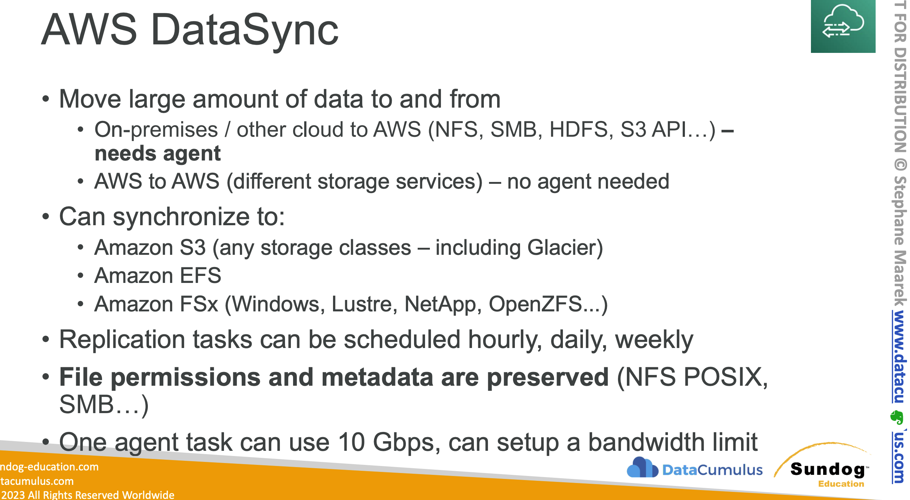
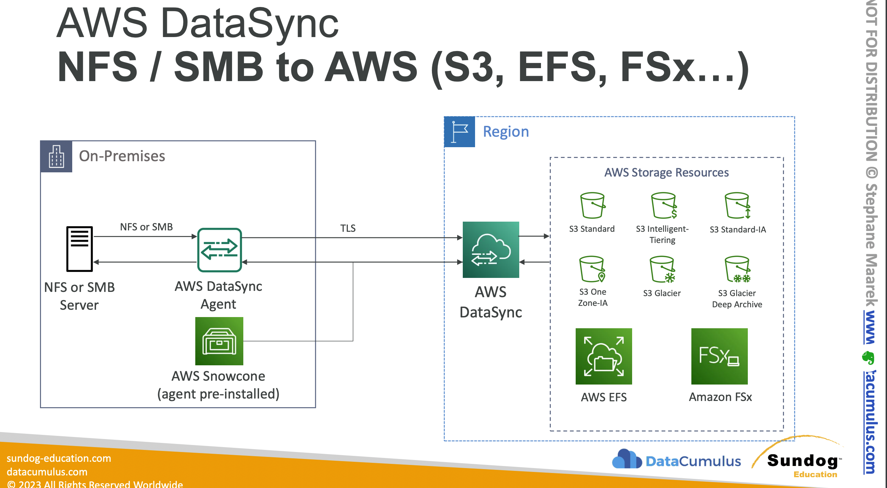
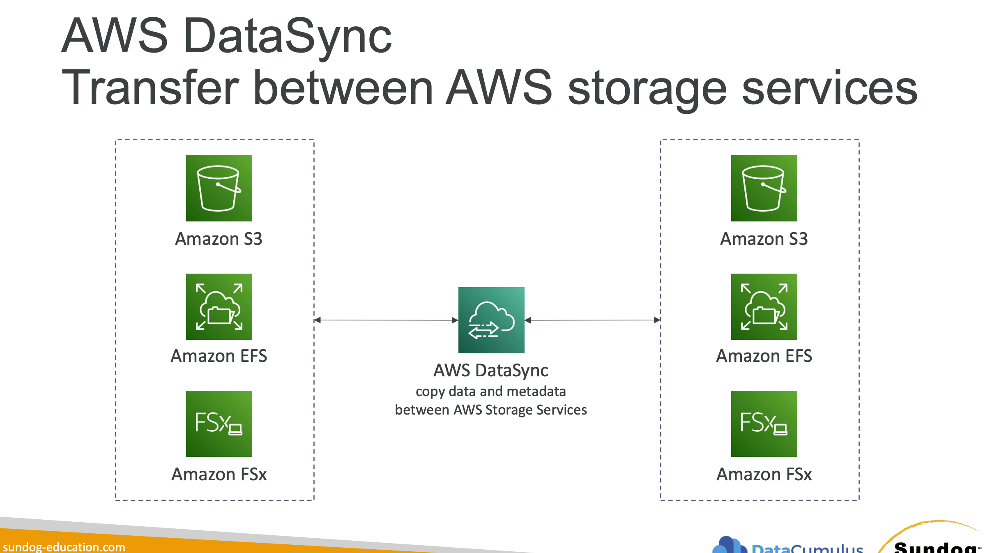

AWS DataSync is a managed data transfer service 

#### 1. **High Performance**
- **Efficient Data Transfer**: DataSync can move data up to 10 times faster than open-source tools by using a purpose-built network protocol and parallel transfer processes that automatically scale to maximize bandwidth utilization.
- **Data Compression and Encryption**: Data is compressed and encrypted in transit, reducing bandwidth costs and enhancing security.

#### 2. **Automation**
- **Scheduled Transfers**: DataSync allows for scheduling of data transfers, making it easy to automate regular data synchronization tasks without manual intervention.
- **Incremental Transfers**: Only data that has changed since the last transfer is moved, which optimizes bandwidth use and speeds up the synchronization process.

#### 3. **Integration and Compatibility**
- **Wide Compatibility**: Supports data transfer between NFS (Network File System), SMB (Server Message Block), and object storage such as Amazon S3, as well as Amazon EFS (Elastic File System) and Amazon FSx for Windows File Server.
- **Agent-Based Architecture**: DataSync uses a virtual machine or hardware appliance deployed in your on-premises environment to connect to your local file systems.

#### 4. **Data Validation**
- **Data Integrity Checks**: After data is transferred, DataSync performs data integrity checks to ensure that the data transferred matches the source data, providing end-to-end verification.

#### 5. **Scalability**
- **Handle Large Datasets**: Capable of handling large volumes of data and millions of files without performance degradation, suitable for enterprise-level data migration and synchronization tasks.

#### 6. **Cost-Effective**
- **Predictable Pricing**: You pay only for the data transferred through DataSync, with no minimum fees or setup charges, making it a cost-effective solution for data migration and ongoing replication needs.

### Use Cases
- **Data Migration**: Migrate active datasets to AWS quickly and securely from on-premises data centers or other cloud environments.
- **Data Protection**: Back up on-premises data to AWS for disaster recovery purposes.
- **Content Distribution**: Distribute content stored in AWS to other locations or systems to ensure availability and local performance.
- **Data Lake Synchronization**: Regularly synchronize on-premises data to Amazon S3 for analytics and processing in AWS, keeping a centralized data lake up-to-date.
- **Hybrid Cloud Workflows**: Maintain consistency between cloud and on-premises storage systems in hybrid cloud architectures.

