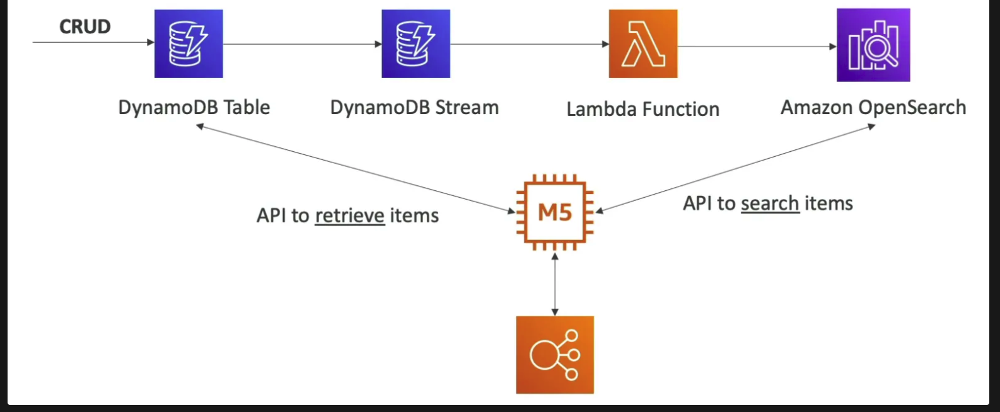
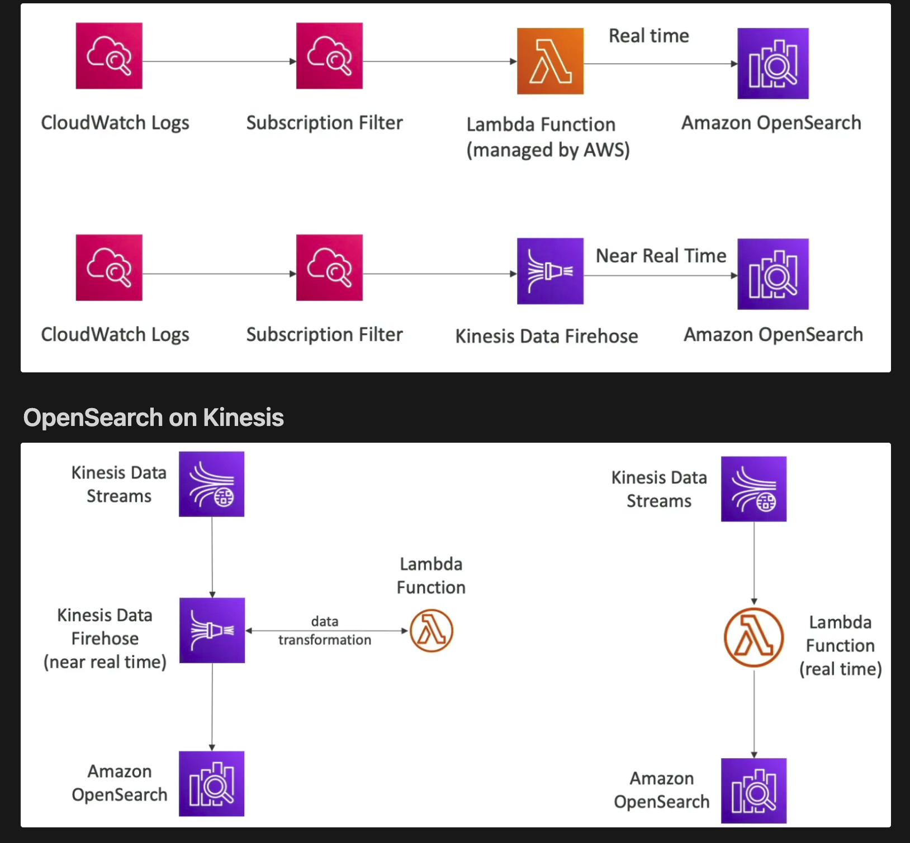

## Intro
- supports **partial matches)**
- Not Serverless
- Comes with **OpenSearch Dashboard** 
- **Does not support SQL** 
- Supports **Multi-Availability Zones**
- Used in Big Data
- Security through IAM, Cognito, KMS and TLS

## Patterns

### OpenSearch on DynamoDB

OpenSearch provides features like search on any column or partial matches and returns the item IDs that will be used to fetch items from the main table.

### OpenSearch on CloudWatch Logs

In Amazon CloudWatch, subscription filters are used to deliver log events from CloudWatch Logs to other services in near real-time. These filters enable you to stream logs continuously to services like Amazon Kinesis Data Streams, Amazon Kinesis Data Firehose, or AWS Lambda for further processing, analysis, or storage.
- Push the logs to lambda and then lambda push them into the opensearch cluster.
