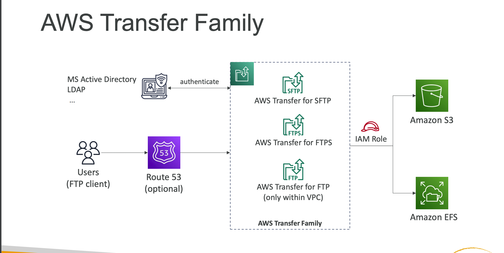

- A fully-managed service for file transfers into and out of Amazon `S3` or Amazon `EFS` using the `FTP protocol`.
- Managed infrastructure, Scalable, Reliable, Highly Available (multi-AZ)
- Pay per provisioned endpoint per hour + data transfers in GB
- Store and` manage users’ credentials within the service`

- Integrate with existing authentication systems (Microsoft Active Directory,
LDAP, Okta, Amazon Cognito, custom)
- Usage: sharing files, public datasets, CRM, ERP.
### Supported Protocols
- FTP
- FTPS 
- SFTP 
