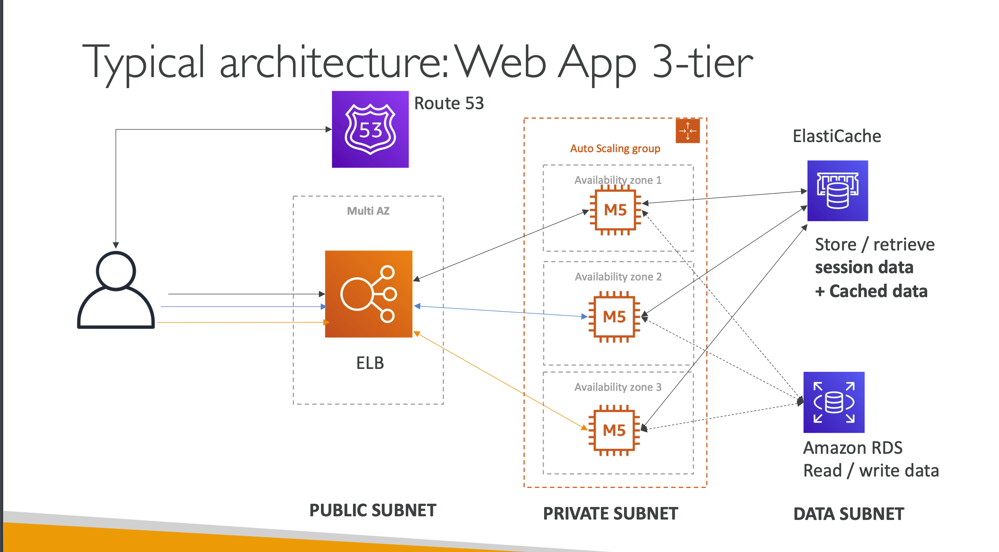

## 3 Tier Architechture

- It uses all the component’s we’ve seen before: EC2, ASG, ELB, RDS,
- Automatically handles capacity provisioning, load balancing, scaling, application
- We still have `full control over the configuration`
- Beanstalk is free but you pay for the underlying instances