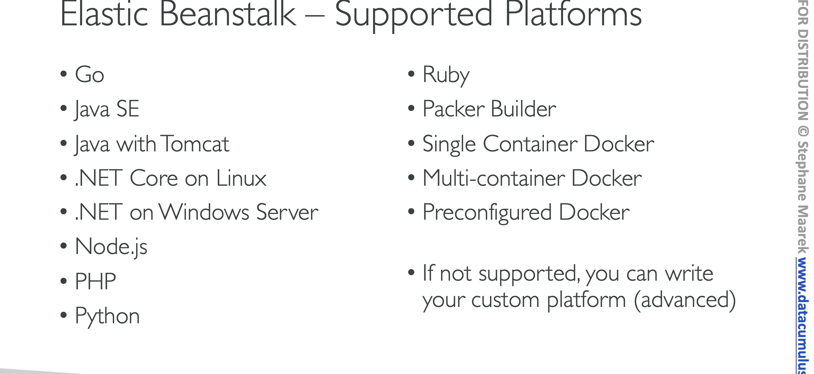
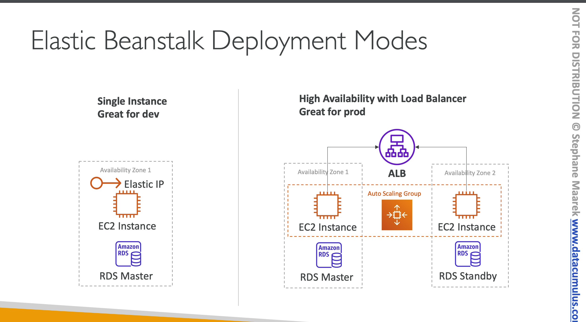
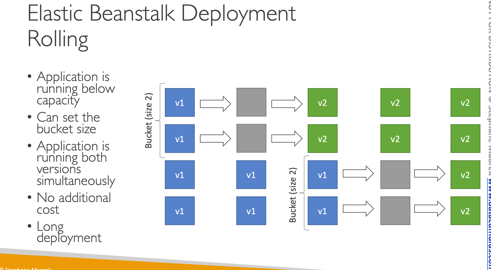
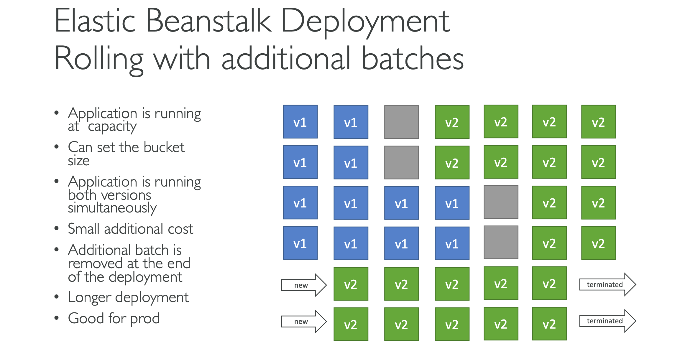
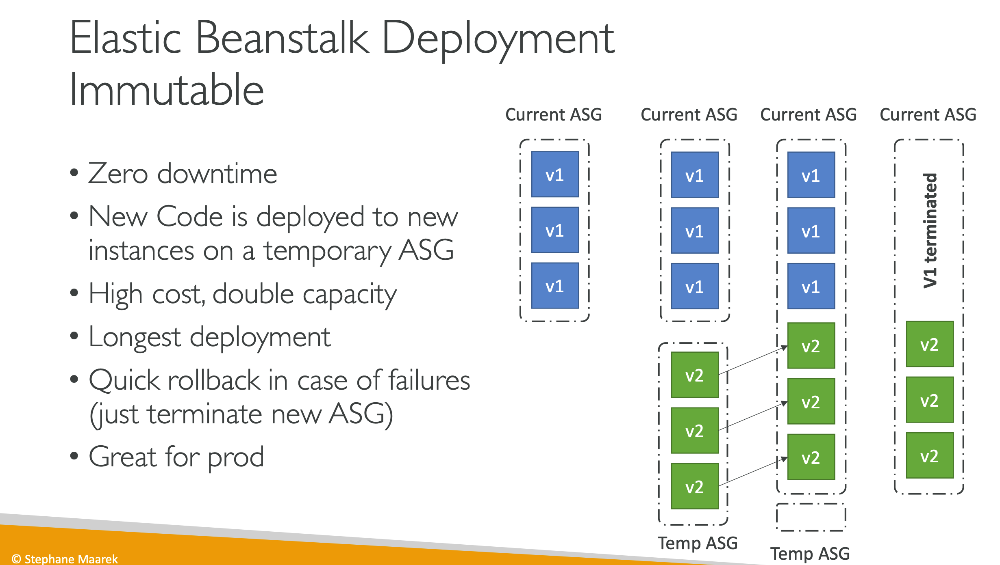
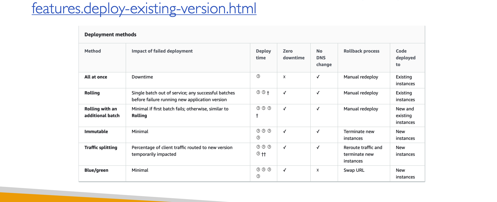
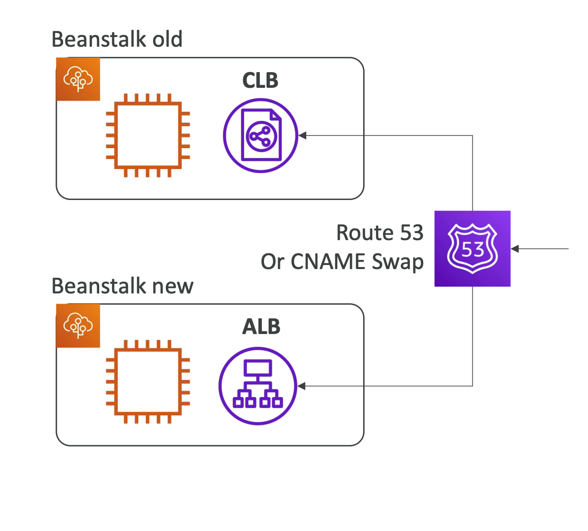
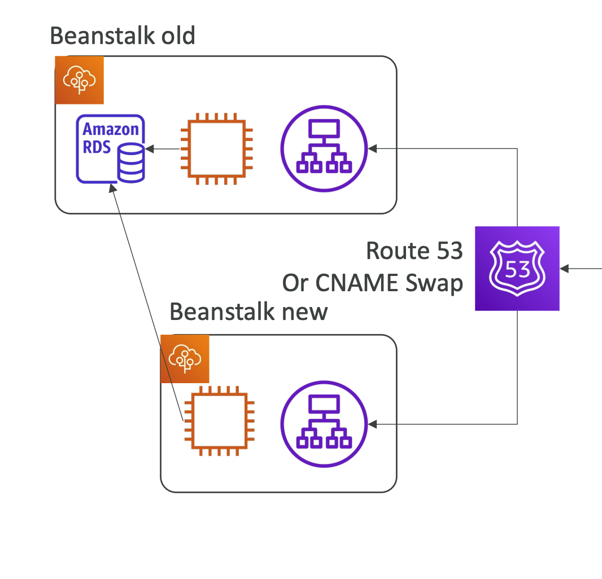

## 3 Tier Architechture

- It uses all the component’s we’ve seen before: EC2, ASG, ELB, RDS,
- Automatically handles capacity provisioning, load balancing, scaling, application
- We still have `full control over the configuration`
- Beanstalk is free but you pay for the underlying instances
### ElasticBeanStalk Components

### Deployment Modes

- All at once (deploy all in one go)
    - fastest
    - No Additional Costs
- Rolling: update a few instances at a time (bucket), and then move onto the next bucket once the first bucket is healthy
    
- Rolling with additional batches: like rolling, but spins up new instances to move the batch (so that the old application is still available)
    
- Immutable: spins up new instances in a new ASG, deploys version to these
instances.
    
#### BLUE GREEN DEPLOYMENT
- Not a “direct feature” of Elastic Beanstalk
- Create a new “stage” environment and deploy v2 there
- Route 53 can be setup using `weighted
policies`
- Using Beanstalk, `“swap URLs”` when done
with the environment test

### Elastic Beanstalk CLI
- We can install an additional CLI called the “EB cli” which makes working with
Beanstalk from the CLI easier
- Basic commands are:
    - eb create
    - eb status
    - eb health
    - eb events
    - eb logs
    - eb open
    - eb deploy
    - eb config
    - eb terminate
### Elastic Beanstalk Deployment Process
- Package code as `zip`, and describe dependencies
    - Python: requirements.txt
    - Node.js: package.json
- Console: upload `zip` file (creates new app version), and then deploy
- CLI: create new app version using CLI.
### Beanstalk Lifecycle Policy
- store at most `1000` application versions
- If you don’t remove old versions, `you won’t be able to deploy anymore`
- To phase out old application versions, use a lifecycle policy
    - Based on `time` 
    - Based on `space` (when you have too many versions)
    - Versions that are currently used won’t be deleted
- Option `not to delete the source bundle in S3`(zip file) to prevent data loss

## Elastic Beanstalk Extensions
- A zip file containing our code must be deployed to Elastic Beanstalk
- All the parameters set in the UI can be configured with code using files
- Requirements:
    - in the `.ebextensions/` directory in the root of source code
    - `YAML / JSON` format
    - .config extensions (example: logging.config)
    - Able to modify some default settings using: option_settings
    - Ability to add resources such as RDS, ElastiCache, DynamoDB, etc.
    - Resources managed by `.ebextensions get deleted if the environment` goes away
## Elastic Beanstalk Cloning
- Clone an environment with the exact same configuration
- Useful for deploying a “test” version of your application
- All resources and configuration are preserved:
    - Load Balancer `type and configuration`
    - RDS database type `(but the data is not peserved)`
    - `Environment variables`
    - After cloning an environment, `you can change settings`
## EB Migration
### Load Balancer Migration
After creating an Elastic Beanstalk
environment, you cannot change the Elastic Load Balancer type `(only the configuration)`
To migrate:
1. create a new environment with the same configuration except LB (can’t clone)
2. deploy your application onto the new environment
3. perform a `CNAME swap` or Route 53 update.

### RDS Migration
- RDS can be provisioned with Beanstalk, which is great for `dev / test`
- This is not great for prod as the database lifecycle is tied to the Beanstalk environment lifecycle so once we destroy the environment, RDS is not preserved
- The best for prod is to separately create an RDS database and provide our `EB application with the connection string`
#### Elastic Beanstalk Migration: Decouple RDS
1. Create a snapshot of RDS DB (as a safeguard)
2. Go to the RDS console and protect the RDS database from deletion
3. Create a `new Elastic Beanstalk environment, without RDS`, point your application to existing RDS
4. perform a CNAME swap (blue/green) or Route 53 update, confirm working for the application.
5. Terminate the old environment (RDS won’t be deleted)
6. Delete CloudFormation stack (in DELETE_FAILED state)

## RDS LIFECYCLE IN ELASTICBEANSTALK

- RDS DB Instance Created Within Elastic Beanstalk: If the RDS database instance was created through the Elastic Beanstalk environment configuration (i.e., during the environment setup using the Elastic Beanstalk management console, CLI, or API), it is typically tied to the lifecycle of the Beanstalk environment. 
    - By default, when you terminate the environment, the RDS instance will also be terminated. 
    - This setup is often used for dev/test environments where the database does not need to persist beyond the life of the application environment.

- Decoupled RDS DB Instance: If you want the database to persist beyond the life of the Beanstalk environment, or if you are using the RDS instance for multiple applications or environments, you should create the RDS instance independently of the Elastic Beanstalk environment. 
    - You can still connect your Elastic Beanstalk application to an external RDS instance by providing the connection string in your application's configuration settings. 
    - In this scenario, deleting the Elastic Beanstalk environment will not affect the RDS instance.
## Elastic Beanstalk – Single Docker
### Either provide:
- `Dockerfile`: Elastic Beanstalk will build and run the Docker container
- Dockerrun.aws.json (v1): Describe where *already built* Docker image is
    - Image
    - Ports
    - Volumes
    - Logging

Beanstalk in Single Docker Container does not use ECS
### Elastic Beanstalk – Multi Docker Container
- Multi Docker helps run multiple containers per EC2 instance in EB
- This will create for you:
    - `ECS Cluster`
    - EC2 instances, configured to use the ECS Cluster
    - Load Balancer (in high availability mode)
- Task definitions and execution
- Requires a config `Dockerrun.aws.json` (v2) at the root of source code
- Dockerrun.aws.json is used to generate the `ECS task definition`
- Your Docker images must be pre-built and stored in ECR for example

### Elastic Beanstalk and HTTPS
- Beanstalk with HTTPS
    - Idea: Load the SSL certificate onto the Load Balancer
    - Can be done from the Console (EB console, load balancer configuration)
- Can be done from the code: .ebextensions/securelistener-alb.config
- SSL Certificate can be provisioned using ACM (AWS Certificate Manager) or CLI
• Beanstalk redirect HTTP to HTTPS
• Configure your instances to redirect HTTP to HTTPS:
https://github.com/awsdocs/elastic-beanstalk-samples/tree/master/configuration-files/aws- provided/security-configuration/https-redirect
- OR configure the Application Load Balancer (ALB only) with a rule
- Make sure health checks are not redirected (so they keep giving 200 OK)

### Elastic Beanstalk – Custom Platform (Advanced)
- Custom Platforms are very advanced, they allow to define from scratch:
    - The Operating System (OS)
    - Additional Software
    - Scripts that Beanstalk runs on these platforms
- Use case: app language is incompatible with Beanstalk & doesn’t use Docker
To create your own platform:
- Define an AMI using `Platform.yaml `file
- Build that platform using the Packer software (open source tool to create AMIs)
- Custom Platform vs Custom Image (AMI):
- Custom Image is to tweak an existing Beanstalk Platform (Python, Node.js, Java…)
- Custom Platform is to create an entirely new Beanstalk Platform