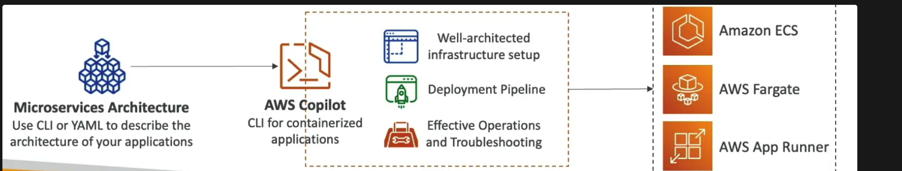

- **CLI tool (not a service)** to build, release, and operate production-ready containerized apps without worrying about infrastructure setup.
- Automatically creates **well-architected infrastructure**
- Containerized apps can be run on:
    - `ECS`
    - `Fargate`
    - AppRunner
- Automated deployments with one command using CodePipeline
- Deploy to multiple environments
- Provides troubleshooting, logs, health status, etc.
