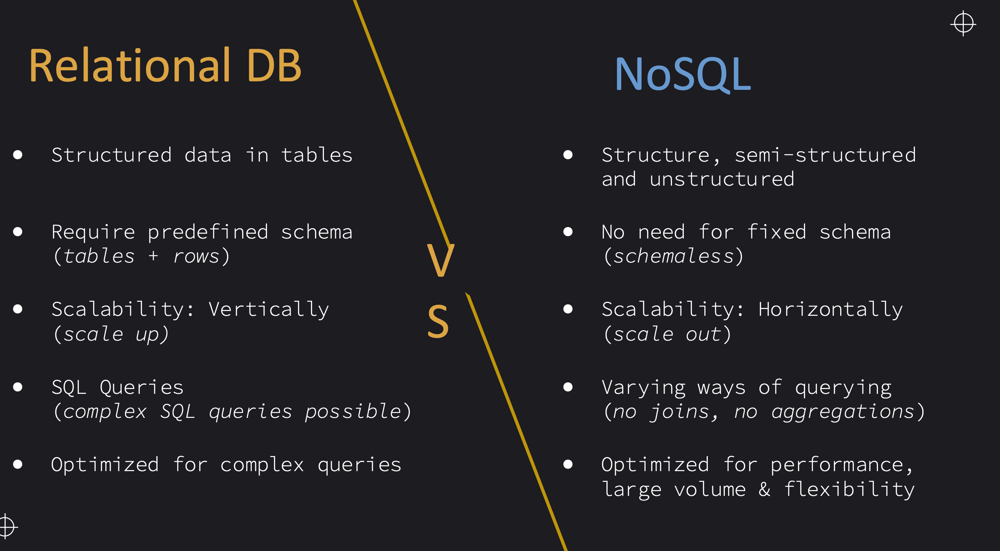
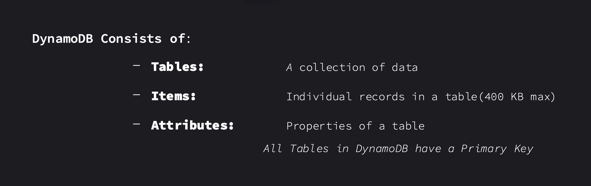
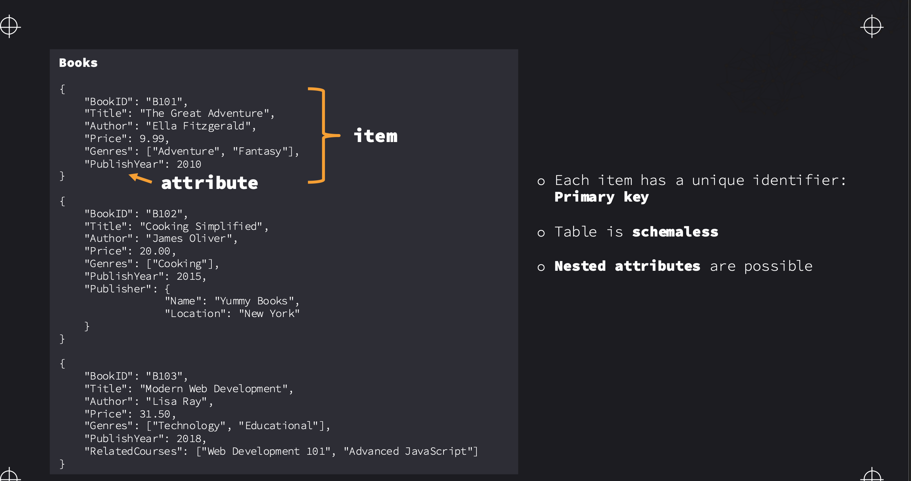
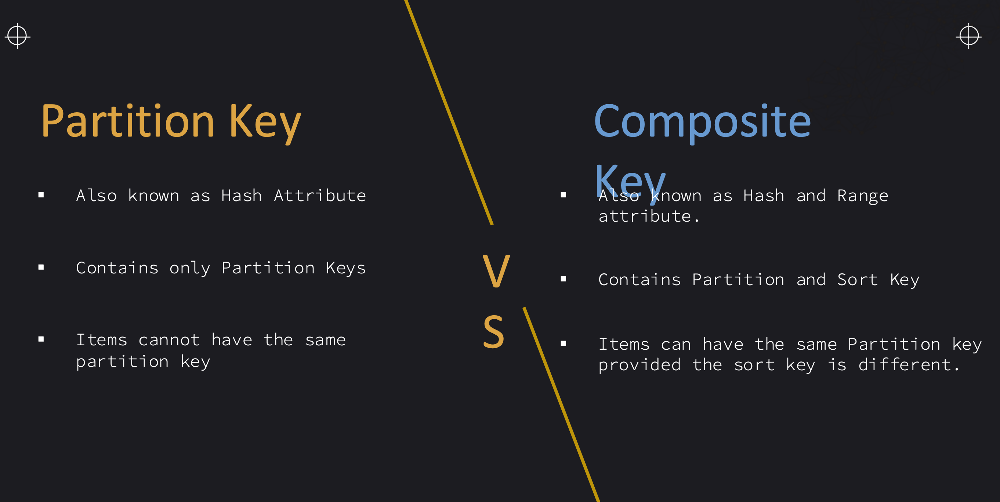
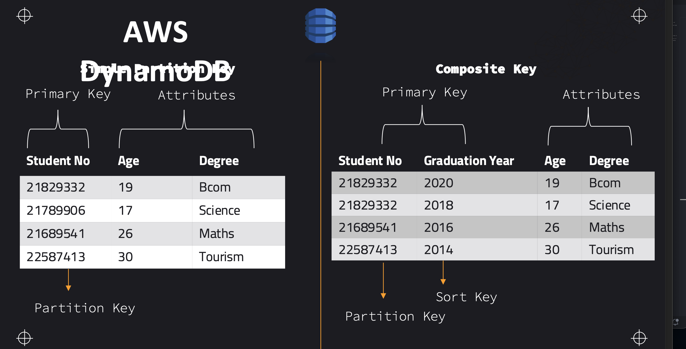
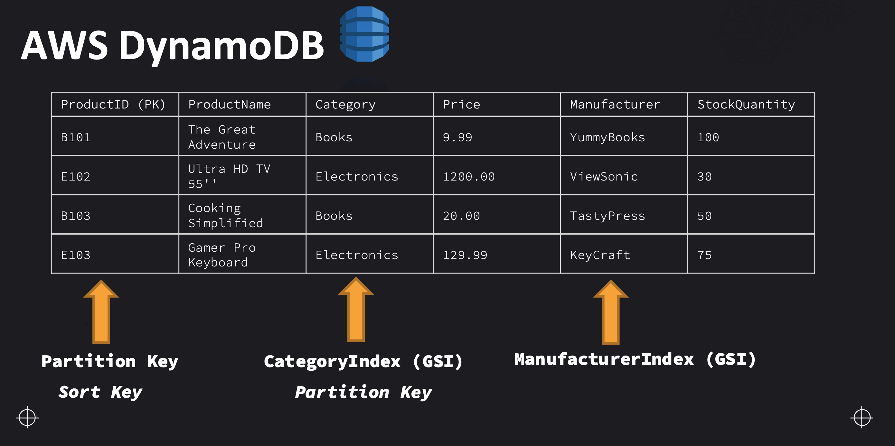
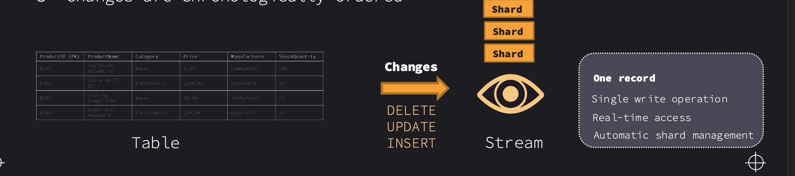
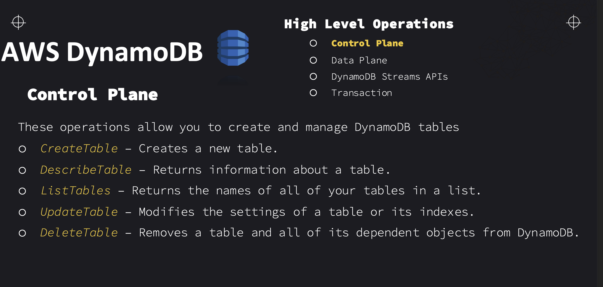
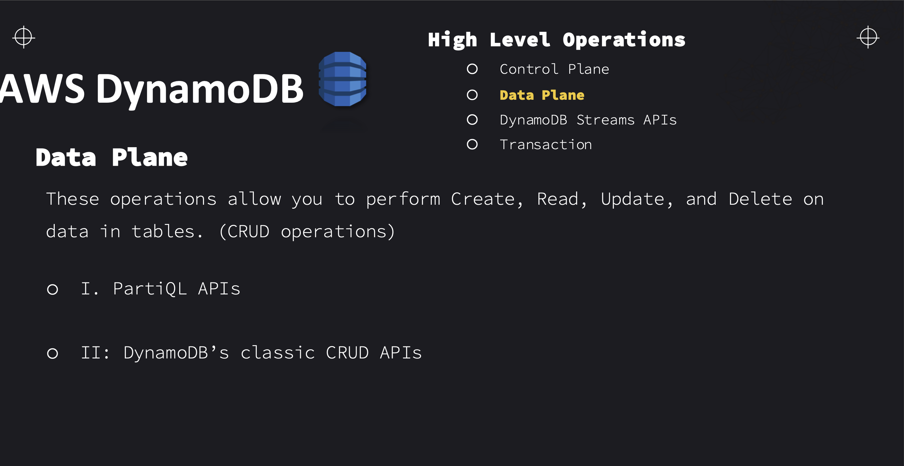

## NOSQL VS SQL DATABASES

## DYNAMO DB FEATURES
 - Data Model: Supports both key-value and document data model
 - Fully-managed distributed database
Performs very well under high traffic and high workloads
High-availability & durability through distribution & AZ-replication
Supports encryption at rest
Millisecond latency

Primary Keys
Partition Key (hash attribute):
A single “key” is used to distinguish items in a table
Composite Key:
Two “keys” are used to distinguish items in a table:
A partition and a sort key (range attribute)

### INDEXES
Local Secondary Index
Global Secondary Index
▪ Index has the same partition key as the
base table, but a different sort key.
▪ Maximum of 5 Local Secondary Indexes
per table
▪ An index with a partition key and sort key
that can be different from the base table.
▪ Created at the same time as the table and
cannot be modified after table creation.
▪ Maximum of 20 GSI per table.
▪ Can be modified after table has been created
▪ If writes throttle, base table writes
will throttle too

#### How to create a secondary index
 We use "projected attributes"
o Attributes that are copied from a table to an Index
o Attributes to copy can be specified
o Maximum 20 projected attributes per index
Three options for projected attributes:
o All: All of the attributes from the base table are projected into the index.
o Keys Only: Only the key attributes from the base table are projected into the
index.
o Include: Only specific attributes from the base table are projected into the
index.
### Dynamo DB Streams
Captures changes done on data in DynamoDB tables
[Writes/Deletes/Updates]
o Changes are sent to a stream record
o Changes are chronologically ordered
Optional feature – Disabled by default
o Records are all changes made to an item during one operation
o You can decide what should be recorded to the stream
Note:
o Changes made before activation of Stream are not recorded
o Data in the stream is retained for 24 hours

#### Stream Record Options
Keys_only: view only the key attributes of the item modified
o New_image: view the item after changes were made
o Old_image: view the item before changes were made
o New_and_old_image: view the item before and after it was made

##### Processing Streams
 AWS Lambda:
2. Amazon Kinesis Data Streams ⇒ Data Firehose
3. Amazon Elasticsearch Service
4. Custom Applications
5. AWS Glue
6. Cross-Region Replication
### Dynamo DB API operations

###### Data Plane Operations
