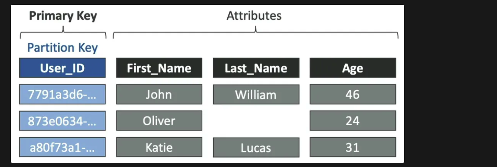
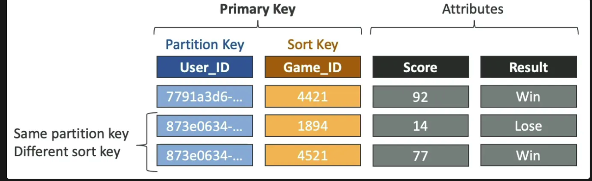
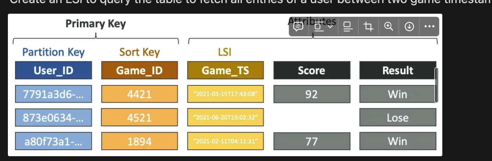
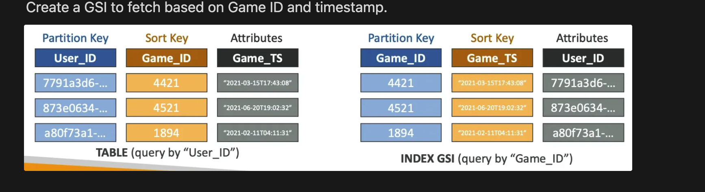
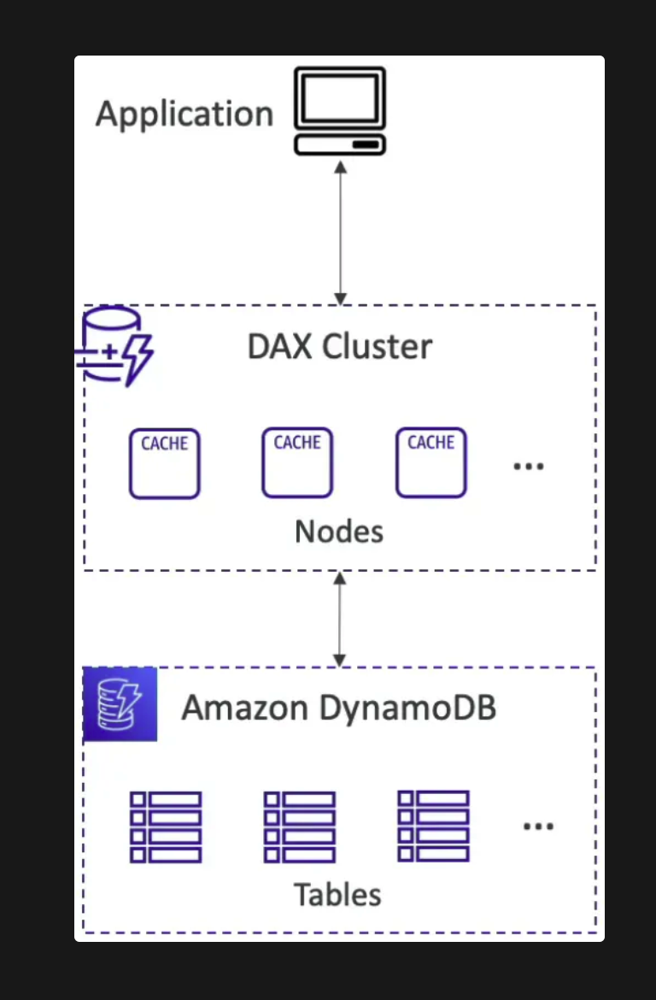
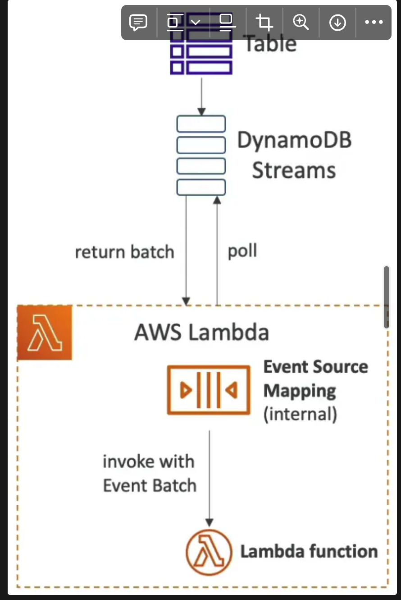
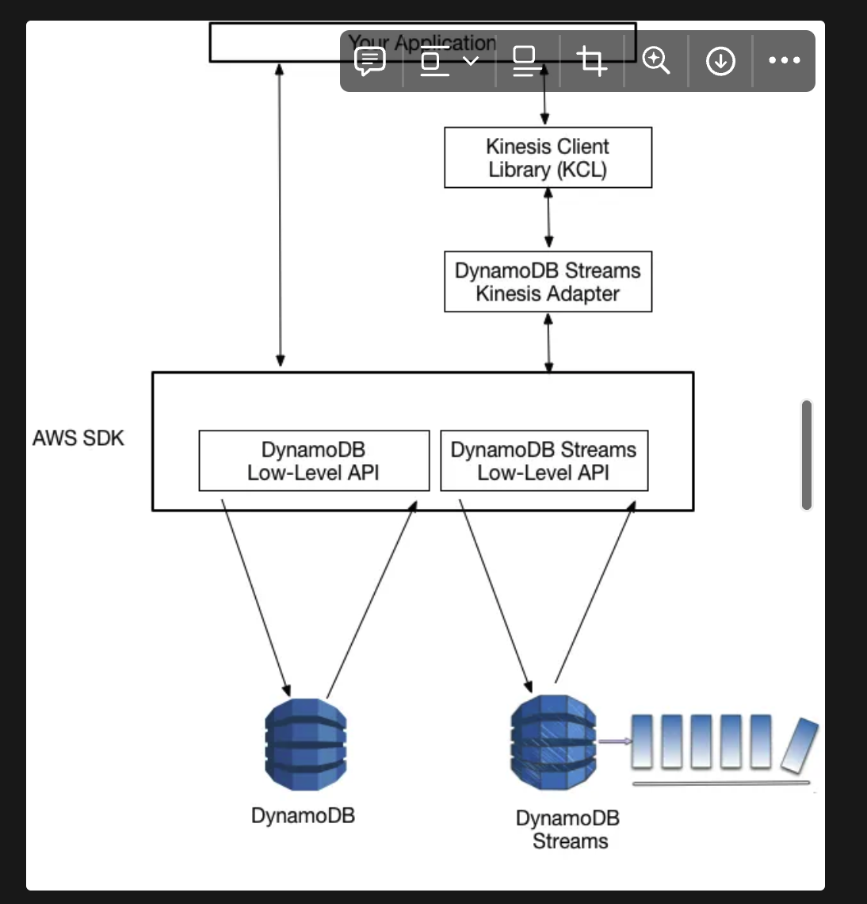
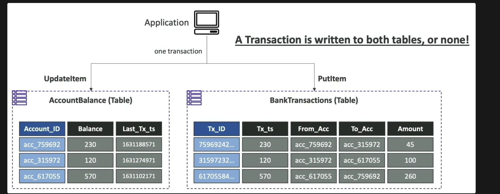
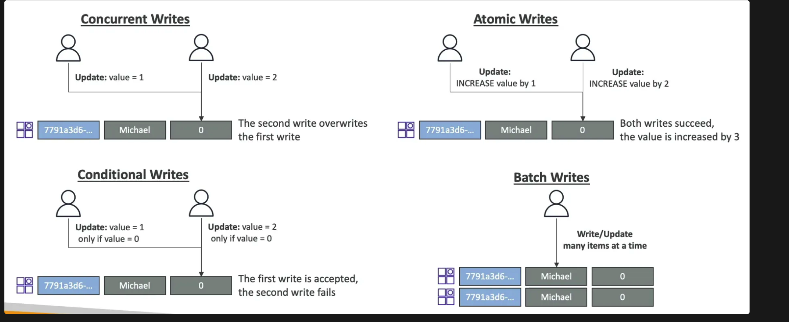

## Intro
- **SQL databases (RDS & Aurora) are centralized** and **can scale reads by adding read replicas** but they **cannot scale writes (no sharding)**. 
- The only way to scale writes is to **vertically scale the DB**.
- DynamoDB is a **Serverless NoSQL DB** with **replication across multiple AZ**. It is a **distributed NoSQL DB** that **can scale both reads and writes horizontally** to support massive workloads.
- Table classes
    - Standard
    - Infrequent Access (IA)
- Popular option to use as a serverless distributed cache. `Latency will be higher than ElastiCache as DynamoDB` is not an in-memory store. It stores data on disk.
#### Copy a table across account or region (3 options):
- Using AWS Data Pipeline
- Backup and restore into a new table (takes some time but easy)
- `Scan and BatchWriteItem` (not recommended)
#### Global Tables
- **Global Tables** - `multi-region`, `multi-active`, replicated tables (need to enable DynamoDB streams)
- **DynamoDB Local** - deploy DynamoDB locally for development or testing

## Tables

- Primary key must be decided at creation time
- Infinite rows (items)
- Attributes (columns) can be added overtime
- **Maximum item size: 400 KB**
- Supported data types:
    - **Scalar** - String, Number, Binary, Boolean, Null
    - **Document** - List, Map
    - **Set** - String Set, Number Set, Binary Set

## Primary Keys

- **Partition Key (Hash)**
    - Partition key is hashed to find the location of data
    - Partition key must be unique for each item
    

    
- **Partition Key (Hash) + Sort Key (Range)**
    - Partition key is hashed to find the partition and sort key is used to search for the data in that partition
    - Combination of partition key and sort key must be unique
    
  
    

<aside>
💡 **Partition key should be a column in the table that has highest cardinality** to maximize the number of partitions (data distribution). Partition key should also be highly diverse to ensure that the data is distributed equally across partitions.

</aside>

<aside>
💡 **If the partition (hash) key is not highly diverse** (only few unique values)**, add a suffix to the partition key to make the partition key diverse.** The suffix can be generated either randomly or calculated using a hashing algorithm.

</aside>

## Read Consistency

- **Eventually Consistent Read** (default)
    - Low latency
    - May get stale data (if the replication hasn’t happened yet)
- **Strongly Consistent Read**
    - **Consumes twice the RCU**
    - More latency
    - Set `ConsistentRead: True` in API calls (`GetItem`, `BatchGetltem`, `Query`, `Scan`) to perform a strongly consistent read
    

## Throughput

### Capacity Planning

- **Read Capacity Units (RCU)**
    - Throughput for reads
    - **1 RCU** ⇒ **1 strongly consistent read per sec** or **2 eventually consistent reads per sec** for an item of **max size 4 KB**
    - 10 eventually consistent reads per sec with item size 6 KB ⇒ [10 / 2 (eventual consistency)] x [8 KB (rounded up) / 4 KB] = 10 RCU
    - 10 strongly consistent reads per sec with item size 10 KB ⇒ 10 x [12 KB (rounded up) / 4 KB] = 30 RCU
- **Write Capacity Units (WCU)**
    - Throughput for writes
    - **1 WCU ⇒ 1 write per sec** for an item of **max size 1 KB**
    - Write 6 items per sec with item size 4.5 KB ⇒ 6 x [5 KB (rounded up) / 1 KB] = 30 WCU
- **WCU & RCU are divided evenly across partitions** (10 partition & 10 RCU ⇒ 1 RCU for each partition).
- To determine how much of the provisioned capacity is being used, you can monitor `ConsumedReadCapacityUnits` and `ConsumedWriteCapacityUnits` over a time period.

### Throttling

- If RCU or WCU for any partition is exceeded, the request will throttle and we’ll get `ProvisionedThroughputExceededException`.
- Reasons for throttling:
    - **Hot Partitions** (most of the data is read or written to only a few partitions)
    - **Large item size**
- Solutions to throttling:
    - **Exponential backoff (already in SDK)**
    - Evenly distributed partition keys (to avoid hot partitions)
    - DynamoDB Accelerator (DAX)

### Capacity Modes

- **Provisioned**
    - Provision RCU and WCU in advance
    - **Optional throughput auto-scaling** (automatically scales RCU and WCU) based on target utilization
        - Example: Min RCU: 1, Max RCU: 100, Target utilization: 70% ⇒
            - 7 RCUs are being consumed ⇒ provisioned RCU = 10
            - 35 RCUs are being consumed ⇒ provisioned RCU = 50
    - Provisioned throughput can be exceeded temporarily using **Burst Capacity**. Once burst capacity is consumed, we’ll get `ProvisionedThroughputExceededException`. At this stage, we need to retry with exponential backoff.
- **On-demand**
    - No capacity planning needed (reads and writes auto-scale)
    - No throttling
    - Pay for the **Read Request Unit (RRU)** and **Write Request Unit (WRU)** consumed. They have the same calculation as RCU and WCU.
    - 2.5 times more expensive than provisioned mode (use only for unpredictable traffic)

## Backups

- Two types:
    - **On-demand**
    - **Point-in-time recovery (PITR)** - automatic continuous backups
- No performance impact during backups
- **Backups are written to S3** under the hood but we cannot access these backup buckets

## APIs

- `PutItem` - **fully update** the item based on the primary key or create a new item if it does not exist
- `UpdateItem` - **partially update** the item based on the primary key or create a new item if it does not exist
- `GetItem` - **read an item** using the primary key (hash / hash + range)
    - Eventually consistent read by default, strongly consistent read optional
    - `ProjectionExpression` can be specified to retrieve a subset of attributes
- `Query` - **read multiple items based on a query** from a table, LSI or GSI
    - `KeyConditionExpression`
        - Partition key (=) - required
        - Sort key (=, <, ≤, >, ≥, between, begins with) - optional
    - `FilterExpression`
        - Client-side filtering on non-key attributes
        - Does not allow partition key or sort key attributes
    - Returns a list of items where number of items = limit in the query or up to 1 MB of data. To get more data, use pagination.
- `Scan` - **scan the entire table** (every partition) and return all the data
    - Consumes a lot of RCU
    - Recommended to use limit in the scan operation
    - Returns up to 1 MB of data (use pagination to get more data)
    - Use `FilterExpression` to filter items and `ProjectionExpression` to retrieve a subset of attributes (client-side)
    - **Not recommended** unless you need to read the entire table (Eg. Analytics)
    - Use **Parallel Scan** for faster scans
        - Multiple workers
        - Increases throughput and RCU consumed
        - Recommended to use limit in the parallel scan operation
- `DeleteItem` - **delete an item**
    - Optional conditional delete (Eg. Delete this item only if age < 0)
- `DeleteTable` - **delete the whole table** and its items
    - Much faster than calling `DeleteItem` on all the items
- `BatchWriteItem` - **write items in a batch of operations** (processed in parallel)
    - **Max 25 operations** or max 16 MB of data written in a single API call
    - Supports `PutItem` and `DeleteItem` (does not support `UpdateItem`)
    - Can write to multiple tables in the same batch API call
    - `UnprocessedItems` (failed writes) can be retried with exponential backoff
    - If the batch write exceeds WCU limits, add more WCU
- `BatchGetItem` - **read items in a batch of operations** (processed in parallel)
    - **Max 100 items** or max 16 MB of data can be read in a single API call
    - Can read from multiple tables in the same batch API call
    - `UnprocessedKeys` (failed reads) can be retried with exponential backoff
    - If the batch read exceeds RCU limits, add more RCU

### Conditional Writes

- Option to specify a **Conditional Expression** to apply the write operation only to the items that satisfy the condition.
- Supported by `PutItem`, `UpdateItem`, `DeleteItem` and `BatchWriteItem` APIs
- Examples
    
    In the examples below, the values for the variables are passed in `values.json` file.
    
    
    
    
    
    
    
    
    
- Using `attribute_not_exists(partition_key)` and  `attribute_not_exists(sort_key)` in our conditional expressions, we can ensure that a data is never overwritten by write commands.
- **Optimistic Locking** - strategy to ensure an item hasn’t changed after you read it and before you update it
    - Each item has an attribute `Version` which is incremented every time the item is updated
    - The idea is to read the item and send a write (update or delete) request to DynamoDB with a conditional expression that the version of the item is what you read. If the version gets incremented before updating, the write operation will fail.

<aside>
💡 Filter Expressions are for read operations, whereas Conditional Expressions are for write operations.

</aside>

## Secondary Indexes

- Allow running queries on non-primary key attributes
- Attribute projections - what attributes (columns) to fetch when queried on an index
    - `KEYS_ONLY` - only index and primary key attributes
    - `INCLUDE` - some attributes (including index and primary key attributes)
    - `ALL` - all attributes

### Local Secondary Index (LSI)

- **Alternative Sort Key** for a table (uses the same partition key)
- Queries are made to a single partition
- The sort key of the LSI **must be a scalar attribute** (String, Number or Binary)
- Max 5 LSI per table
- **Must be defined at table creation time**
- **Uses RCU and WCU of the main table** (works on the same table partition)
- **Queries on LSI support both eventual consistency and strong consistency**
- Example
    
    Create an LSI to query the table to fetch all entries of a user between two game timestamps.
    
  
    

### Global Secondary Index (GSI)

- **Alternative Primary Key** for a table (Hash or Hash + Sort) to speed up queries on non-key attributes.
- The hash key and sort key (optional) of the GSI **must be scalar attributes** (String, Number or Binary)
- Queries are made to the entire database
- **Must provision RCU and WCU** (supports auto-scaling) for GSI since it partitions the same table differently. **If the writes are throttled on the GSI, the main table will be throttled for writes as well.**
- **GSIs can be added or modified after table creation**
- **Queries on GSI support eventual consistency only**
- Example
    
    Create a GSI to fetch based on Game ID and timestamp.
    
    
    

## PartiQL

- SQL-compatible query language for DynamoDB
- Can run queries across multiple DynamoDB tables
- Supports some (not all) SQL statements: `INSERT`, `UPDATE`, `SELECT`, `DELETE` (does not support `JOIN` operation)
- Supports batch operations
- PartiQL queries can be run from
    - AWS Management Console
    - NoSQL Workbench for DynamoDB
    - DynamoDB APIs
    - AWS CLI
    - AWS SDK
    

## DynamoDB Accelerator (DAX)

- **In-memory distributed cache** for DynamoDB
- Caches reads, queries and individual objects automatically
- Microseconds latency for cached items
- **Doesn’t require application code changes** (managed on DB side)
- **Solves the Hot Key Problem** (too many reads from a single partition)
- Default 5 min TTL
- Encryption at rest using KMS
- DAX is good for automatic caching of reads and queries made to a DynamoDB table. To cache aggregation results, ElastiCache needs to be used.

- Enable DAX and provision nodes for the DAX cluster
    - Multi-AZ recommended (min 3 nodes) in production
    - **Max 10 nodes in a cluster**
    - Node types:
        - **r-type**: fixed resource with always-capacity (recommended for higher throughput)
        - **t-type**: baseline performance with burst capability (recommended for lower throughput)
- DAX needs IAM permissions to access DynamoDB table (created automatically)
- **DAX is expensive** (should not be used in low cost applications)

## DynamoDB Streams

- Ordered stream of item-level modifications (create / update / delete)
- **Data retention: 1 day**
- Stream records can be:
    - Read directly by AWS Lambda (using Event Source Mapping)
      
    - Read by KCL as a stream (requires **Kinesis Adapter**)
        
        The **Kinesis Adapter** is the **recommended way to consume streams from DynamoDB** for real-time processing. The KCL simplifies coding by providing useful abstractions above the low-level Kinesis Streams API.
        
       
        
- Stream record contents:
    - `KEYS_ONLY` - key attributes of the modified item
    - `NEW_IMAGE` - modified item
    - `OLD_IMAGE` - old item
    - `NEW_AND_OLD_IMAGES` - both new and old items
- **No need to provision shards** (managed by AWS)
- **Not retroactive** (stream will not contain records of changes prior to enabling streams)
- Use cases
    - React to changes in real-time (Eg. welcome emails to new users)
    - Send data to OpenSearch for indexing (search capability on top of DynamoDB)
    - **Implement cross-region replication** or **Global Tables** (requires DynamoDB stream to be enabled)

## Time To Live (TTL)

- Option to delete items after their expiry timestamp
- The TTL attribute must be `Number` type with Unix Epoch timestamp value
- Expired items are deleted within 48 hours (might appear in queries after expiry)
- **Deletion through TTL does not consume WCU** (no extra cost)
- **Expired items are deleted from secondary indexes**
- DynamoDB stream can be used to recover deleted items
- Working
    
    A process within DynamoDB performs a scan on the table regularly to check the TTL timestamps and mark the items as expired. Another process performs a scan to find the expired items and deletes them.
   
    

## CLI Options

- `--projection-expression` - specify the attributes to be retrieved
- `--filter-expression` - filter items client-side before displaying on the CLI
- `--page-size` - make **multiple API calls**, each retrieving few items, to get the full list of items to prevent timeout error (default 1000 items)
- `--max-items` - retrieve only a few items in a **single API call**, returns `NextToken` if more items exist
- `--starting-token` - specify the last `NextToken` to retrieve the next set of items

## Transactions

- **All-or-nothing operation** (the change happens to all the items across multiple tables or none of the items). 
- Provides ACID
- **Available in both Read and Write operations**
- Performs 2 operations for every item
    - `TransactGetItems` - get the required items
    - `TransactWriteItems` - update the required items
- **Consumes twice the WCU and RCU of strongly consistent reads**
    - 3 transactional writes per sec with item size 5 KB ⇒ 3 x [ 5 KB / 1 KB ] x 2 = 30 WCU
    - 5 transactional reads per sec with item size 5 KB ⇒ 5 x [ 8 KB (rounded up) / 4 KB ] x 2 = 20 RCU
- Use cases: financial transactions, multi-player games, managing orders, etc.
- Example
    
    Update both the tables in a single transaction.
    

## Security

- Access Control using IAM
- At-rest encryption using KMS
- In-flight encryption using TLS
- Gateway Endpoints to access DynamoDB from the VPC without traversing the internet
- **Fine-grained (low level) access control** can be controlled using **federated login** and:
    - `LeadingKeys` - limit access to rows
    - `Attributes` - limit access to columns

## Atomic Counters

- Use `UpdateItem` operation to implement an ***atomic counter,*** a numeric attribute that is incremented, unconditionally.
- Updates are not idempotent (the counter will increment each time you call `UpdateItem`)
- Not suitable where counting must be accurate (use conditional update instead)

## Misc

- **AWS Database Migration Service (DMS)** can be used to migrate data to DynamoDB
- **Partitioning data too finely is bad** (can increase the overhead of retrieving and processing the partition metadata)
- Reduce page size to reduce consumed RCU
- To perform scan operations for analytics purposes, the best way is to create a shadow table (copy of the original table) and perform scans on it. This way scan operations don’t impact the RCU of the main table.
- To return the number of write capacity units consumed by any write operation, set the `ReturnConsumedCapacity` parameter to one of the following:
    - `TOTAL` - total number of WCU consumed
    - `INDEXES` - total number of WCU consumed, with subtotals for the table and any secondary indexes that were affected by the operation
    - `NONE` - returns nothing (default)
- To perform an upsert operation, we only need permission for `GetItem` and `UpdateItem` (also has the permission to put an item if it doesn’t exist).
- Write types in DynamoDB

    