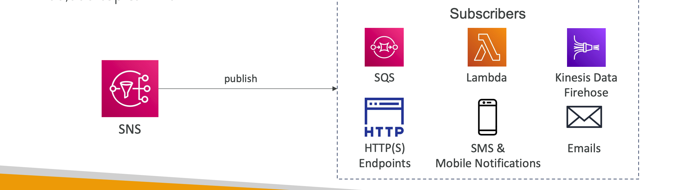
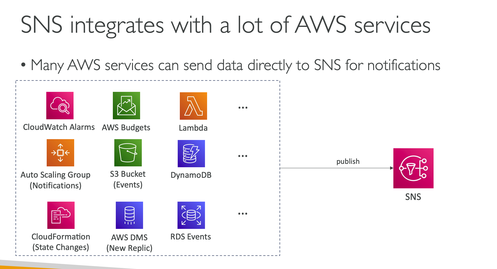
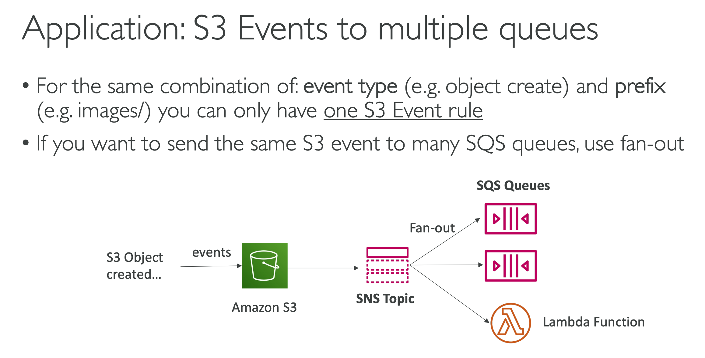
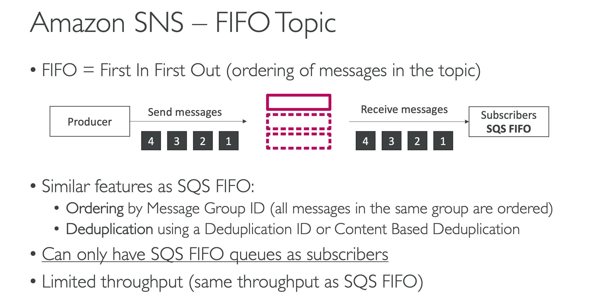
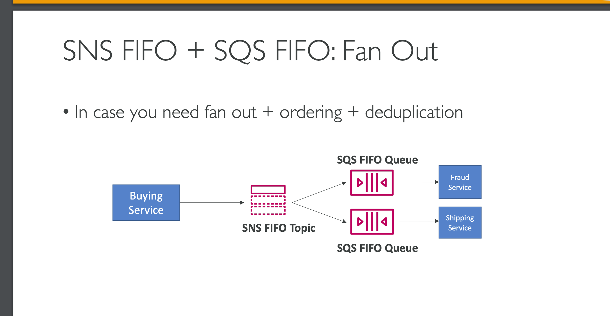
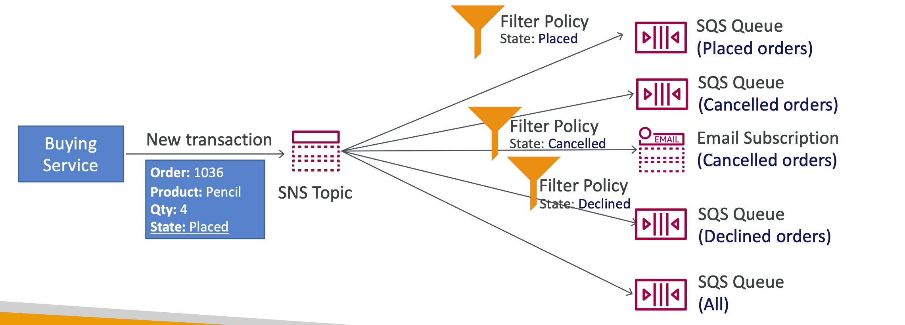

- The “event producer” only sends message to one SNS topic
- As many “event receivers” (subscriptions) as we want to listen to the SNS topic notifications
- Each subscriber to the topic will get all the messages (note: new feature to filter messages)
- Up to `12,500,000` subscriptions per topic
- `100,000` topics limit

### How to publish
- Topic Publish (using the SDK)
    - Create a topic 
    - Create a subscription (or many) 
    - Publish to the topic 
- Direct Publish (for mobile apps SDK) - Create a platform application 
    - Create a platform endpoint 
    - Publish to the platform endpoint Works with Google GCM, Apple APNS, Amazon ADM…
### Amazon SNS – Security
- Encryption:
    - In-flight encryption using HTTPS API
    - At-rest encryption using KMS keys
    - Client-side encryption if the client wants to perform encryption/decryption itself
- Access Controls: IAM policies to regulate access to the SNS API
- SNS Access Policies (similar to S3 bucket policies)
    - Useful for cross-account access to SNS topics
    - Useful for allowing other services ( S3…) to write to an SNS topic
## SNS+SQS FAN OUT
Push once in SNS, receive in all SQS queues that are subscribers
- Fully decoupled, no data loss
- SQS allows for: data persistence, delayed processing and retries of work
- Ability to add more SQS subscribers over time
- Make sure your SQS queue access policy allows for SNS to write
- Cross-Region Delivery: works with SQS Queues in other regions

### SNS – Message Filtering
- JSON policy used to filter messages sent to SNS topic’s subscriptions
- If a subscription doesn’t have a filter policy, it receives every message
