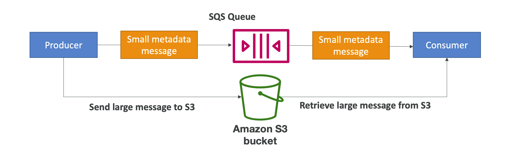

## SQS – Producing Messages
- Produced to SQS using the SDK (SendMessage API)
- The message is persisted in SQS until a consumer deletes it
- Message retention: default `4 days`,up to `14 days`
- Example: send an order to be processed
    - Order id
    - Customer id
    - Any attributes you want
- SQS standard: `unlimited throughput`

## SQS – Consuming Messages
- Consumers (running on EC2 instances, servers, or AWS Lambda)
- Poll SQS for messages (receive up to 10 messages at a time)
- Process the messages (example: insert the message into an RDS database)
- Delete the messages using the `DeleteMessage API`

## Other Facts
- SQS messages continue to exist even after Ec2 instances process it `so we need to delete them using Delete Message API`
- If we need to access the SQS from the VPC itself then we can use `VPC Endpoints` for that without going through the internet and it is powered by AWS private link.
- Queue names are `case sensitive` in nature.
- Concept of message timers are there through which we can add invisibility timers to message in queue when added `max is 15 minute` so that multiple consumers do not consume the same message.

- If there is a permission issue then the permission error must be given.
- Unlimited number of messages in queue
- Consumers could be EC2 instances or Lambda functions and SQS cannot ingest data, it must be sent to the queue by the producer (use Kinesis ⮕ Kinesis Data Stream KDS instead)
## Lambda:
- We can trigger a `lambda using SQS but we need to make sure these both are in the same region` and only queue can be added to a lambda not multiple queue.
### Dead letter queue:
- Contains messages which we were not able to process.
- After certain retry attempts the message comes here.
- To reduce the problem on poison pill where we are receiving so many messages we cannot process.
- Avoid dead letter queues with FIFO Queues as the order can be broken by using this.
Useful for debugging!
- DLQ of a FIFO queue must also be a FIFO queue
- DLQ of a Standard queue must also be a Standard queue
- Make sure to process the messages in the DLQ before they expire:
- Good to set a retention of 14 days in the DLQ

#### Amazon SQS Delay Queue

#### Amazon SQS Long Polling

### Message Locking:
- Locks the message while it is being processed and then it is available to systems where the systems will be able to access this message.

## SQS EXTENDED CLIENT
- Message size limit is 256KB, how to send large messages, e.g. 1GB?
- Using the SQS Extended Client (Java Library)

### SQS API

- CreateQueue (MessageRetentionPeriod), DeleteQueue
- PurgeQueue: delete all the messages in queue
- SendMessage (DelaySeconds), ReceiveMessage, DeleteMessage
- MaxNumberOfMessages: default 1, max 10 (for ReceiveMessage API)
- ReceiveMessageWaitTimeSeconds: Long Polling
- ChangeMessageVisibility: change the message timeout
- Batch APIs for SendMessage, DeleteMessage, ChangeMessageVisibility
helps decrease your costs

#### Components:
- Queue: Store messages produced by producers.
    - Messages:
        - Max message size: 256KB
        - Max 10 messages received per batch (configured using MaxNumberOfMessages parameter in the Receive Message API)
        - Message Attribute is the metadata and a  message can have 10 of these as maximium
    - Consumers:
        - Consumes the messages in the queue.

## Queue Types     
- Standard Queue
    - Unlimited throughput (publish any number of message per second into the queue)
    - Uses short polling by default and store messages on multiple servers for redundancy.
    - Low latency (<10 ms on publish and receive)
    - Original order is not guaranteed and. Can have duplicate messages (at least once delivery)
        - Occasionally we can get duplicate messages also.
    - Can have out of order messages (best effort ordering)

- FIFO Queue
    - Limited throughput and Order is maintained here always.
    - Latency is on the higher side and it is not available in all the regions.
    - 300 msg/second without batching (batch size = 1) and one batch can have 10 messages or the total size should be less than 256KB.
    - There is High Throughput mode also which can go upto 9000 messages without batching and even more with batching.
    - The queue name must end with .fifo to be considered a FIFO queue Message is sent only once and not again and again it remains in the queue till the user make sure to use it.
## Message De-duplication
- De-duplication interval: 5 min (duplicate messages will be discarded only if they are sent less than 5 mins apart)
- De-duplication methods:
        - Content-based de-duplication: computes the hash of the message body and compares
        - Using a message de-duplication ID: messages with the same de-duplication ID are considered duplicates
### Message Grouping
- Group messages based on MessageGroupID to send them to different consumers
- Same value for MessageGroupID
- All the messages are in order as they are in order this message grouping is only available for fifo queue. Single consumer
- Different values for MessageGroupID
        - Messages will be ordered for each group ID
        - Ordering across groups is not guaranteed
            - Ordering within groups is guaranteed.
        - Each group ID can have a different consumer (parallel processing)
        - Max number of consumers = number of unique group IDs
        
## Cross Account Access
