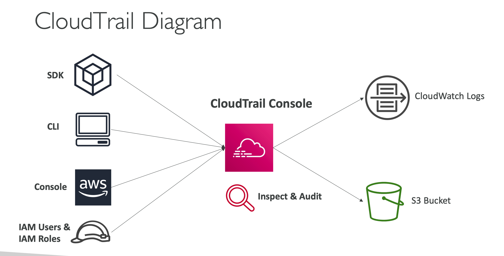
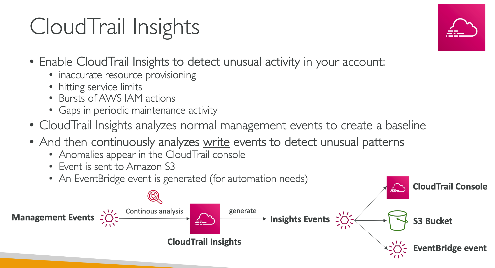

Provides governance, compliance and audit for your AWS Account
- CloudTrail is enabled by default!
- Get an history of events / API calls made within your AWS Account by:
    - Console
    - SDK
    - CLI
    - AWS Services
- Can put logs from CloudTrail into `CloudWatch Logs or S3`
- A trail can be applied to `All Regions (default)` or a single Region.
- If a resource is deleted in AWS, investigate CloudTrail first

## Cloudtrail Events
### Management Events:
- Operations that are performed on resources in your AWS account
- Examples:
- Configuring security (IAM AttachRolePolicy)
- Configuring rules for routing data (Amazon EC2 CreateSubnet)
- Setting up logging (AWS CloudTrail CreateTrail)
By default, trails are configured to log management events.
- Can `separate Read Events` (that don’t modify resources) from Write Events (that may modify resources)
### Data Events:
- By default, data events are not logged (because high volume operations)
- Amazon `S3 object-level activity (ex: GetObject, DeleteObject, PutObject): can separate Read and Write Events`
- AWS Lambda function execution activity (the Invoke API)
- Event retention is for 90 days then store them in s3 and use athena.

## Cloudtrail Insights

### CloudTrail vs CloudWatch vs X-Ray
#### CloudTrail:
- Audit API calls made by users / services / AWS console
- Useful to detect unauthorized calls or root cause of changes
#### CloudWatch:
- CloudWatch Metrics over time for monitoring
- CloudWatch Logs for storing application log
- CloudWatch Alarms to send notifications in case of unexpected metrics
#### X-Ray:
- Automated Trace Analysis & Central Service Map Visualization
- Latency, Errors and Fault analysis
- Request tracking across distributed systems