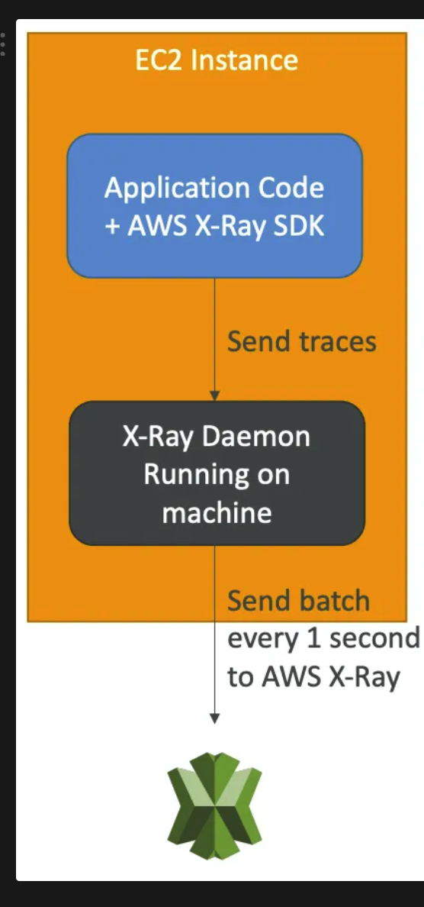
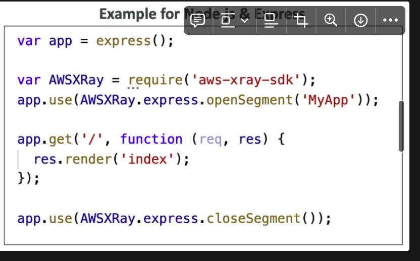
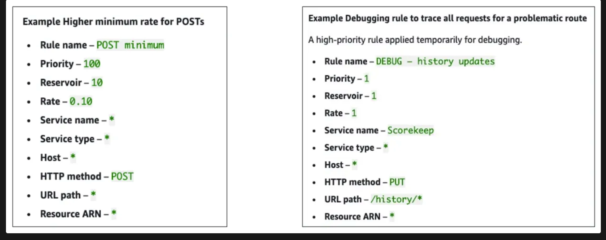
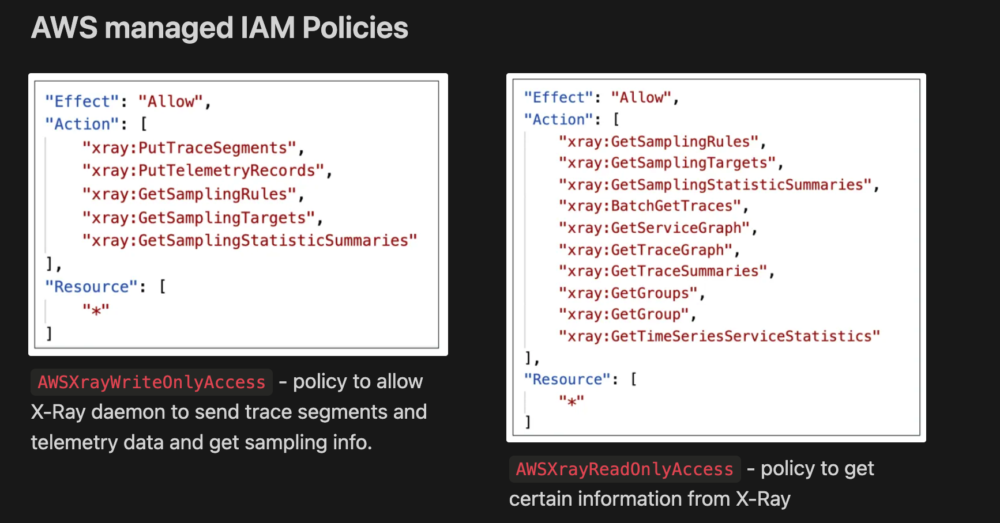
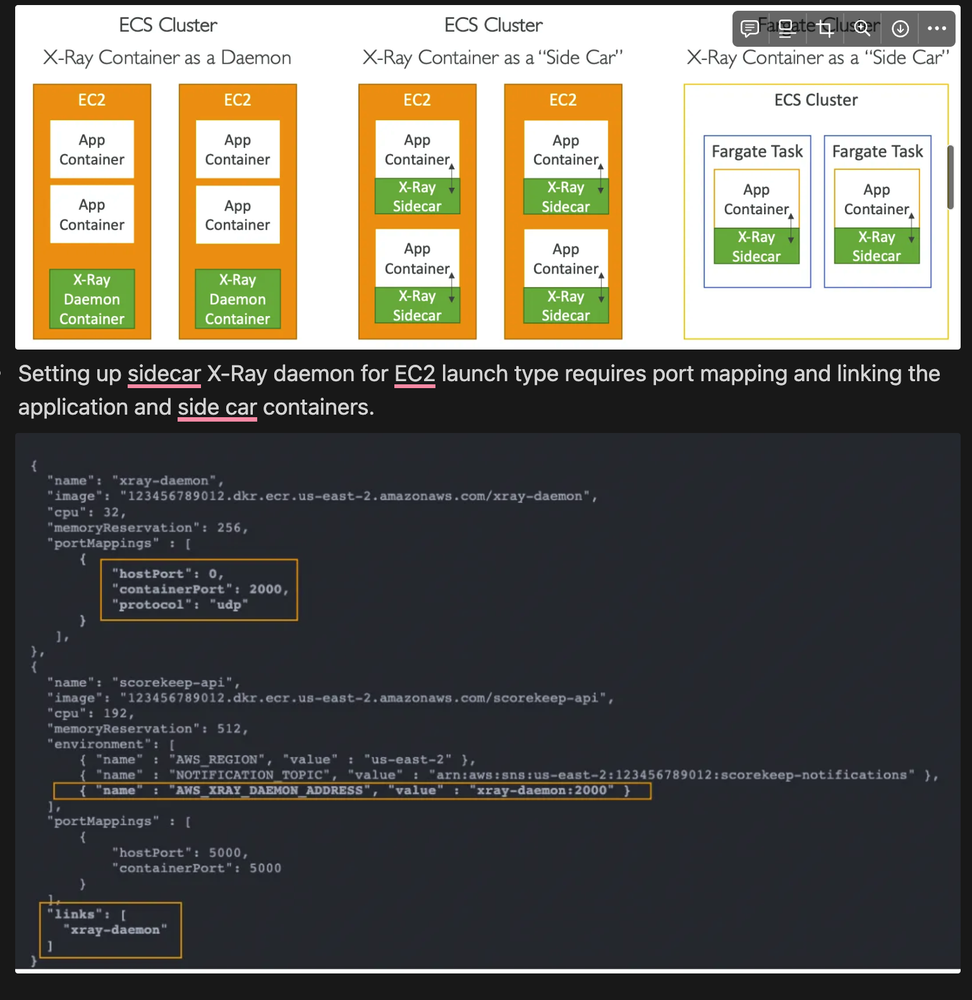
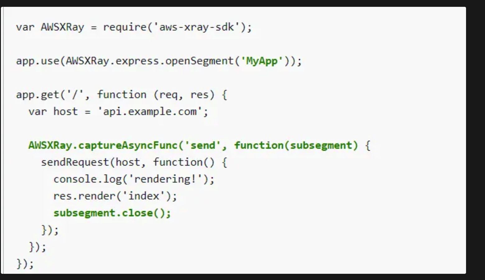

- **Provides tracing of requests as they travel through different AWS services** to
    - identify performance bottlenecks
    - pinpoint errors
    - understand dependencies in micro-services
- **Useful for micro-services (distributed) applications** where debugging is hard
- Ability to trace every request or a sample of requests
- Compatible with
    - Lambda
    - Elastic Beanstalk
    - `ECS`
    - ELB
    - API Gateway
    - EC2 instances or `on-premise servers`
- Security
    - IAM for authorization
    - KMS for encryption at rest
- Ability to **send traces across accounts** (allows to have a `central account for application tracing`)
## Enabling X-Ray

- Use the AWS **X-Ray SDK** in your code (little code modification)
- Install **X-Ray daemon** if your application is running on EC2 or `on-premise server`. For other services, enable X-Ray integration (X-Ray daemon is already running).
- Configure IAM permissions for the X-Ray daemon or AWS service to write data to X-Ray.

## How traces are sent

- X-Ray SDK captures calls to AWS services as well as other HTTP / HTTPS / Database / Queue calls.
- X-Ray SDK sends traces to X-Ray daemon through **UDP** on **port 2000** (configure port mappings and network settings in the manifest definition file to allow the application to communicate with the X-Ray daemon container- run it as a sidecar)
- `X-Ray daemon` batches the traces and sends them to X-Ray service every second.

## X-Ray instrumentation in code

- Only configuration change is required in the code
- Can modify the application code to customize and annotate the traces sent by X-Ray SDK.

## Terminologies

- **Segments**: data sent by each application / service
- **Subsegments**: provide more granular timing information and details about downstream calls (to AWS services, HTTP API or an SQL DB) that your application makes to fulfill the original request.
- **Trace**: segments collected together to form an end-to-end trace
- **Annotations**: indexed key-value pairs attached to traces for search capability and filtering traces using **filter expressions**
- **Metadata**: non-indexed key-value pairs attached to traces

## Sampling

- Control the amount of data (traces) sent to X-Ray (to reduce cost)
- `Sampling rules can be modified in the X-Ray console without changing the application code or restarting the application`. The sampling rules are automatically applied to the X-Ray daemons.
- By **default**, the X-Ray SDK records the **first request each second** (**reservoir**), and **five percent of any additional requests** (**rate**).
- Custom sampling rules
    
    Smaller priority number ⇒ higher priority
    
    
## X-Ray with ‣

- Enable X-Ray daemon by including the `xray-daemon.config` configuration file in the `.ebextensions` directory of your source code.
- Instance profile should have the required IAM permissions
- Application code should be instrumented with X-Ray SDK
- **X-Ray daemon must be manually setup in Multi-Container Docker**

- In ECS, the **X-Ray daemon must be running as a container**. For EC2 launch types we can either have 1 X-Ray daemon container per instance or per application (side car). In fargate launch type, since we have no control over the container placement, we need to use sidecar pattern.

## Misc

### 1. **Indexed Segment Fields and Searching**
   - **Subset of Segment Fields Indexed**: AWS X-Ray indexes a specific subset of segment fields for easy search and filtering. For example, if you add a `user` field to a segment and set it to a unique identifier, you can search for traces associated with a specific user in the X-Ray console or via the `GetTraceSummaries` API.
   - **Practical Use Case**: By indexing fields like user IDs, request IDs, or transaction IDs, you can easily filter out specific traces during troubleshooting or debugging.

### 2. **Segment Metadata Is Not Indexed**
   - **Segment Metadata**: Metadata is additional information you can attach to a segment in AWS X-Ray. It is helpful for debugging purposes, but it is not indexed. This means that while metadata can provide detailed information in traces, it cannot be used in search or filtering operations.
   - **Use Case**: You might add metadata like SQL query times or the result of a specific API call in the segment metadata. While you can't search for this data directly, it will appear in the detailed trace view in X-Ray for manual inspection.

### 3. **Uploading Trace Segments via the `PutTraceSegments` API**
   - **PutTraceSegments API**: This API is used to upload trace data to AWS X-Ray. Trace segments contain information about the work done in a single request by your application. You can use this API to submit custom trace data from your applications or services.
   - **Use Case**: If you have an on-premises application or a service that isn't natively integrated with X-Ray, you can use this API to send trace data to X-Ray for monitoring and troubleshooting.

### 4. **X-Ray Daemon Sends Telemetry via the `PutTelemetryRecords` API**
   - **X-Ray Daemon**: The X-Ray daemon is a background process that collects trace data generated by your application and sends it to AWS X-Ray. It uses the `PutTelemetryRecords` API to send telemetry data, such as trace summaries, service map updates, and more.
   - **Use Case**: Running the X-Ray daemon on an EC2 instance, container, or on-premises server allows you to offload the responsibility of sending telemetry data to AWS X-Ray, making the integration easier and more efficient.

### 5. **X-Ray for Serverless Applications (Preferred over CloudWatch)**
   - **X-Ray for Debugging Serverless**: AWS X-Ray is often preferred for debugging serverless applications (e.g., Lambda) because it provides deep insights into the application's performance, including end-to-end tracing across different AWS services. CloudWatch provides logs, but X-Ray provides detailed traces of individual requests and helps track latency bottlenecks.
   - **Use Case**: For example, if you have a serverless architecture with AWS Lambda functions, X-Ray can trace how each Lambda function interacts with other services (such as DynamoDB or S3) and pinpoint which part of the architecture is causing delays or failures.

### 6. **Lambda Environment Variables for X-Ray**
   - Lambda functions use environment variables to communicate with the X-Ray service:
     - **`AWS_XRAY_DAEMON_ADDRESS`**: Specifies the address where the X-Ray daemon is listening.
     - **`_X_AMZN_TRACE_ID`**: Contains the trace ID for the current request.
     - **`AWS_XRAY_CONTEXT_MISSING`**: Defines how the SDK handles missing trace context (e.g., "LOG_ERROR" logs an error if trace context is missing).
   - **Use Case**: These variables enable the automatic propagation of trace data from Lambda functions to X-Ray, making it easier to track requests as they flow through multiple Lambda functions or microservices.

### 7. **Retrieving Trace Data using `GetTraceSummaries` and `BatchGetTraces` APIs**
   - **GetTraceSummaries API**: You can use this API to get a list of trace summaries, which includes the trace IDs.
   - **BatchGetTraces API**: After getting the list of trace IDs using `GetTraceSummaries`, you can use this API to retrieve detailed trace data for those traces.
   - **Use Case**: This is useful for retrieving specific traces programmatically for further analysis or debugging in automated systems.

### 8. **Using AWS Distro for OpenTelemetry Over X-Ray**
   - **AWS Distro for OpenTelemetry (ADOT)**: If you want to send trace data to multiple tracing backends (e.g., AWS X-Ray, Datadog, Jaeger) without re-instrumenting your code, AWS Distro for OpenTelemetry is preferred over X-Ray. ADOT is a vendor-neutral, open-source solution.
   - **Use Case**: In a multi-cloud or hybrid environment, where you might need to send trace data to X-Ray and other tracing systems simultaneously, using OpenTelemetry will save effort by allowing you to manage one unified telemetry pipeline.

### 9. **Custom Subsegments for Fine-Grained Tracing**
   - **Subsegments**: In X-Ray, you can define **subsegments** to trace specific functions or lines of code within your application. This allows you to get detailed performance insights into individual components of your application, like a specific function, database query, or API call.
   - **Use Case**: You might create a subsegment for an external API call within a Lambda function to measure its latency or failure rate. This helps in pinpointing performance issues in specific parts of your code.

    
