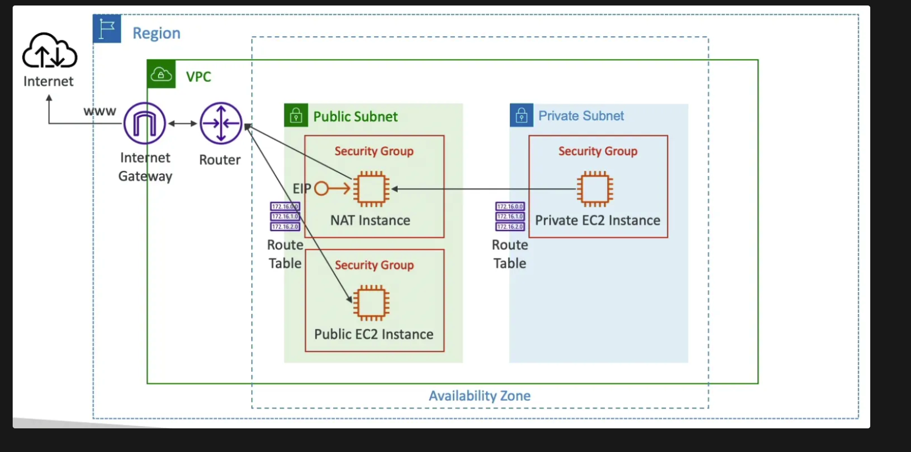

## **Amazon Virtual Private Cloud (VPC) and Related Components**

### **Amazon VPC**
### HOW TO IDENTIFY PUBLIC AND PRIVATE SUBNETS:
1. **Public Subnet**: 
   - A subnet is classified as public if its route table has a route that directs traffic to an **Internet Gateway** (IGW). 
   - Specifically, you will see a route entry for `0.0.0.0/0` pointing to `igw-xxxxxxxxxxxxxxxxx` in the route table.

2. **Private Subnet**: 
   - Conversely, a subnet is considered private if its route table does not have a route to an Internet Gateway. 
   - Instead, it may route to a **NAT Gateway** or simply have no route for `0.0.0.0/0`, meaning it cannot directly access the internet.
#### **Key Features**
- **Subnets**: A subnet is a range of IP addresses in your VPC. 
  - Each **subnet must reside in a single Availability Zone**.
- **IP Addressing**: You can assign both IPv4 and IPv6 
- **Gateways and Endpoints**: Gateways connect your VPC to another network, such as the internet or AWS services.
- **Peering Connections**: Route traffic between resources in two VPCs.
- **Traffic Mirroring**: Copy network traffic from network interfaces for inspection.
- **Transit Gateways**: Central hub to route traffic between VPCs, VPN connections, and AWS Direct Connect connections.
- **VPC Flow Logs**: Capture information about IP traffic going to and from network interfaces in your VPC.


### **VPC Endpoint**

A VPC endpoint enables you to privately connect your VPC to supported AWS services without requiring an internet gateway, NAT device, VPN connection, or AWS Direct Connect connection. 
- Traffic between your VPC and the service does not leave the Amazon network.

#### **Types of VPC Endpoints**
- **Interface Endpoints**: Use AWS PrivateLink to connect to supported AWS services and services hosted by other AWS customers and partners.
- **Gateway Endpoints**: Used for services like Amazon S3 and DynamoDB. 
  - They are configured in the route table of your VPC.

### NACL VS SECURITY GROUP:
- The default NACL allows everything outbound and everything inbound
- We define one NACL per subnet, new subnets are assigned the default NACL
- Rules have a number (1 - 32766) which defines the precedence
- Rules with lower number have higher precedence
- Last rule is has the precedence of **asterisk (*)** and denies all the requests. This rule is not editable
- **AWS recommends adding rules by increment of 100**

### **Security Groups**
   - Security groups are stateful. 
     - This means that if an inbound request is allowed, the response is automatically allowed.
   - Only support `"allow"`rules. 
   - By default, all inbound traffic is denied, and all outbound traffic is allowed.
   - Changes to security group rules take effect immediately.


### **Comparison Table**

| Feature                  | Security Groups                              | Network ACLs                              |
|--------------------------|----------------------------------------------|-------------------------------------------|
| **Level of Operation**   | Instance level                               | Subnet level                              |
| **Statefulness**         | Stateful                                     | Stateless                                 |
| **Rules**                | Only "allow" rules                           | Both "allow" and "deny" rules             |
| **Default Behavior**     | Deny all inbound, allow all outbound         | Allow all inbound and outbound by default |
| **Rule Evaluation**      | All rules are evaluated collectively         | Rules are evaluated in numerical order    |
| **Use Cases**            | Granular control at instance level           | Broad control at subnet level             |
| **Configuration**        | Immediate effect, based on IP, protocol, port| Immediate effect, based on IP, protocol, port |

### **Internet Gateway**

- horizontally scaled, redundant, and highly available VPC component. 
- It supports IPv4 and IPv6 traffic

#### **Key Functions**
- **Outbound Traffic**: Allows instances in public subnets to connect to the internet.
- **Inbound Traffic**: Allows resources on the internet to connect to instances in your VPC using public IP addresses.
- **NAT for IPv4**: Performs network address translation for IPv4 traffic.

### **NAT Gateway**

A NAT gateway is a managed service that allows instances in a private subnet to connect to the internet or other AWS services while preventing the internet from initiating connections with those instances.
- There are two types of NAT gateways: public and private.

#### **Key Functions**
- **Public NAT Gateway**: Allows instances in private subnets to **connect to the internet using an Elastic IP address**.
- **Private NAT Gateway**: Allows instances in private subnets to connect to **other VPCs or on-premises networks without using an Elastic IP address**.

### **VPC Flow Logs**

VPC Flow Logs capture information about the IP traffic going to and from network interfaces in your VPC. 
- Flow log data can be published to Amazon CloudWatch Logs, Amazon S3, or Amazon Kinesis Data Firehose.

### **VPC Monitoring**

#### **Amazon CloudWatch**
- **Metrics**:
- **Alarms**: .
- **Dashboards**: 

#### **AWS CloudTrail**

#### **VPC Flow Logs**
- **Traffic Analysis**: Use flow logs to analyze traffic patterns and troubleshoot issues.

## **VPC Endpoint Types, CIDR Ranges in VPC, and Secondary CIDRs**

### **VPC Endpoint Types**

#### **1. Interface Endpoints**
- **Description**: Interface endpoints use AWS PrivateLink to connect.
- **Components**: Consist of one or more elastic network interfaces with **private IP addresses**.
- **Supported Services**: Many AWS managed services, including Amazon S3, DynamoDB, and others.
- **Cost**: Charged based on the number of endpoints and data transfer.

#### **2. Gateway Endpoints**
- **Description**: Gateway endpoints are used to connect to specific AWS services, such as Amazon S3 and DynamoDB, **by adding entries to the route table**.
- **Components**: Targets specific IP routes in a VPC route table using prefix lists.
- **Supported Services**: Only Amazon S3 and DynamoDB.
- **Cost**: No additional cost.

### **CIDR Ranges in VPC**
- A VPC must have an associated IPv4 CIDR block, and optionally, an IPv6 CIDR block.

#### **IPv4 CIDR Blocks**
- **Private IP Ranges**: Typically fall within the private IP address ranges specified in RFC 1918:
  - 10.0.0.0/8
  - 172.16.0.0/12
  - 192.168.0.0/16
- **Public IP Ranges**: Can also use publicly routable CIDR blocks, but direct internet access requires an internet gateway.

#### **IPv6 CIDR Blocks**
- **Format**: Eight groups of four hexadecimal digits, separated by colons, followed by a double colon and a number from 1 to 128 (e.g., 2001:db8:1234:1a00::/56).
- **Global Uniqueness**: IPv6 addresses are globally unique and can be configured to remain private or reachable over the internet.

### **Secondary CIDRs**
#### **Configuration**
- **Restrictions**: Ensure that secondary CIDR blocks do not overlap with existing CIDR blocks in the VPC or peered VPCs.

### **Example Configuration for Adding Secondary CIDR**

```sh
aws ec2 associate-vpc-cidr-block --vpc-id vpc-12345678 --cidr-block 10.1.0.0/16
```

## **How Many CIDR Blocks Can Be Attached to a VPC?**


### **Primary and Secondary CIDR Blocks**

1. **Primary CIDR Block**:
   - When you create a VPC, you must specify a primary IPv4 CIDR block.
   - This primary CIDR block cannot be changed after the VPC is created.

2. **Secondary CIDR Blocks**:
   - You can associate additional (secondary) IPv4 CIDR blocks with your VPC.
   - Upto` 5 for IPV6 and IPV4`

## **Public and Private NAT Gateways in AWS**


### **Public NAT Gateway**

**Description**:
- A Public NAT Gateway enables instances in private subnets to connect to the internet.
- It resides in a public subnet and requires an Elastic IP address.
- Traffic from instances in private subnets is routed to the NAT gateway, which then forwards it to the internet gateway.
**Use Cases**:
- **Software Updates**: 
- **Accessing External APIs**:

**Configuration Steps**:
1. **Create a Public Subnet**:
2. **Create a NAT Gateway**: NAT Gateways and create a new NAT gateway in the public subnet, associating it with an Elastic IP address.
3. **Update Route Tables**:

### **Private NAT Gateway**

**Description**:
- A Private NAT Gateway enables instances in private subnets to connect to **other VPCs or on-premises networks**.
- It resides in a *`*private subnet** and does not require an Elastic IP address.`
- Traffic from instances in private subnets is routed to the NAT gateway, which then forwards it to a transit gateway.

**Key Characteristics**:
- **No Internet Access**: Used for communication between VPCs or with on-premises networks.
- **Private IP Address**: Uses a private IP address for outbound traffic.


### **Comparison Table**

| Feature                   | Public NAT Gateway                              | Private NAT Gateway                             |
|---------------------------|--------------------------------------------------|-------------------------------------------------|
| **Subnet**                | Public Subnet                                    | Private Subnet                                  |
| **Elastic IP**            | Required                                         | Not Required                                    |
| **Internet Access**       | Yes (Outbound only)                              | No                                              |
| **Use Case**              | Accessing the internet from private subnets      | Communication between VPCs or with on-premises  |
| **Traffic Routing**       | Routes to internet gateway                       | Routes to transit gateway or virtual private gateway |
| **Security**              | Prevents unsolicited inbound connections         | Enhanced security for non-internet communication |

## **AWS Transit Gateway and Elastic IP Address**

### **AWS Transit Gateway**

**Overview**:
AWS Transit Gateway is a networking service that connects Amazon Virtual Private Clouds (VPCs) and on-premises networks through a central hub.

**Key Features**:
- **Centralized Hub**: Acts as a central hub for connecting multiple VPCs, AWS accounts, and on-premises networks.
- **Inter-Region Peering**: Supports encrypted **inter-region peering, allowing VPCs**.
- **Multicast Support**: Supports multicast applications without the need for specialized hardware.


**Use Cases**:
- **Global Application Delivery**: Deploy and manage applications across multiple VPCs and regions without complex peering configurations.
- **Rapid Scaling**: Quickly add VPCs, AWS accounts, VPN capacity, or AWS Direct Connect gateways to meet demand.
- **Multicast Applications**: Host multicast applications that scale based on demand.

**How It Works**:
- **Hub-and-Spoke Model**: Connects VPCs and on-premises networks to a central hub, simplifying network management.
- **Routing**: Uses route tables to determine the next hop for traffic based on destination IP addresses.

### **Elastic IP Address**

**Overview**:
An Elastic IP address is a static IPv4 address

**Key Characteristics**:
- **Static IP**: Does not change over time, providing a consistent IP address for your resources.
- **Public IPv4 Address**: Reachable from the internet, enabling **communication with instances that do not have a public IP address**.
- **Region-Specific**: Elastic IP addresses are specific to a region.
  - `5 per region.`

**Use Cases**:
- **DNS Configuration**: Use the Elastic IP address in DNS records to ensure your domain points to the correct instance.

**Pricing**:
- **Charges**: 
  - AWS charges for Elastic IP addresses that are not associated with running instances. 
  - `There is no charge for Elastic IP addresses associated with running instances`.
- No, you cannot attach the same Elastic IP address to multiple Amazon EC2 instances simultaneously. Each Elastic IP (EIP) can only be associated with one instance or network interface at a time. 
- If you need multiple instances to share a single public IP address, you can use a Network Address Translation (NAT) gateway or a load balancer.

### Virtual Private Cloud (VPC) in AWS

#### **1. What is a VPC?**
   - **Amazon Virtual Private Cloud (VPC)** allows you to create a **logically isolated network** in the AWS cloud.
 

#### **2. VPC Components:**
   - **Subnets**: A subdivision of the VPC's IP address range. Subnets can be **public** (access to the internet) or **private** (no direct internet access).
   - **Route Tables**: Used to control routing for traffic within the VPC. Each subnet must be associated with a route table.
   - **Internet Gateway (IGW)**: Allows communication between instances in the VPC and the internet.
   - **Elastic IP**: A static public IP that can be associated with instances for internet access.
   - **NAT Gateway**: Allows instances in a private subnet to connect to the internet without exposing them to inbound traffic.
   - **Network Access Control Lists (NACLs)**: A stateless firewall for controlling inbound and outbound traffic at the subnet level.
   - **Security Groups**: A stateful firewall that controls inbound and outbound traffic for EC2 instances.

---

### **Steps to Create a VPC, Attach Subnets, Route Tables, and Internet Gateway**

#### **Step 1: Create a VPC**
   - **Go to the VPC Console**:
     1. Navigate to the **VPC Dashboard** in the AWS Management Console.
     2. Click on **"Create VPC"**.

   - **Configure VPC Settings**:
     1. **Name Tag**: Provide a name for your VPC (e.g., `My-VPC`).
     2. **IPv4 CIDR Block**: Specify the IP address range for the VPC in CIDR notation (e.g., `10.0.0.0/16`).
        - The `/16` CIDR block provides 65,536 IP addresses, a good range for many deployments.
     3. **Tenancy**: Choose between **default** (shared hardware) or **dedicated** (instances run on dedicated hardware). 

   - **Click "Create VPC"**: Your VPC is now created, but no subnets or gateways are yet attached.

#### **Step 2: Create Subnets**
   - **Public Subnet**:
     1. Navigate to the **Subnets** section of the VPC dashboard.
     2. Click **"Create Subnet"**.
     3. Choose the **VPC** created earlier.
     4. **Name Tag**: Give it a name (e.g., `Public-Subnet`).
     5. **Availability Zone**: Select an AZ (e.g., `us-east-1a`).
     6. **IPv4 CIDR Block**: Specify a subset of your VPC’s IP range (e.g., `10.0.1.0/24` for the public subnet).
     7. **Click "Create"**.

   - **Private Subnet**:
     1. Repeat the above process to create a **Private Subnet**.
     2. **IPv4 CIDR Block**: Use a different range from the VPC (e.g., `10.0.2.0/24` for private subnet).

#### **Step 3: Create an Internet Gateway (IGW)**
   - **Create the IGW**:
     1. Go to the **Internet Gateways** section.
     2. Click **"Create Internet Gateway"**.
     3. **Name Tag**: Give the gateway a name (e.g., `My-IGW`).
     4. **Click "Create"**.

   - **Attach IGW to VPC**:
     1. After creating the IGW, select it and click **"Attach to VPC"**.
     2. Choose the **VPC** you created earlier and attach the IGW.

#### **Step 4: Create and Configure Route Tables**
   - **Create Route Table for Public Subnet**:
     1. Navigate to **Route Tables** in the VPC console.
     2. Click **"Create Route Table"**.
     3. **Name Tag**: Give it a name (e.g., `Public-Route-Table`).
     4. Choose the VPC created earlier and click **Create**.

   - **Edit Routes**:
     1. Select the **Public Route Table** and click **"Edit Routes"**.
     2. Add a route with the destination `0.0.0.0/0`.
     3. For the **target**, select the **Internet Gateway (IGW)** you attached earlier.
     4. Save the changes.

   - **Associate the Route Table with the Public Subnet**:
     1. Go to **Subnet Associations** under the public route table.
     2. Click **Edit Subnet Associations**, select your **Public Subnet**, and save.

   - **Create Route Table for Private Subnet**:
     1. Repeat the process to create a **Private Route Table**, but do not attach an IGW.
     2. You can add a route for a **NAT Gateway** if you want the private subnet to have outbound internet access (e.g., for software updates).

---
Here are some **scenario-based interview questions** on **VPC**, covering different concepts like subnets, route tables, internet gateways, and troubleshooting:

---

### **Question 1: Public Subnet Connectivity Issue**
**Scenario**: You have created a VPC with one public and one private subnet. You launched an EC2 instance in the public subnet, but it is not accessible over the internet. You verified that the security group allows inbound SSH traffic, and the instance has a public IP. What could be the problem and how would you troubleshoot?

**Answer**:
1. **Check the Internet Gateway (IGW)**:
   - Ensure that an **Internet Gateway (IGW)** is attached to the VPC.
   - If no IGW is attached, attach one to the VPC.

2. **Check Route Table for Public Subnet**:
   - Verify that the **public subnet's route table** has a route for `0.0.0.0/0` that points to the **Internet Gateway**.
   - If missing, add a route entry in the route table with `0.0.0.0/0` as the destination and the IGW as the target.

3. **Check Network ACLs**:
   - Ensure that the **Network ACL** (NACL) associated with the public subnet allows inbound and outbound traffic for the relevant ports (e.g., port 22 for SSH).
   - Check if the NACL is blocking the incoming/outgoing traffic.

4. **Elastic IP**:
   - If the instance was launched without an Elastic IP and relies on AWS-assigned public IP, ensure that a public IP was assigned during instance launch.
   - If needed, associate an **Elastic IP** to ensure static access.

---

### **Question 2: Private Subnet Internet Access**
**Scenario**: You have a private subnet, and you need instances in this subnet to access the internet for software updates, but they should not be publicly accessible. How would you design this setup?

**Answer**:
1. **Create a NAT Gateway**:
   - Launch a **NAT Gateway** in the **public subnet** to allow instances in the private subnet to initiate outbound internet connections.
   - Ensure the NAT Gateway has an **Elastic IP** associated with it.

2. **Configure Route Table for Private Subnet**:
   - Modify the **private subnet's route table** to add a route:
     - Destination: `0.0.0.0/0`
     - Target: The **NAT Gateway** (not the Internet Gateway).
   
3. **Security Group and NACLs**:
   - Ensure that the **Security Group** associated with the private instances allows outbound traffic.
   - The **NACL** for the private subnet should allow outbound traffic (typically for ports 80/443 for HTTP/HTTPS).

---

### **Question 3: Instances in Private Subnet Can't Connect to the Internet**
**Scenario**: You configured a NAT Gateway in the public subnet, but instances in the private subnet still can't connect to the internet. What could be the problem, and how would you troubleshoot?

**Answer**:
1. **Check NAT Gateway**:
   - Verify that the **NAT Gateway** is **in an active state** and associated with an **Elastic IP**.
   - Ensure that the NAT Gateway is placed in a **public subnet**.

2. **Check Private Subnet Route Table**:
   - Ensure the **route table associated with the private subnet** has the route `0.0.0.0/0` pointing to the NAT Gateway's ID.
   - If not, add the correct route for external internet access.

3. **Check Security Group and NACL**:
   - Ensure that the **Security Group** for private instances allows outbound internet access (e.g., port 80 for HTTP, port 443 for HTTPS).
   - The **NACL** associated with the private subnet should allow both inbound and outbound traffic.

4. **Test with Ping**:
   - From a private instance, try using `ping 8.8.8.8` to verify outbound traffic. If ping works but DNS resolution fails, check if the private subnet’s **DNS settings** allow instances to resolve domain names.

---

### **Question 4: Route Table Mismatch**
**Scenario**: You have two subnets: one public and one private. Instances in the public subnet are unable to communicate with instances in the private subnet. What could be wrong?

**Answer**:
1. **Check Route Tables**:
   - Ensure that the **route tables** of both the public and private subnets have appropriate routes for internal communication.
   - Example: If the public subnet’s CIDR is `10.0.1.0/24` and the private subnet’s CIDR is `10.0.2.0/24`, both route tables should allow routing between these CIDR blocks.
   
2. **Check Security Groups**:
   - Ensure that the **Security Group** for instances in both subnets allows inbound traffic from each other's CIDR range (e.g., allow traffic from `10.0.2.0/24` to `10.0.1.0/24` and vice versa).
   
3. **Check NACLs**:
   - Ensure that **Network ACLs** for both subnets allow internal traffic between the subnets' IP ranges.

4. **Check Subnet Type**:
   - Verify that the private subnet isn’t misconfigured as a public subnet. If the **route table** for the private subnet includes a route to the **Internet Gateway**, then it is incorrectly considered a public subnet.

---

### **Question 5: Multi-VPC Communication Issue**
**Scenario**: You have two VPCs, and you set up **VPC Peering** between them. Instances in both VPCs cannot communicate with each other. What could be the cause?

**Answer**:
1. **Check VPC Peering Status**:
   - Ensure that the **VPC Peering connection** is in an **active** state.

2. **Check Route Tables in Both VPCs**:
   - Ensure that both VPCs’ **route tables** have entries for each other’s CIDR blocks.
   - Example: If VPC A has CIDR `10.0.0.0/16` and VPC B has `192.168.0.0/16`, the route table in VPC A should have a route for `192.168.0.0/16` pointing to the VPC Peering connection, and vice versa for VPC B.

3. **Check Security Groups and NACLs**:
   - Ensure that **Security Groups** in both VPCs allow traffic from each other’s CIDR ranges.
   - Also check **Network ACLs** to ensure they permit the traffic between the VPC CIDR ranges.

4. **Check DNS Settings (Optional)**:
   - If you're trying to resolve instance names across VPCs, ensure that **DNS resolution and hostname settings** are enabled for the VPC Peering connection.

---

