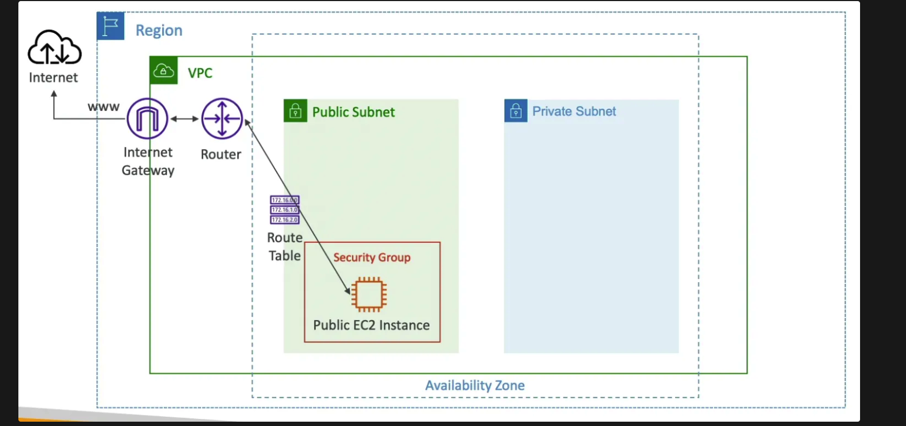
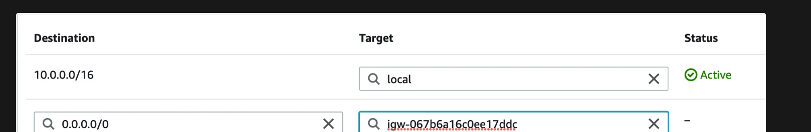
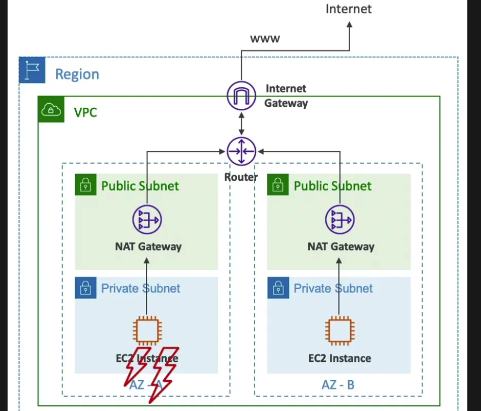
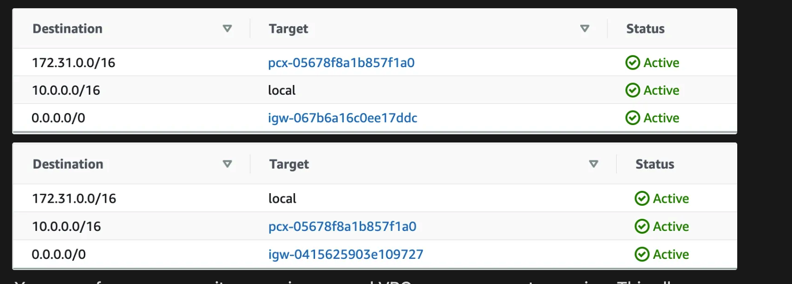
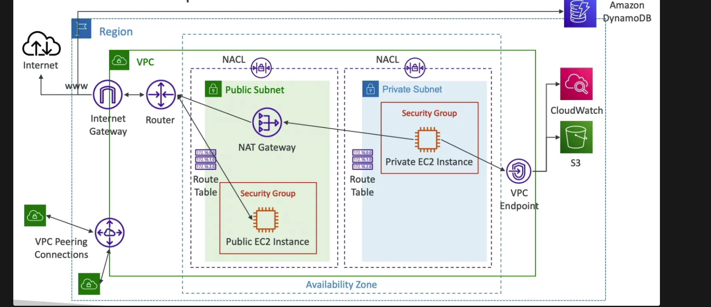

## Intro

- **Regional resource**
- Soft limit of `5 VPCs` per region
- Only the Private IPv4 ranges are allowed

## Subnets

- Sub-ranges of IP addresses within the VPC
- **Each subnet is bound to an AZ**
- Subnets in a VPC cannot have overlapping CIDRs
- **Default VPC only has `public subnets`** (1 public subnet per AZ, no private subnet)
- **AWS reserves 5 IP addresses (first 4 & last 1) in each subnet**. These 5 IP addresses are not available for use.
Example: if CIDR block 10.0.0.0/24, then reserved IP addresses are 10.0.0.0, 10.0.0.1, 10.0.0.2, 10.0.0.3 & 10.0.0.255

<aside>
💡 To make the EC2 instances running in private subnets accessible on the internet, place them behind an internet-facing (running in public subnets) Elastic Load Balancer.

</aside>

<aside>
💡 There is no concept of Public and Private subnets. Public subnets are subnets that have:

- “Auto-assign public IPv4 address” set to “Yes”
- The subnet route table has an attached Internet Gateway

This allows the resources within the subnet to make requests that go to the public internet. **A subnet is private by default.**

Since the resources in a private subnet don't have public IPs, they need a NAT gateway for address translation to be able to make requests that go to the public internet. 
- NAT gateway also prevents these private resources from being accessed from the internet.

</aside>

## Internet Gateway (IGW)

- Allows resources in a VPC to connect to the Internet
- **Attached to the VPC** (not subnets)
- Should be used to **connect public resources to the internet** (use NAT gateway for private resources since they need network address translation)
- Route table of the public subnets must be edited to allow requests destined outside the VPC to be routed to the IGW
    
    

<aside>
💡 IGW performs network address translation (NAT) for a public EC2 instance

</aside>

## Network Address Translation (NAT) Instance

- An EC2 instance **launched in the public subnet** which performs network address translation to enable private instances to use the public IP of the NAT instance to access the internet. This is exactly the same as how routers perform NAT. This also prevents the private instances from being accessed from the public internet.
- **Must disable EC2 setting: source / destination IP check on the NAT instance** as the IPs can change.
- **Must have an Elastic IP attached to it**
- Route Tables for private subnets must be configured to route internet-destined traffic to the NAT instance (its elastic IP)
- **Can be used as a Bastion Host**

### **Disadvantages**

- Not highly available or resilient out of the box. Need to create an ASG in multi-AZ + resilient user-data script
- Internet traffic bandwidth depends on EC2 instance type
- You must manage Security Groups & rules:
    - Inbound:
        - Allow HTTP / HTTPS traffic coming from Private Subnets
        - Allow SSH from your home network (access is provided through Internet Gateway)
    - Outbound:
        - Allow HTTP / HTTPS traffic to the Internet

## NAT Gateway

- AWS managed NAT with **bandwidth autoscaling** (up to 45Gbps)
- Preferred over NAT instances
- **Uses an Elastic IP** and Internet Gateway behind the scenes
- **Created in a public subnet**
- **Bound to an AZ**
- **Cannot be used by EC2 instances in the same subnet** (only from other subnets)
- **Cannot be used as a Bastion Host**
- Route Tables for private subnets must be configured to route internet-destined traffic to the NAT gateway
- No Security Groups to manage
- Pay per hour

### High Availability

- Create NAT gateways in public subnets bound to different AZ all routing outbound connections to the IGW (attached to the VPC)
- No `cross-AZ failover needed because if an AZ goes down, all of the instances in that AZ also go down`.

## Network Access Control List (NACL)

- NACL is a firewall at the subnet level
- One NACL per subnet but a NACL can be attached to multiple subnets
- **New subnets are assigned the Default NACL**
- **Default NACL allows all inbound & outbound requests**
   
- NACL Rules
    - Based only on IP addresses
    - Rules number: 1-32766 (lower number has higher precedence)
    - First rule match will drive the decision
    - The last rule denies the request (only when no previous rule matches)

### NACL vs Security Group

| Security Group | NACL |
| --- | --- |
| Firewall for EC2 (applied to ENI) | Firewall for subnets |
| Supports only Allow rules | Supports both Allow and Deny rules |
| Stateful (only request will be evaluated against the SG rules) | Stateless (both request and response will be evaluated against the NACL rules) |
| All rules are evaluated | Only the first matched rule is considered |

## VPC Peering

- Connect two VPCs (could be in **different regions or accounts**) using the AWS private network
- Participating VPCs must have **non-overlapping CIDR**
- VPC Peering connection is **non-transitive** (A - B, B - C != A - C) because it works based on route-table rules.
- Must update route tables in each VPC’s subnets to ensure requests destined to the peered VPC can be routed through the peering connection
    
- You can reference a security group in a peered VPC across account or region. This allows us to use SG instead of CIDR when configuring rules.

## VPC Endpoints

- **Private endpoints** within your VPC that allow AWS services to privately connect to resources within your VPC without traversing the public internet (cheaper)
- Powered by **AWS PrivateLink**
- **Route table is updated automatically**
- **Bound to a region** (do not support inter-region communication)
- `Need to create separate endpoints for different resources`
- Two types:
    - **Interface Endpoint**
        - Provisions an **ENI** (private IP) as an entry point per subnet
        - Need to **attach a security group to the interface endpoint** to control access
        - Supports most AWS services
    - **Gateway Endpoint**
        - Provisions a gateway
        - Must be used as a target in a route table
        - Supports only **S3** and **DynamoDB**

## VPC Flow Logs

- Captures information about **IP traffic** going into your **interfaces**
- Three levels:
    - **VPC** Flow Logs
    - **Subnet** Flow Logs
    - **ENI** Flow Logs
- Can be configured to show accepted, rejected or all traffic
- Flow logs data can be sent to **S3** (bulk analytics) or **CloudWatch Logs** (near real-time decision making)
- Query VPC flow logs using **Athena** in S3 or **CloudWatch Logs Insights** or have a subscription filter and then push these logs into kinesis firehose.

## Connecting to On-Premise

- **Site-to-site VPN** - **IPSec encrypted** connection over the public internet
- **Direct Connect (DX)** - Dedicated connection
    - Not encrypted (but private connection)
    - Takes about 30 days to setup