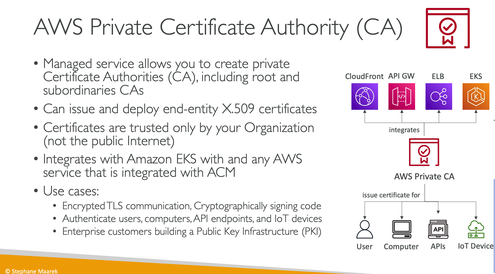
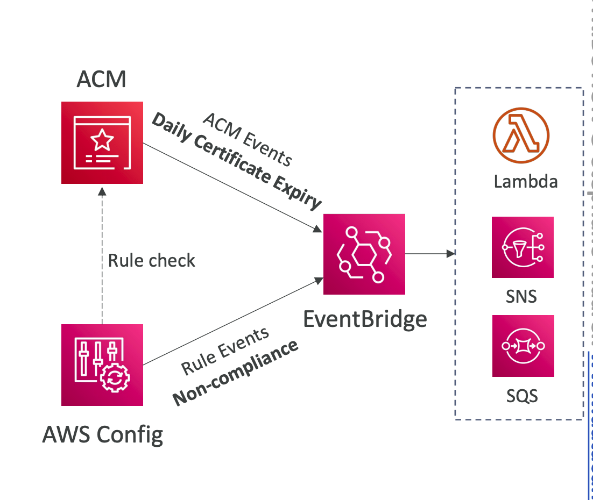

- Provision, manage and deploy TLS Certificates easily
- **Supports both public and private TLS certificates**
- Free for `public TLS certificates`
- TLS certificates can be loaded on:
    - ELB
    - API Gateway
    - CloudFront Distributions
- If we already have a certificate, we can load them to ACM. Otherwise, we can request a certificate from ACM directly.
- **ACM issued certificates are valid for 13 months.** They are also renewed automatically.

- **Imported certificates are not automatically renewed** and `would need to be imported after getting renewed from the 3rd party.`
- An ACM certificate that was validated using DNS validation will automatically renew if the certificate is still being using by an AWS service 60 days prior to its expiration and has an ACM-provided CNAME that is accessible via public DNS. If the certificate is not being used or if the CNAME is not correct, ACM will not automatically validate the DNS and will send notifications starting at 45 days prior to the expiration date.
- For regions where ACM is not supported, **IAM Certificate Store** can be used to import SSL certificates issued by a 3rd party.
- ACM sends daily expiration events
starting 45 days prior to expiration
- The # of days can be configured
- Events are appearing in EventBridge
- AWS Config has a managed rule
named `acm-certificate-expirationcheck` to check for expiring certificates (configurable number of
days)
