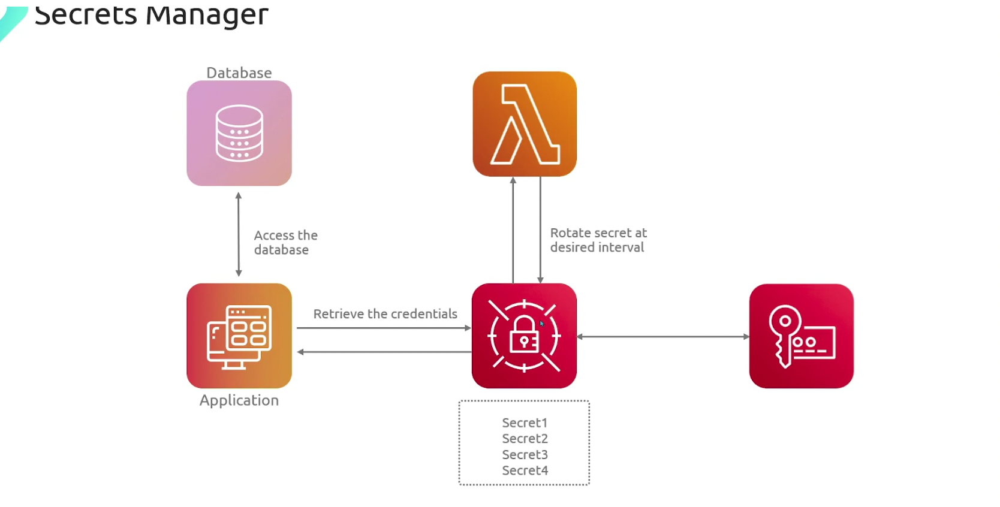

- AWS Secrets Manager helps you manage, retrieve, and rotate database credentials, application credentials, OAuth tokens, API keys, and other secrets throughout their lifecycles
    - With Secrets Manager, you can configure an automatic rotation schedule for your secrets. This enables you to replace long-term secrets with short-term ones, significantly reducing the risk of compromise
    - Encrypts the secret at rest.
    - Encryption at transit is also present.
    - When you use Secrets Manager, you pay only for what you use, with no minimum or setup fees. 
    - There is no charge for secrets that are marked for deletion
    - If you enable AWS CloudTrail on your account, you can obtain logs of the API calls that Secrets Manager sends out. 

- Secrets Manager logs all events as management events. 

AWS CloudTrail stores the first copy of all management events for free. However, you can incur charges for Amazon S3 for log storage and for Amazon SNS if you enable notification