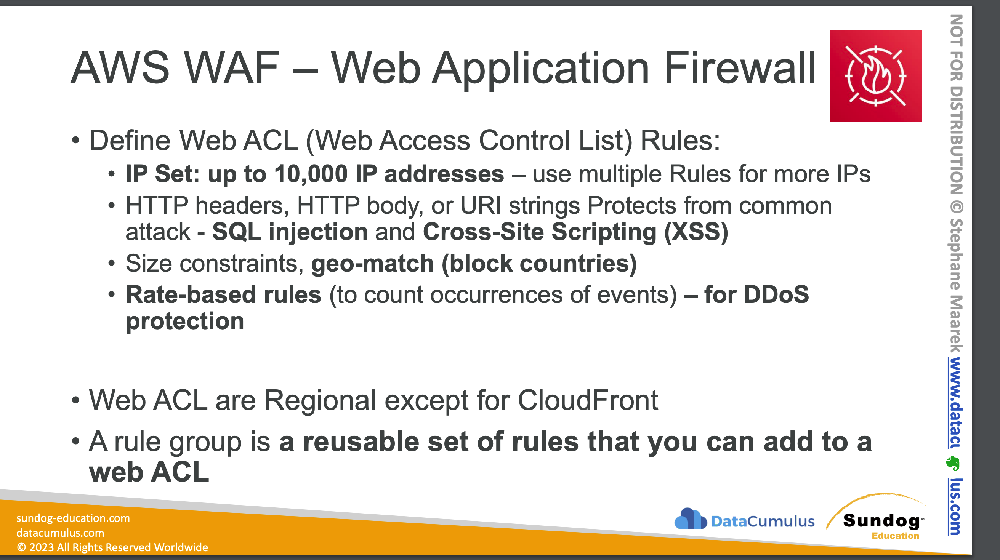
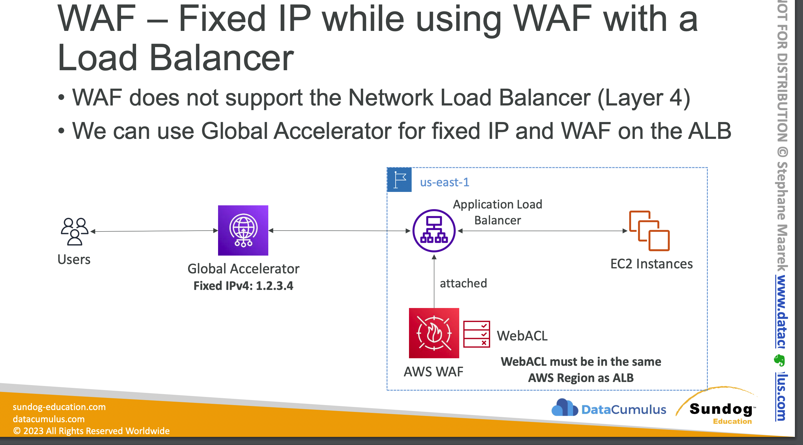

- Cloud front(DEFINED GLOBALLY FOR THIS) because this is not in the same region
- Api gateway
- COGNITO WEB POOL
- APP SYNC GRAPH QL
- Deploy on Application Load Balancer (localized rules)
- Deploy on API Gateway (rules running at the regional or edge level)
- Deploy on CloudFront `(rules globally on edge locations)`
- Used to front other solutions: CLB, EC2 instances, custom origins, S3 websites
- Deploy on AppSync (protect your GraphQL APIs)
- WAF is not for DDoS protection
- Define Web ACL (Web Access Control List):
    - Rules can include IP addresses, HTTP headers, HTTP body, or URI strings
- Protects from common attack - SQL injection and Cross-Site Scripting (XSS)
    - `Size constraints`, `Geo match`
    - Rate-based rules (to count occurrences of events)
- Rule Actions: Count | Allow | Block | CAPTCHA

### Web ACL:
- To filter based on IP sets(One set has 10k IP)
- Add Rule Groups or Rules - processed in order
- Web ACL Capacity Units (WCU) - Default 1500
        ○ can be increased via support ticket
        ○ WEBACL’s are associated with resources (this can take time)
    • adjusting a WEBACL takes less time than associating one

- Protects from:
    - Sql Injection
    - Cross site scripting

#### How to use WAF On an ALB?
- Challenge is ALB does not have a fixed IP
- We can go for global accelerator for fixed UP and WAF on ALB.
  
    
## AWS WAF – Managed Rules
- Library of over 190 managed rules
- Ready-to-use rules that are managed by AWS and AWS Marketplace Sellers
- Baseline Rule Groups – general protection from common threats
- AWSManagedRulesCommonRuleSet, AWSManagedRulesAdminProtectionRuleSet
- Use-case Specific Rule Groups – protection for many AWS WAF use cases
    - AWSManagedRulesSQLiRuleSet, - AWSManagedRulesWindowsRuleSet,
- Bot Control Managed Rule Group – block and manage requests from bots