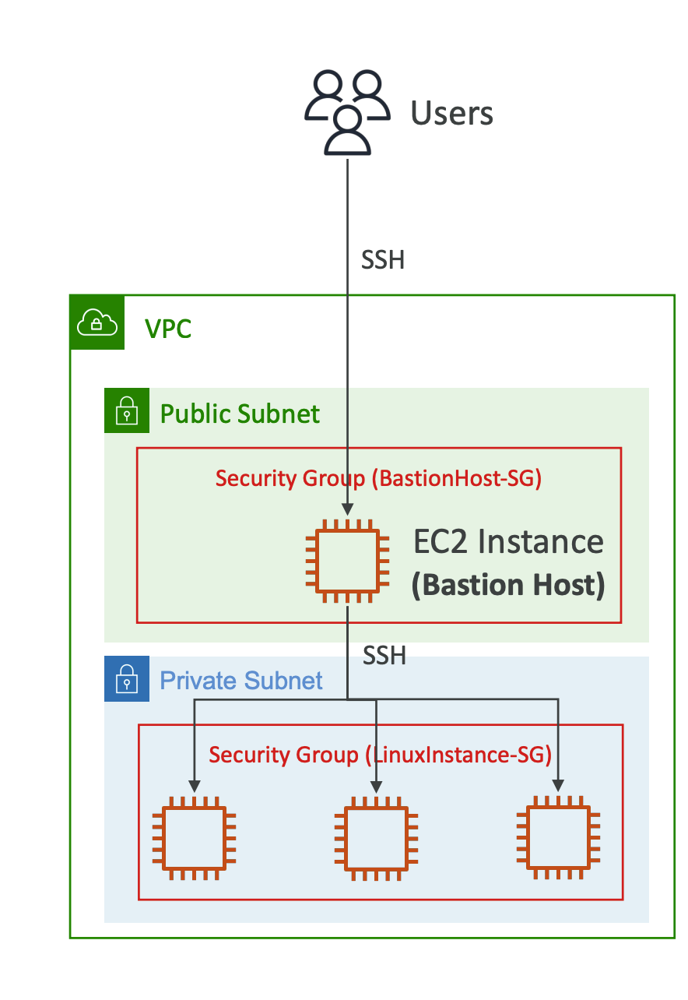

- We can use a Bastion Host to SSH into
our private EC2 instances
- The bastion is in the public subnet which is then connected to all other private subnets
- Bastion Host security group must allow
inbound from the internet on port 22 from
restricted CIDR, for example the public
CIDR of your corporation
- Security Group of the EC2 Instances must allow the Security Group of the Bastion Host, or the private IP of the Bastion host.
