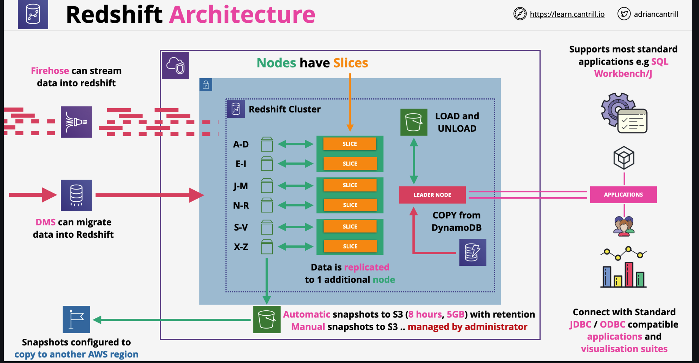
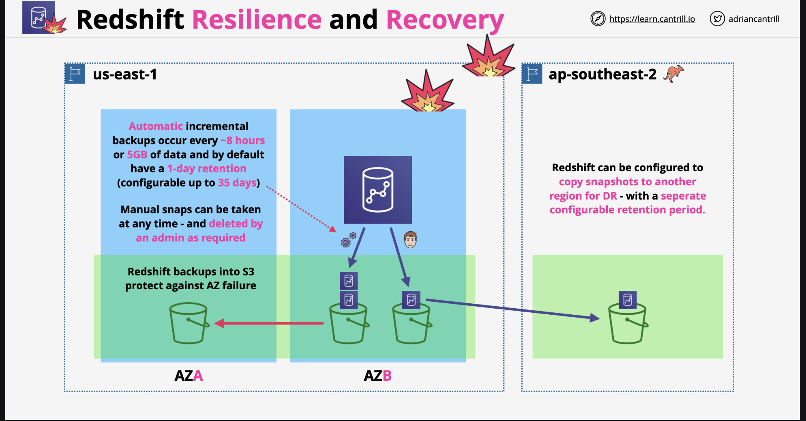

# Amazon Redshift

- It is petabyte scale data warehouse
- It is designed for reporting and analytics
- It is an OLAP (column based) database, not OLTP (row/transaction)
## Node Types
Amazon Redshift offers various **node types** with different configurations for **storage** and **performance** to handle a wide range of data warehousing needs. These node types are primarily divided into two categories: **RA3 nodes** and **DS2 and DC2 nodes**.

### 1. RA3 Nodes

RA3 nodes are the latest generation and are designed to provide **separate storage and compute** capabilities, allowing for more efficient data processing. With RA3 nodes, you can scale **compute** and **storage** independently based on your needs.
#### Key Features of RA3 Nodes

- **Managed Storage**: RA3 nodes use **Amazon Redshift Managed Storage (RMS)**, which automatically manages data storage by moving frequently accessed data to high-performance SSDs and less-frequently accessed data to S3.
- **Cost-Effective Scaling**: As storage and compute are decoupled, you can scale storage without needing to add additional compute resources, making RA3 nodes cost-efficient for large datasets.
- **Concurrency Scaling**: RA3 nodes support Redshift’s concurrency scaling feature, allowing you to handle thousands of concurrent queries.

### 2. DC2 Nodes (Dense Compute)

DC2 nodes are optimized for **high-performance compute** and are best for workloads with high compute demands and smaller data sets that fit within the on-node SSD storage.

#### Key Features of DC2 Nodes

- **High-Performance SSD Storage**: DC2 nodes use fast SSD storage, which makes them suitable for performance-sensitive applications with smaller datasets.
- **Compute-Optimized**: DC2 nodes are designed for applications needing high-speed processing of small to medium-sized datasets.

### 3. DS2 Nodes (Dense Storage)

DS2 nodes are designed for **storage-intensive workloads** that don’t require high compute power. These nodes are best for workloads with larger datasets that don’t require fast SSD storage.

#### Types of DS2 Nodes

#### Key Features of DS2 Nodes

- **High Storage Capacity**: DS2 nodes use HDD storage, offering high storage capacity at a lower cost than SSD-based nodes.
- **Cost-Effective for Storage-Intensive Applications**: DS2 nodes are ideal if your workload requires significant storage but doesn’t demand the higher speeds of SSD.

### Choosing the Right Node Type

- **RA3 Nodes**: Choose for flexibility and scalability when you need high storage and want to scale compute independently.
- **DC2 Nodes**: Choose for high-performance compute with a smaller dataset that fits within the SSD storage limits.
- **DS2 Nodes**: Choose for storage-intensive workloads that don’t require high-speed SSDs and are cost-sensitive.

Each node type is optimized for different workloads, allowing you to select the most suitable configuration based on your data volume, performance needs, and budget.
## Advanced features of Redshift:
    - RedShift Spectrum: allows querying data from S3 without loading it into Redshift platform
    - Federated Query: directly query data stored in remote data sources
- Redshift integrates with Quicksight for visualization
- It provides a `SQL-like interface` with JDBC/ODBC connections
- By Redshift is a `provisioned product, it is not serverless` (AWS offers Redshift Serverless option as well). It does come with provisioning time
- It uses a cluster architecture. A cluster is a private network, and `it can not be accessed directly`
- Redshift runs in one AZ, `not HA by design`
- All clusters have a leader node with which we can interact in order to do querying, planning and aggregation
- Compute nodes: perform queries on data. A compute node is partition into slices. Each slice is allocation a portion of memory and disk space, where it processes a portion of workload. Slices work in parallel, a node can have 2, 4, 16 or 32 slices, depending the resource capacity
- Redshift if s VPC service, it uses VPC security: IAM permissions, KMS encryption at rest, CloudWatch monitoring
- Redshift Enhance VPC Routing:
    - By default Redshift uses public routes for traffic when communicating with external services or any public AWS service (such as S3)
    - When enabled, traffic is routed based on the VPC networking configurations (SG, ACLs, etc.)
    - Traffic is routed based on the VPC networking configuration
    - Traffic can be controlled by security groups, it can use network DNS, it can use VPC gateways
- Redshift architecture:

In Amazon Redshift, `VACUUM` is a command used to **reclaim storage space** and **improve performance** by reorganizing and compacting data on disk. Over time, as data is deleted or updated, Redshift tables can become fragmented, leading to inefficient use of storage and slower query performance. Running `VACUUM` helps address these issues by re-sorting and compacting tables.

### Types of VACUUM Operations in Redshift

1. **VACUUM FULL**:
   - Completely re-sorts all rows and reclaims deleted space.
   - Ideal after heavy DELETE operations.
   - Syntax: 
     ```sql
     VACUUM FULL table_name;
     ```

2. **VACUUM SORT ONLY**:
   - Only re-sorts data without reclaiming deleted space.
   - Useful when new data is appended without significant deletions.
   - Syntax:
     ```sql
     VACUUM SORT ONLY table_name;
     ```

3. **VACUUM DELETE ONLY**:
   - Reclaims space from deleted rows but doesn’t re-sort.
   - Useful when there are many deletions but the sort order is intact.
   - Syntax:
     ```sql
     VACUUM DELETE ONLY table_name;
     ```

4. **VACUUM REINDEX**:
   - Rebuilds the interleaved sort key index, improving query performance for tables with interleaved sort keys.
   - Syntax:
     ```sql
     VACUUM REINDEX table_name;
     ```

### Running VACUUM with Parameters

You can adjust the `VACUUM` operation to specify the level of re-sorting and compaction:

```sql
VACUUM FULL table_name TO threshold_percent;
```

- `threshold_percent`: Specifies the percentage of unsorted rows that triggers the re-sorting. For example, setting this to `80` will only vacuum the table if 80% or more of rows are unsorted.

### Considerations for Using VACUUM

- **Timing**: `VACUUM` can be resource-intensive, so it’s recommended to run during low-usage periods.
- **Table Size**: Large tables can take time to vacuum. Consider running `VACUUM` incrementally with the `TO threshold_percent` option.
- **Automatic Vacuuming**: Redshift has automated vacuuming and analyze features, so in some cases, manual vacuuming may be less necessary.

### Example Usage

To reclaim space and re-sort rows on a table named `sales`:

```sql
VACUUM FULL sales;
```

Or, to only reclaim deleted space:

```sql
VACUUM DELETE ONLY sales;
```

Running `VACUUM` regularly can improve query performance, especially for tables that experience frequent updates and deletes in Redshift.

## Redshift Components
-  **Cluster**: a set of nodes, which consists of a leader node and one or more compute nodes
    - Redshift creates one database when we provision a cluster. This is the database we use to load data and run queries on your data
    - We can scale the cluster in or out by adding or removing nodes. Additionally, we can scale the cluster up or down by specifying a different node type
    - Redshift assigns a 30-minute maintenance window at random from an 8-hour block of time per region, occurring on a random day of the week. During these maintenance windows, the cluster is not available for normal operations
    - Redshift supports both the EC2-VPC and EC2-Classic platforms to launch a cluster. We create a cluster subnet group if you are provisioning our cluster in our VPC, which allows us to specify a set of subnets in our VPC
- **Redshift Nodes**:
    - The leader node receives queries from client applications, parses the queries, and develops query execution plans. It then coordinates the parallel execution of these plans with the compute nodes and aggregates the intermediate results from these nodes. Finally, it returns the results back to the client applications
    - Compute nodes execute the query execution plans and transmit data among themselves to serve these queries. The intermediate results are sent to the leader node for aggregation before being sent back to the client applications
    - Node Type:
        - Dense storage (DS) node type – for large data workloads and use hard disk drive (HDD) storage
        - Dense compute (DC) node types – optimized for performance-intensive workloads. Uses SSD storage
- **Parameter Groups**: a group of parameters that apply to all of the databases that we create in the cluster. The default parameter group has preset values for each of its parameters, and it cannot be modified

## Redshift Resilience and Recovery

- Redshift can use S3 for backups in the form a snapshots
- There are 2 types of backups:
    - Automated backups: occur every `8 hours or after every 5 GB of data`, by default having 1 day retention (max 35). Snapshots are incremental
    - Manual snapshots: performed after manual triggering, no retention period
- Restoring from `snapshots creates a brand new cluster`, we can chose a working AZ to be provisioned into as it is single AZ by default and this can be used for HA design.
- We can copy snapshots to another region where a new cluster can be provisioned
- Copied snapshots also can have retention periods


## Amazon Redshift Workload Management (WLM) 

- Enables users to flexibly manage priorities within workloads so that short, fast-running queries won’t get stuck in queues behind long-running queries
- Amazon Redshift WLM creates query queues at runtime according to service classes, which define the configuration parameters for various types of queues, including internal system queues and user-accessible queues
- From a user perspective, a user-accessible service class and a queue are functionally equivalent