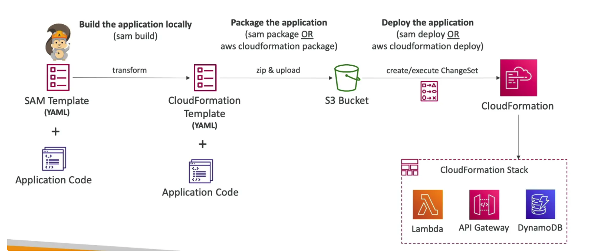

- IaC (YAML) for deploying serverless applications easily
- Abstraction over [CloudFormation]
 to allow developers to easily deploy their code
- Can deploy Lambda, API Gateway and DynamoDB locally for development using **SAM CLI** and **AWS Toolkits**
- Uses **CodeDeploy** under the hood to update Lambda functions

## Workflow & Commands
- `sam build` - Fetch dependencies & build the application. If the application code does not require building, skip this command and run `sam package` directly.
- `aws cloudformation package` or `sam package` - Convert the SAM template to CloudFormation template, package the application code and the CloudFormation template and upload to an S3 bucket (must be created beforehand).
- `aws cloudformation deploy` or `sam deploy` - Deploy the application package from S3 (creates and executes Change Set in CloudFormation)
- `sam publish` - publish serverless app to SAR (only needs the CF template, the code is referenced from S3)

## Template

- `Transform: "AWS::Serverless-2016-10-31'` - indicates that the YAML file is a SAM template (required)
- `Resources` - resources to be created (required)
    - `AWS::Serverless::Function` - define a Lambda function
    - `AWS::Serverless::Api` - define an API gateway
    - `AWS::Serverless::SimpleTable` - define a DynamoDB table
    - `AWS::Serverless::Application` - use an application from SAR