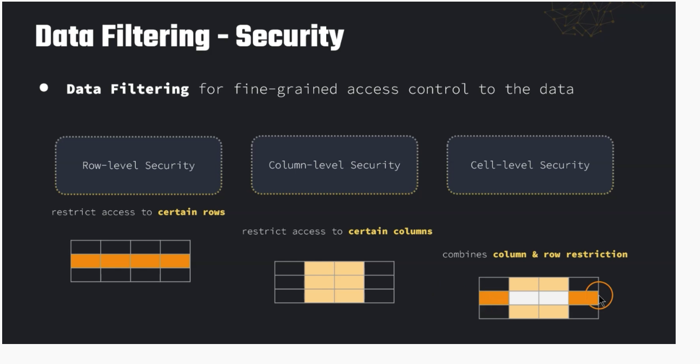

- `Fully managed service` that makes it easy to setup a `data lake` in days using proper migration techniques.
- **Everything is at one place, we can have control at the row and column level in the data for all the applications connected.**
- Automatic Collection and Cataloging of the Data
	- Data Preparation and Pools are available.
- Discover, `cleanse, transform`, and ingest data into your Data Lake
- It automates many complex manual steps (collecting, cleansing, moving, cataloging data, …) and de-duplicate (using ML Transforms)
- Combine structured and unstructured data in the data lake
- Out-of-the-box source blueprints: S3, RDS, Relational & NoSQL DB.
- **Fine-grained Access Control for your applications (row and column-level)**
- `Built on top of AWS Glue`
- Lake is stored on `S3`
- You can use [Redshift] Spectrum to store the data on S3 of this data lake.
#### Security
- Control access at Database, Table or Column or Row Level
- Data Filtering: on even cells also.

### Lake Formation TBAC
- LF Tags are attached to resources and they control the permission to these tables or rows etc
- We can assign permissions to these Tags
- We can Integrate [IAM] , IAM Roles etc
### Cross Account Sharing
- Cross Account Access is possible on AWS.
- Use Named Resources or LF Tags to share the resources tagged with the same tag.
- Granular Access with Data Filters for specific Resources on shared tables with another account
- We Can use resource access manager to make sure the correct permissions are in place while sharing it with another account.
- We need to create a resource link so they can use [Athena] or spectrum to query this data.