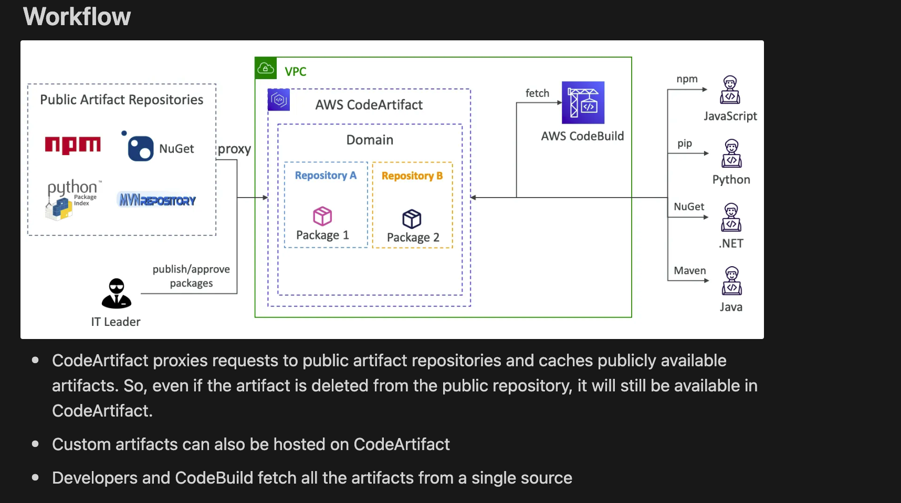
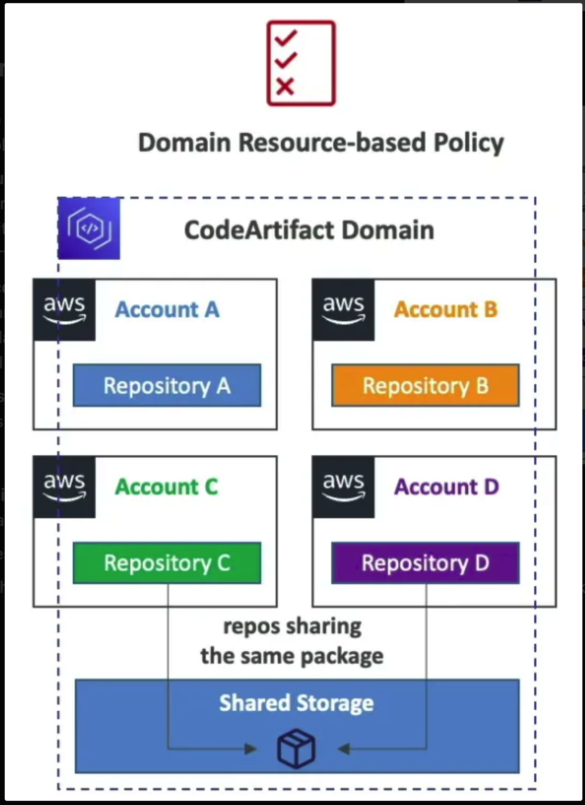

## Intro

- AWS managed **artifact management service** or storing and retrieving software dependencies that our application requires to run.
- Works with dependency management tools like Maven, Gradle, npm, yarn, twine, pip and NuGet.
- **Artifacts (dependencies) live inside the VPC**

## Upstream Repositories

### 1. **Upstream Repositories**:
   - A **CodeArtifact repository** can reference **up to 10 upstream repositories**.
   - When a repository has upstream repositories, if a package request is made to the repository and it cannot find the package in its local storage, it will search through the upstream repositories to find the package.
### 2. **One External Connection to Public Repository**:
   - A CodeArtifact repository can be connected to a **public package repository**, such as **npm**, **Maven Central**, **PyPI**, or **NuGet**. However, you can only have **one external connection** per CodeArtifact repository.

### 3. **Caching Behavior**:
   - When CodeArtifact fetches packages from a public repository (like npm or Maven), those artifacts are **cached** within the CodeArtifact domain.
   - Cached artifacts mean that once CodeArtifact pulls a package from a public repository, the package is stored in the CodeArtifact repository. 
  

## Retention
Let's break down the points about how AWS CodeArtifact handles package resolution, caching, and references between repositories in an upstream-downstream configuration.

### 1. **If a requested package is found in an upstream repository, a reference to it is stored in the downstream repository closest to the developer.**
   - When a developer requests a package from a downstream repository (the one they are directly connected to), and the package is not available locally, CodeArtifact will check the upstream repositories to find the package.
   - Once the package is found in one of the upstream repositories, CodeArtifact doesn't just serve it to the developer; it creates a **reference to that package** in the downstream repository. This means the downstream repository now "knows" about the package and can quickly serve it next time without going to the upstream again.

### 2. **If the package is fetched from a public repository, a reference to it will be stored in the repository connected to the external repository.**
   - If CodeArtifact is connected to an external public repository (such as npm, Maven Central, or PyPI), and a package is fetched from that external source, the package is **cached** in the CodeArtifact repository that has the external connection.
   - This means that all future requests for the same package will be resolved from the cached version stored in CodeArtifact, not directly from the public repository.

### 3. **Intermediate repositories that were involved in resolving the package do not store a reference to the package.**
   - If a repository acts as an **intermediate** repository in the upstream chain (i.e., the requested package is found in a repository further upstream), the intermediate repository does not store a reference to the package. Only the **downstream repository closest to the developer** (the one that directly resolved the request) stores the reference.

### 4. **The package cached in the downstream repository is not affected by changes to the package in the upstream repository.**
   - Once a package is fetched and cached in the downstream repository, it becomes **independent** of the upstream repository from where it was originally retrieved.
   
## Domains

- `Single shared storage` for all the repositories across multiple accounts.
- **De-duplicated storage**: Artifacts are stored only once in the shared storage of the domain and repositories only store references to these artifact.` The artifacts are not duplicated across repositories.`
- **Fast copying**: when a repository pulls an artifact from an upstream repository, it only copies the metadata (containing the reference to the artifact stored in the domain).
- **Easy sharing across repositories and teams**: all the assets and the metadata in a domain are encrypted with a single KMS key
- **Domain Resource-based Policy**: domain administrator can apply policy across the domain such as:
    - Restricting which accounts have access to repositories in the domain
    - Who can configure connections to public repositories to use as sources of packages
