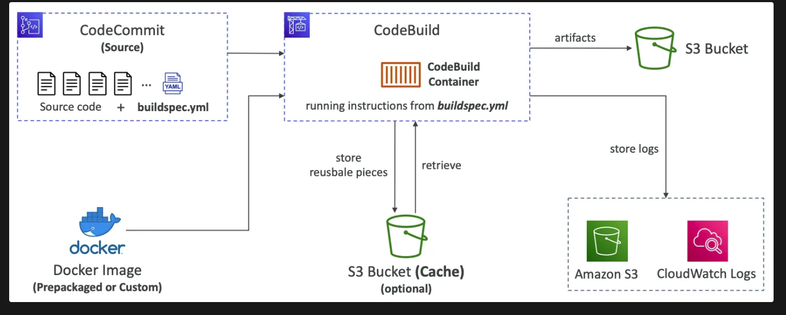
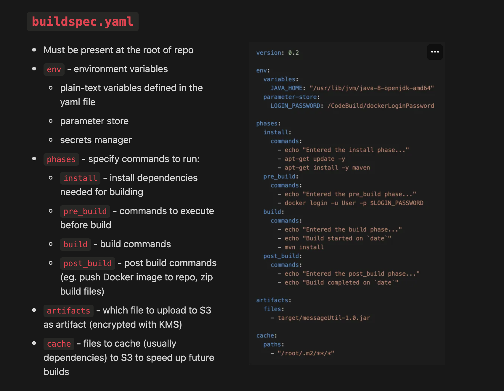

- **AWS managed CI server for building and testing code**
- Build instructions are provided in **`buildspec.yaml`** **present in the root of the repo**
- Build logs can be stored in `S3` or CloudWatch
- CW Metrics can be used to monitor build statistics and CW Events to detect failed builds
- Build projects can be defined in CodeBuild or CodePipeline
- Supported environment
    - Java
    - Ruby
    - Python
    - Go
    - Node.js
    - Android
    - .NET Core
    - PHP
    - Docker - to extend further
- **CodeBuild can be run locally** (requires Docker) using `CodeBuild Agent` for troubleshooting purposes.
- `By default, your CodeBuild containers are launched outside the VPC.` It cannot access resources within the VPC. When creating a CodeBuild project, we can specify the VPC where it should be launched. This way, the CodeBuild project can access resources within the VPC.
- `CodeBuild creates a Docker container as the building or testing environment`.

- CodeBuild containers are deleted at the end of their execution (success or failure). You can't SSH into them, even while they're running.
- **CodeBuild scales automatically** to meet peak build requests. 
    - CodeBuild eliminates the need to provision, manage, and scale your own build servers.

<aside>
💡 CodePipeline and CodeBuild can be combined to build a single page application from MD files and copy the static files to an S3 bucket. This is because CodeBuild can run any commands, so you can use it to run commands including build a static website and copy your static web files to an S3 bucket; and CodePipeline will help make it into a pipeline.

</aside>

