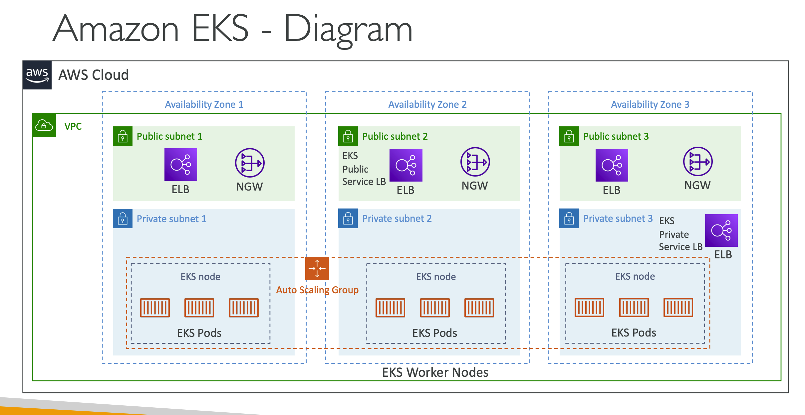
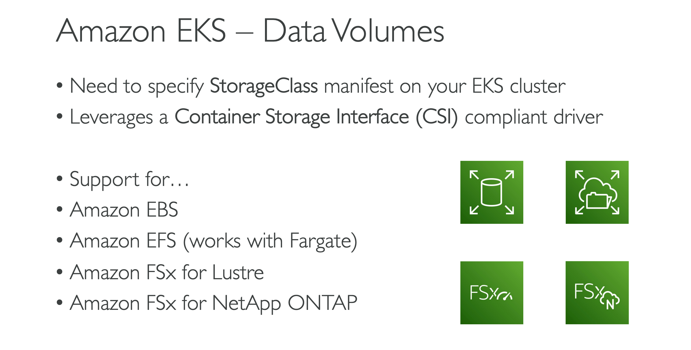

# ELASTIC KUBERNETES SERVICE
- EKS supports EC2 if you want to deploy worker nodes or Fargate to deploy serverless containers
- For multiple regions, deploy one `EKS cluster per region`
- Collect logs and metrics using `CloudWatch Container Insights`

### NODE TYPES
#### Managed Node Groups
- (EC2 instances) for you
- part of an ASG managed by EKS
- Supports On-Demand or `Spot Instances`
#### Self-Managed Nodes
- Nodes created by you and registered to the EKS cluster and `managed by an ASG`
- You can use `prebuilt AMI` - Amazon EKS Optimized AMI
- Supports On-Demand or `Spot Instances`
#### AWS Fargate
- No maintenance required
- no nodes managed
