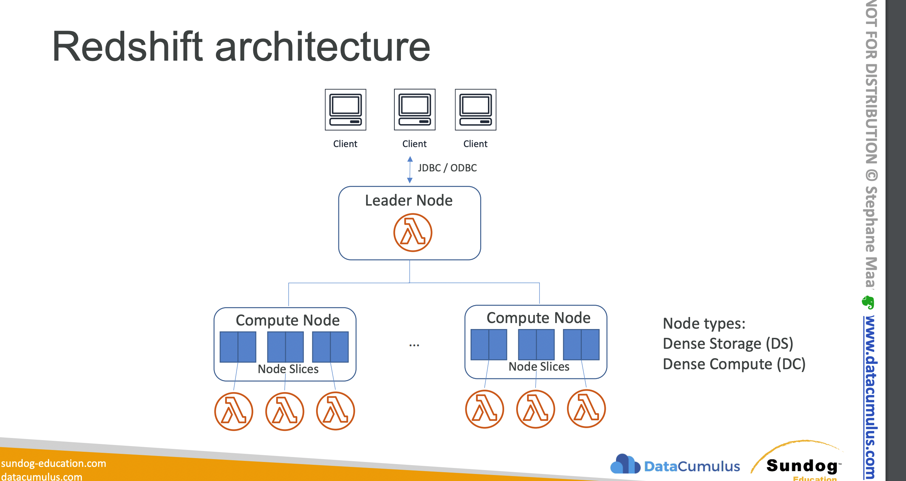

## Amazon Redshift

- AWS managed data warehouse (10x better performance than other data warehouses)
- Based on `PostgreSQL` and Used for Online Analytical Processing (OLAP) and high performance querying
- `Columnar storage` of data with massively parallel query execution in SQL, not like OLTP operations here it is more of read purposes so it is stored in columnar format.
- Uses Massive Parallel processing across multiple nodes.

- When the CPU Utilisation is a problem then go for `Advanced Query Selector Service Present`
- Faster querying than Athena due to indexes
- Fine grained Access control using IAM and VPC Security.
- Need to provision instances and size of the instance as a part of the Redshift cluster (pay for the instances provisioned)
- Integrated with Business Intelligence (BI) tools such as Quick Sight or Tableau
### Architecture 
- Redshift Cluster can have ==1 to 128 nodes (128TB per node)==
- Leader Node: query planning & result aggregation
	- Automatic provisioning when two or more compute nodes are there
	- Develops the execution plan and steps.
	- ==SQL Function will return an error if it is executed on the COMPUTE Nodes so it can be computed only on the leader node and not on the compute node otherwise error will be thrown.==
- Compute Nodes: execute queries & send the result to leader node
	- Connected to leader node by ODBC or JDBC.
	- Minimum compute nodes are two
	- Dedicated CPU, Memory and Disk
	- Transmit data among themselves
	- Can combine them upgrade them also.
- ==No multi-AZ support (all the nodes will be in the same AZ) ==
- Auto-healing feature or automatic recovery.
- Encryption can be enabled on a running cluster also so there is no need to create anther cluster to enable encryption on it.
- Deployment:
	- Provisioned
	- Serverless
#### Loading data into Redshift
- S3
	- Use COPY command to load data from an S3 bucket into Redshift
- Without Enhanced VPC Routing
	- data goes through the public internet
- Enhanced VPC Routing
	- data goes through the VPC without traversing the public internet
- Kinesis Data Firehose
	- Sends data to S3 and issues a COPY command to load it into Redshift
- EC2 Instance
	- Using JDBC driver
	- Optimal to write data in batches

#### Snapshot
- Stored internally in `S3`
- Incremental (only changes are saved)
- Can be restored into a new Redshift cluster
- Automated
	- based on a schedule or storage size (every 5 GB)
	- set retention
- Manual
	- retains until you delete them
- Feature to automatically copy snapshots into another region for disaster recovery using `S3 cross region replication feature`.

### Redshift Spectrum:
- Query exabytes of unstructured data in S3 without loading
- Limitless concurrency 
- Horizontal scaling 
- Separate storage & compute resources
- Wide variety of data formats 
- Support of Gzip and Snappy compression
### Node Types
##### RA3 nodes
- ==Uses Redshift Managed Storage (RMS).==
- Separates compute and storage.
- Scale and pay for compute and managed storage independently.
- ==Supports multi Availability Zone (AZ)==

##### DC2 nodes
- Local SSD storage included.
- ==DC2 nodes store your data locally for high performance.==
- Available on single Availability Zone (AZ) only.
- Recommend by AWS For datasets under 1TB (compressed).
- You can add more compute nodes to increase the storage capacity of the cluster. 