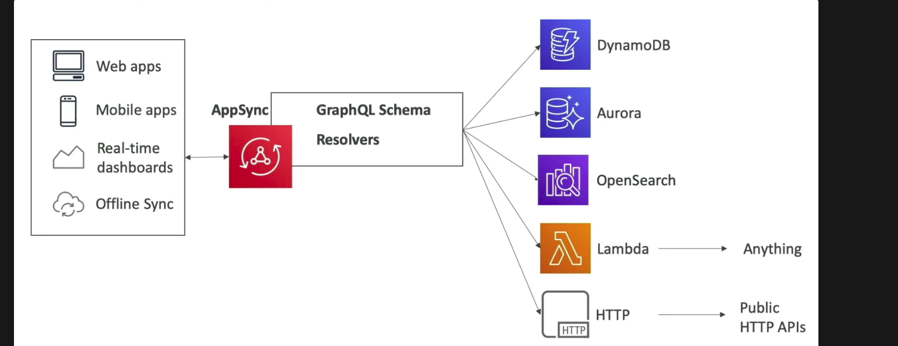

# AWS AppSync

- AppSync is a managed service which uses *GraphQL*
- It is used for building APIs on AWS which use *GraphQL*
- *GraphQL* makes it easy for applications to get the exact data they need. This includes combining data from multiple resources

- Datasets behind *GraphQL* can include:
    - NoSQL data stores
    - RDS databases
    - HTTP APIs
    - etc.
- AppSync integrates with (resolvers) DynamoDB, Aurora, ElasticSearch, etc.
- Supports customer resources using Lambda
- Provides support for real time data retrieval using WebSocket or MQTT on WebSocket protocols
- Mobile applications: replacement for Cognito Sync
- Requires a GraphQL schema for getting started
- Example for GraphQL schema:

    ```
    type Query {
        human(id: ID!): Human
    }

    type Human {
        name: String
        appearsIn: [Episode]
        starships: [Starship]
    }

    enum Episode {
        NEWHOPE
        EMPIRE
        JEDI
    }

    type Starship {
        name: String
    }
    ```

## Security

- **To get HTTPS on AppSync with a custom domain, use CloudFront in front of AppSync**
- 4 ways to authorize applications to interact with AppSync GraphQL API:
    - `API_KEY` - generate an API key and give it to the customer
    - `AWS_IAM` - authorize IAM users or roles / **cross-account access**
    - `AMAZON_COGNITO_USER_POOLS` - AWS managed IDP for external users
    - `OPENID_CONNECT` - 3rd party OIDC compatible IDP for external users