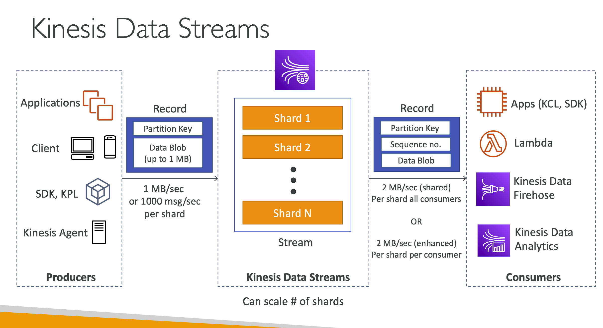
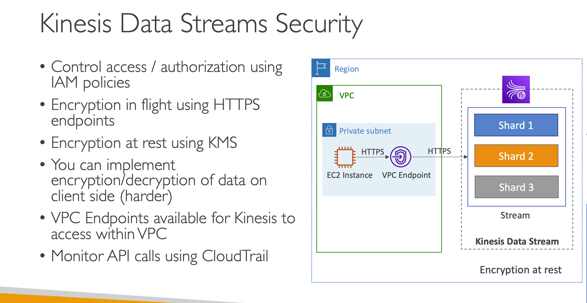
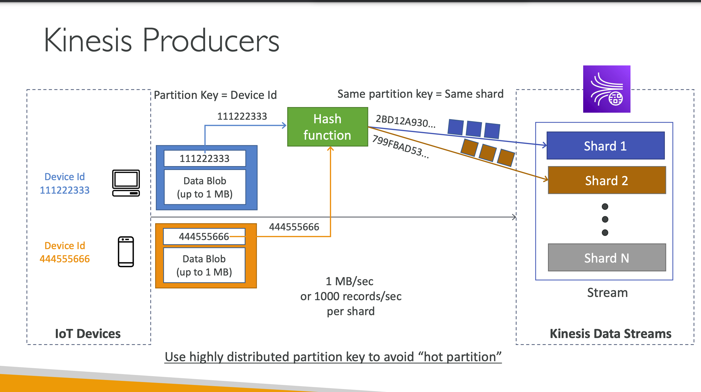
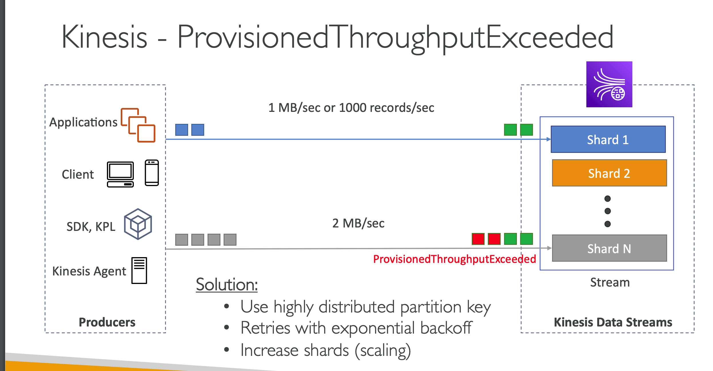
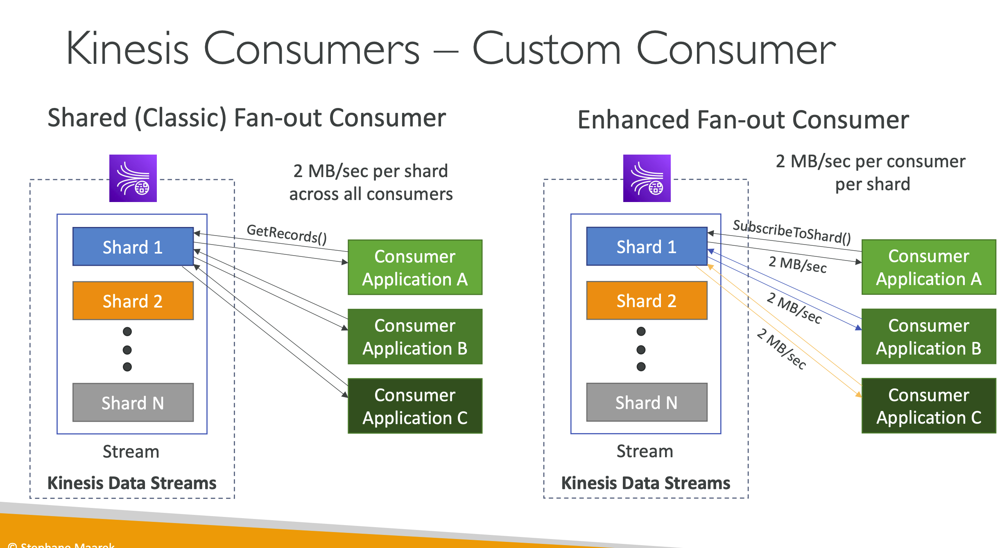
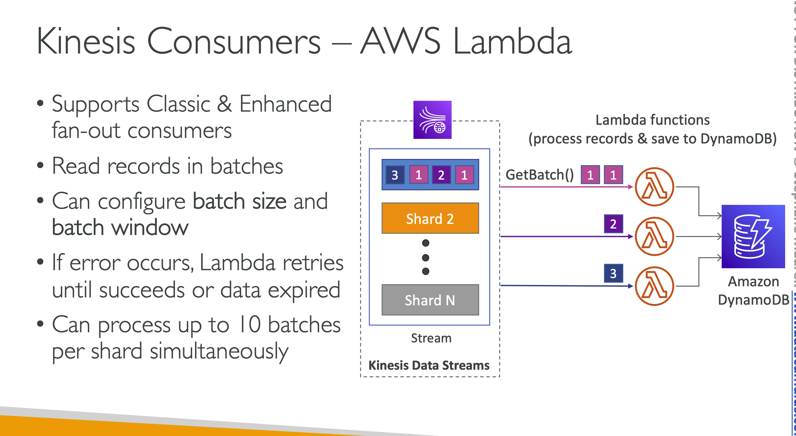
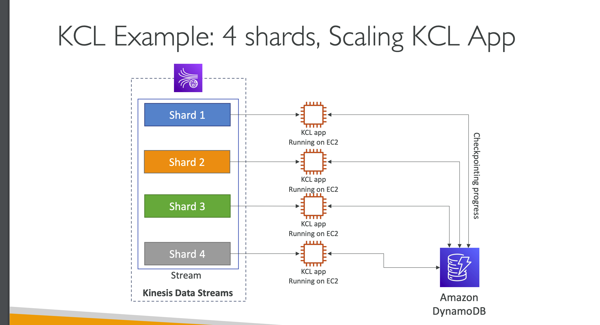
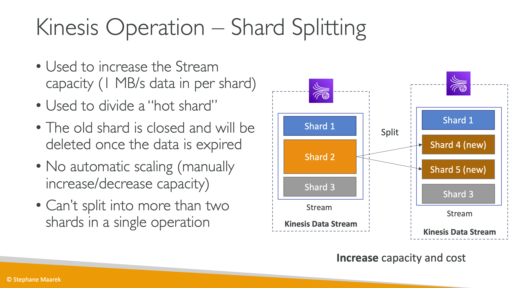
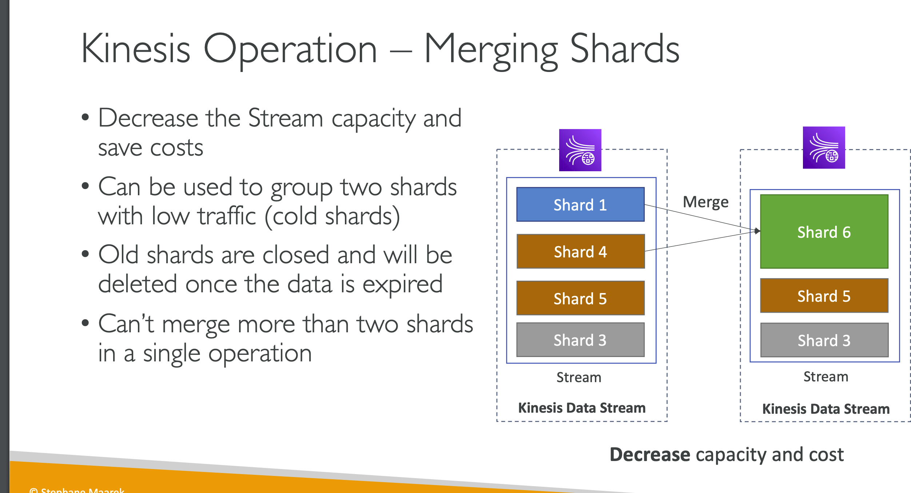

- Makes it easy to collect, process, and `analyze streaming data in real-time`
- Kinesis Data Streams: capture, process, and store data streams
- Kinesis Data Firehose: load data streams into AWS data stores
- Kinesis Data Analytics: analyze data streams with `SQL` or `Apache Flink`
- Kinesis Video Streams: capture, process, and store video streams
## Kinesis Data Streams
- Retention between `1 day to 365 days`
- Ability to reprocess (replay) data
- Once data is inserted in Kinesis, `it can’t be deleted (immutability)`
- Data that shares the same partition goes to the same shard (ordering)
- Producers: AWS SDK, Kinesis Producer Library (KPL), Kinesis Agent
### Consumers:
- Write your own: Kinesis Client Library (KCL), AWS SDK
- Managed: AWS Lambda, Kinesis Data Firehose
## Kinesis Data Analytics
### Provisioned mode:
- You choose the number of shards provisioned, scale manually or using API
- Each shard gets 1MB/s in `(or 1000 records per second)`
- Each shard gets 2MB/s out (classic or enhanced fan-out consumer)
- You pay per shard provisioned per hour
### On-demand mode:
- No need to provision or manage the capacity
- Default capacity provisioned `(4 MB/s in or 4000 records per second)`
- Scales automatically based on observed throughput peak `during the last 30 days`
- Pay per stream per hour & data in/out per GB

### Kinesis Security
Control access / authorization using
IAM policies
• Encryption in flight using HTTPS
endpoints
• Encryption at rest using KMS
• You can implement
encryption/decryption of data on
client side (harder)
• VPC Endpoints available for Kinesis to
access within VPC
• Monitor API calls using CloudTrail

## Kinesis Producers
• Puts data records into data streams
• Data record consists of:
• Sequence number (unique per partition-key within shard)
• Partition key (must specify while put records into stream)
• Data blob (up to 1 MB)
• Producers:
• AWS SDK: simple producer
• Kinesis Producer Library (KPL): C++, Java, batch, compression, retries
• Kinesis Agent: monitor log files
• Write throughput: 1 MB/sec or 1000 records/sec per shard
• PutRecord API
• Use batching with PutRecords API to reduce costs & increase throughput

### Kinesis Data Streams Consumers
• Get data records from data streams and process them
• AWS Lambda
• Kinesis Data Analytics
• Kinesis Data Firehose
• Custom Consumer (AWS SDK) – Classic or Enhanced Fan-Out
• Kinesis Client Library (KCL): library to simplify reading from data stream

#### Consumer Types
Kinesis Consumers Types
Shared (Classic) Fan-out Consumer - pull Enhanced Fan-out Consumer - push
• Low number of consuming applications
• Read throughput: 2 MB/sec per shard
across all consumers
• Max. 5 GetRecords API calls/sec
• Latency ~200 ms
• Minimize cost ($)
• Consumers poll data from Kinesis using
GetRecords API call
• Returns up to 10 MB (then throttle for
5 seconds) or up to 10000 records
• Multiple consuming applications for
the same stream
• 2 MB/sec per consumer per shard
• Latency ~70 ms
• Higher costs ($$$)
• Kinesis pushes data to consumers
over HTTP/2 (SubscribeToShard
API)
• Soft limit of 5 consumer applications
(KCL) per data stream (default)

## Kinesis Client Library (KCL)
• A Java library that helps read record from a Kinesis Data Stream with
distributed applications sharing the read workload
• Each shard is to be read by only one KCL instance
• 4 shards = max. 4 KCL instances
• 6 shards = max. 6 KCL instances
• Progress is checkpointed into DynamoDB (needs IAM access)
• Track other workers and share the work amongst shards using DynamoDB
• KCL can run on EC2, Elastic Beanstalk, and on-premises
• Records are read in order at the shard level
• Versions:
• KCL 1.x (supports shared consumer)
• KCL 2.x (supports shared & enhanced fan-out consumer)

