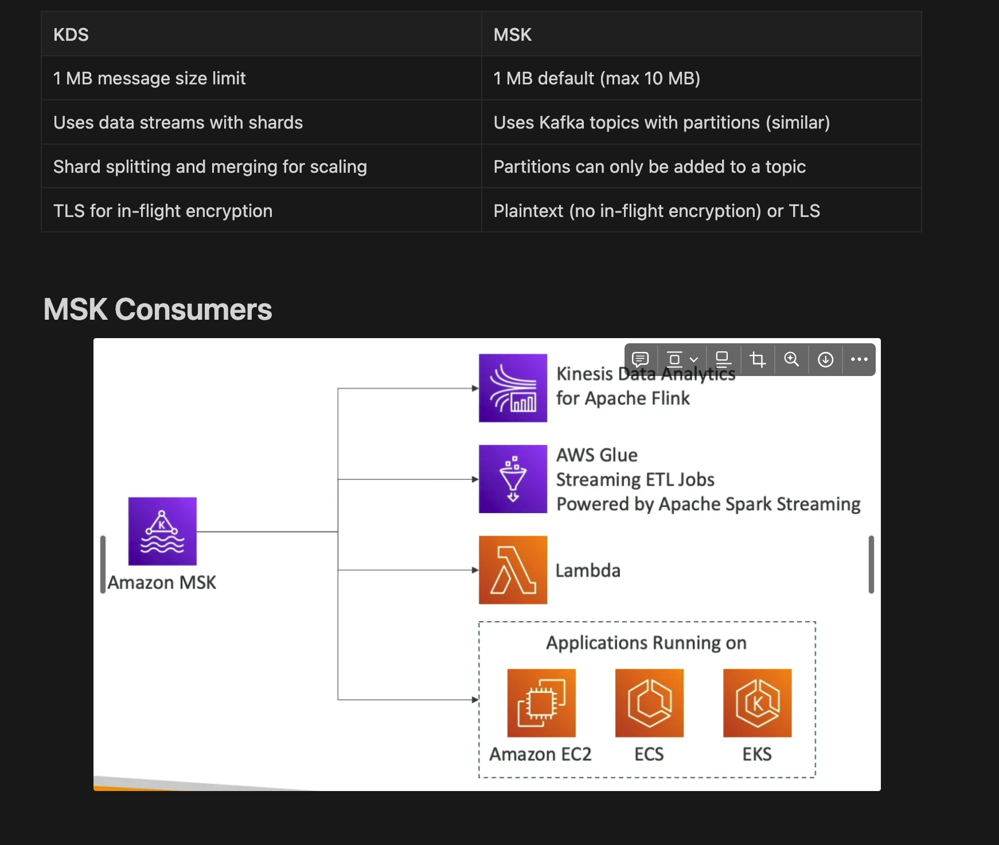

## Intro

- Managed Apache Kafka cluster on AWS
- Used to stream data (alternative to KDS)
- Creates and **manages Kafka broker nodes and Zookeeper nodes**
- MSK cluster is deployed in the VPC `(3 AZ for HA)`
- Automatic recovery from common Kafka failures
- **Data is stored on `EBS volumes` as long as needed**
- **MSK Serverless**: auto-scaling MSK cluster without provisioning or managing capacity
- `KMS for at-rest encryption`
- `No in-flight encryption`
