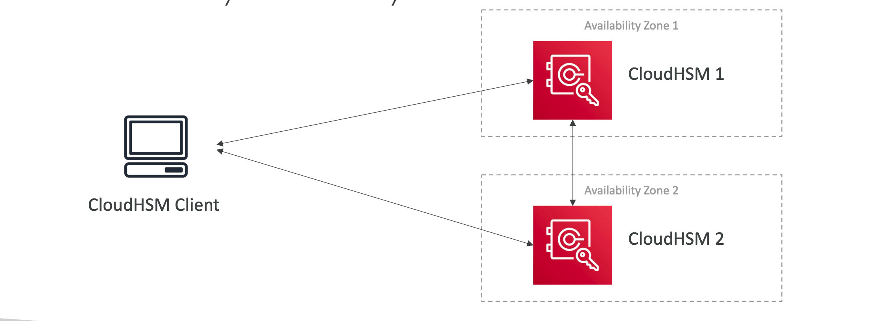
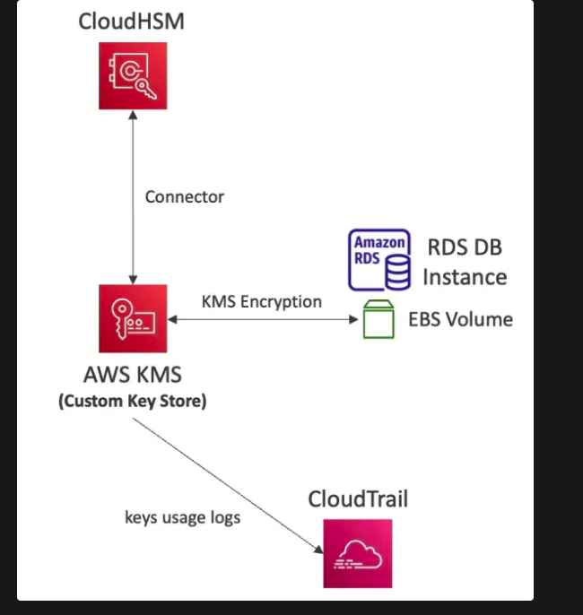
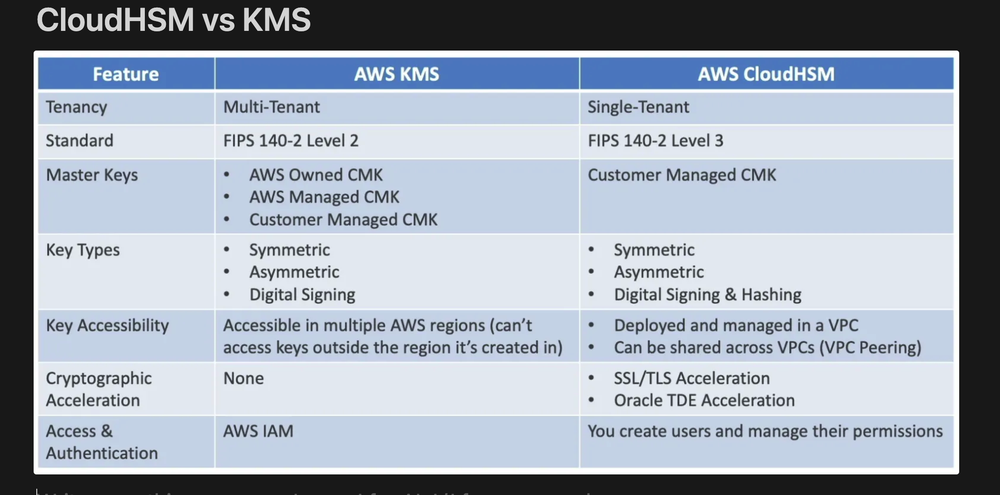

- AWS provisions **dedicated encryption hardware** (Hardware Security Module)
- Use when you want to manage encryption keys completely.
- HSM device is stored in AWS (tamper resistant, FIPS 140-2 Level 3 compliance)
- **Supports both symmetric and asymmetric encryption**
- Good option to use with **SSE-C** encryption
- CloudHSM clusters are spread across **Multi AZ (high availability)** by having multiple devices.

- **Redshift supports CloudHSM** for database encryption and key management
- IAM permissions are required to perform CRUD operations on HSM cluster but any user management or etc is totally dependent on the client and not AWS.
- **CloudHSM Software** is used to manage the keys and users.
- Can be integrated with KMS so that KMS uses CloudHSM internally
    - ek custom key store banao which will make the connectivity to the CloudHSM cluster and then you use these custom keys to encrypt your db or ebs volume data.

## Cross Account HSM
- You can share the private subnets a
CloudHSM clusters resides in using
AWS RAM, so you need to share the whole subnet itself will all the resources in it you can pinpoint and say i need to share HSM only that is not possible.
- You `CANNOT share the CloudHSM cluster itself`
- Share VPC Subnets with entire Organization, specific OUs, or AWS accounts
- Note: configure CloudHSM Security Group to allow traffic from clients