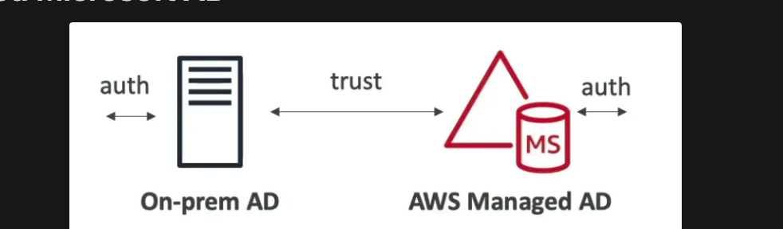
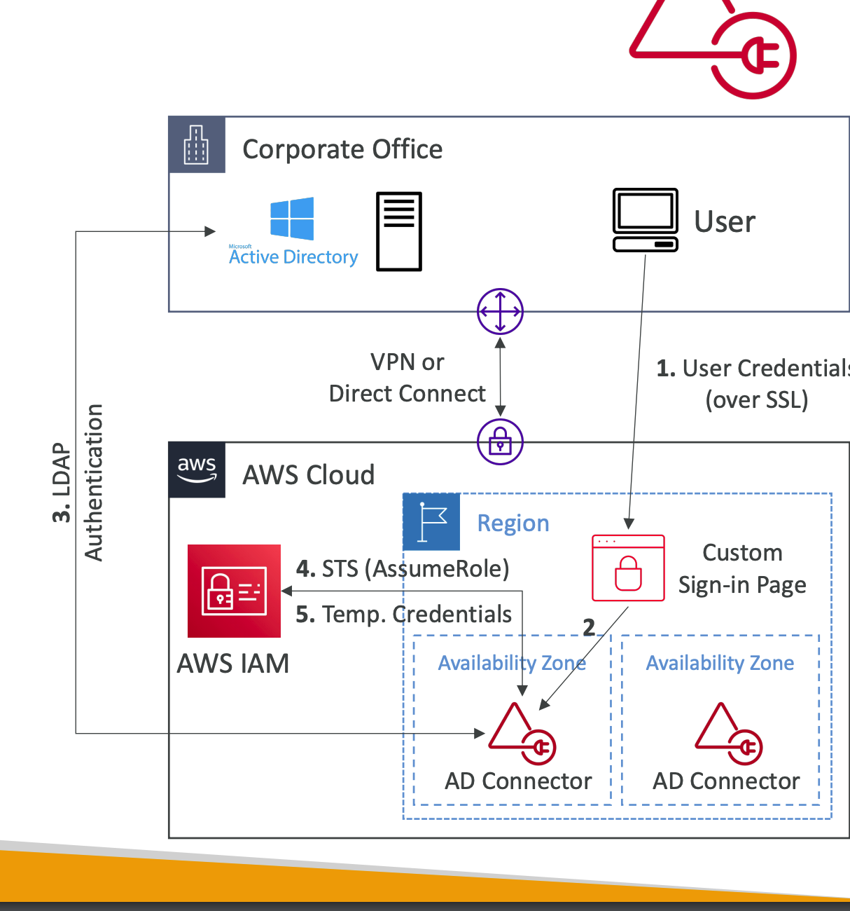

## Intro

- Database of objects (User Accounts, Computers, Printers, File Shares, Security Groups) on a Windows server. Users can login on any system in the network.
- Objects are organized in **trees**. 
- A group of trees is called **forest**.
- Used to extend the AD network by involving services like EC2 to be a part of the AD to share login credentials.

### AWS Managed Microsoft AD

- Login credentials are shared between on-premise and AWS managed AD
- **Manage users on both AD (on-premise and on AWS managed AD)**
Managed Service: Microsoft AD in your AWS VPC
    - EC2 Windows Instances:
    - EC2 Windows instances can join the domain and run
    traditional AD applications (sharepoint, etc)
    - Seamlessly Domain Join Amazon EC2 Instances from
    Multiple Accounts & VPCs
#### Integrations:
- RDS for SQL Server, AWS Workspaces, Quicksight…
- AWS SSO to provide access to 3rd party applications
- Standalone repository in AWS or joined to on- premises AD
- Multi AZ deployment of AD in 2 AZ, # of DC
(Domain Controllers) can be increased for scaling
- Automated backups
- Automated Multi-Region replication of your directory
- Supports `MFA`
- Establish trust connections with your `on premise AD`
- Supports **directory-aware workloads on AWS**

### AD Connector

- AD connector will proxy all the requests to the on-premise AD
- **Users are managed on the on-premise AD only**
- Does not support `directory-aware workloads` on AWS
- Doesn’t work with `SQL Server`

### Simple AD

- AD-compatible managed directory on AWS (**cannot be joined with on-premise AD**)
- **Users are managed on the AWS AD only**
- `Use when you don’t have an on-premise AD`