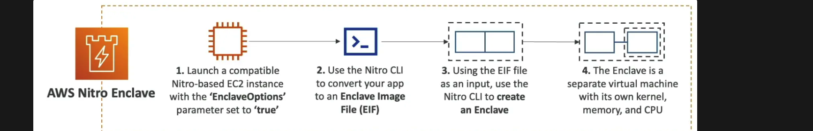
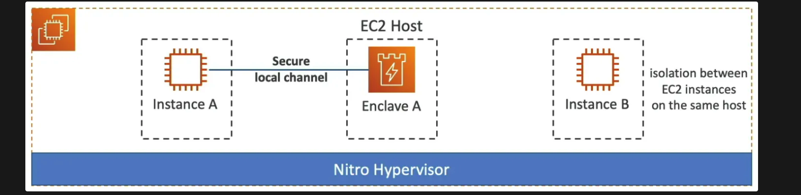

- **Fully isolated VMs** for **processing highly sensitive data** such as PII, healthcare data, etc.
- No `interactive access (eg. SSH)` or external networking (reduces attack surface)
- **Cryptographic Attestation**: only authorized code can be run in the Enclave which have crypto security enabled.
- Only Enclaves can access sensitive data (integration with KMS)
- `Highest level of security on EC2`
- `EnclaveOptions`: Parameter set it to `true`
- Use Cases: Secure data processing, confidential computing, and cryptographic key management.

