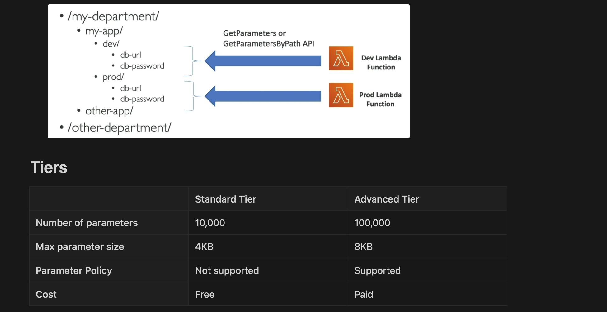

- **Serverless**
- Used to store parameters & secrets
- **Parameter versioning**
- It's designed to store and retrieve configuration data such as the API URL and other variables. 
- It supports storing `plain-text values and encrypted strings`, allowing you to easily manage different configurations (e.g., API URLs) for development, testing, and production environments.
- Using unique paths for each environment (e.g., /dev/api/url, /prod/api/url) ensures that the correct values are retrieved based on the environment.
- Seamless Encryption with KMS for encryption and decryption of stored secrets
- **Parameters are stored in hierarchical fashion** which simplifies granting IAM permissions to applications to access them

## Parameter Policies
- Only supported in `advanced tier`
- Assign policies to a parameter for additional features
    - Expire the parameter after some time (TTL)
    - `Parameter expiration notification`
    - `Parameter change notification`