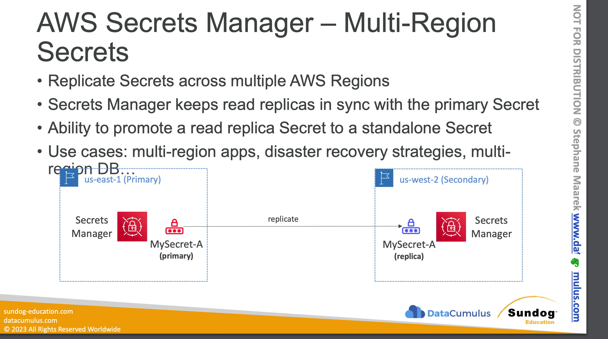
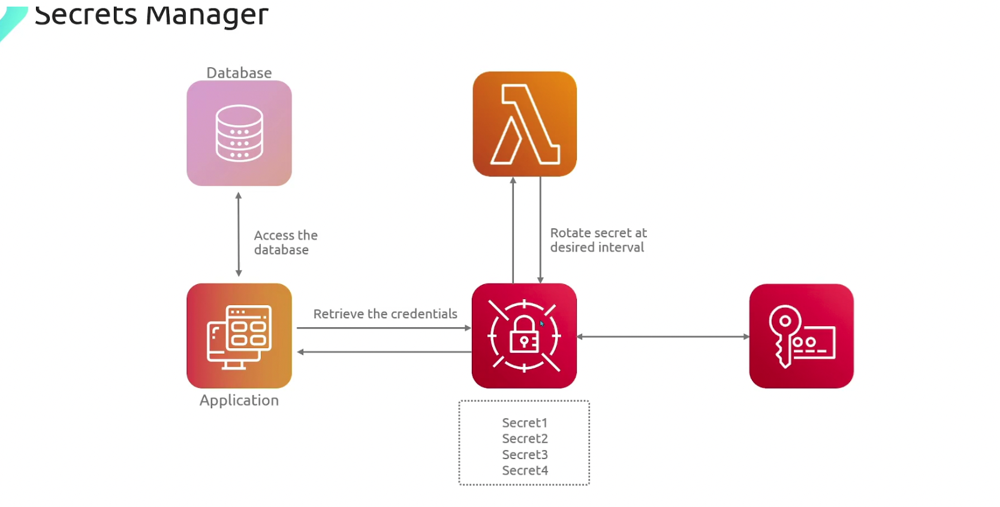

- For storing secrets only
- **Mandatory encryption** using KMS
- **Each secret can have multiple key-value pairs**
- **Ability to force rotation of secrets every n days** (not available in Parameter Store)
- **Well integrated with SQL databases** like `MySQL, PostgreSQL, RDS and Aurora` to store DB username and password
- There is no charge for secrets that are marked for deletion
- **Automated secret rotation using Lambda** (needs IAM permission)
- Mostly used for **RDS authentication**
    - need to specify the username and password to access the database
    - link the secret to the database to allow for automatic rotation of database login.
- Can create custom secrets
- **Secrets are retained after deletion for 7 - 30** (default) days (waiting period)
- AWS Secrets Manager helps you manage, retrieve, and rotate database credentials, application credentials, OAuth tokens, `API keys`.
- When you use Secrets Manager, you pay only for what you use, with no minimum or setup fees. 
    - `There is no charge for secrets that are marked for deletion`
    - If you enable AWS CloudTrail on your account, you can obtain logs of the API calls that Secrets Manager sends out. 

- Secrets Manager logs all events as management events. 

- AWS CloudTrail stores the first copy of all management events for free. 
    - However, you can incur charges for Amazon S3 for log storage and for Amazon SNS if you enable notification