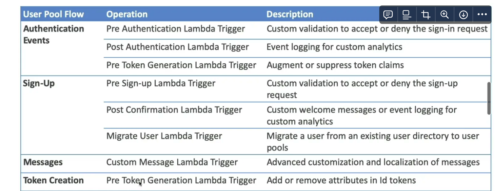

1. Step functions can be used to transform the data from multiple sources and can do reprocessing in case of a failure.
2. AWS SAM is an open-source framework that extends AWS CloudFormation to provide a simplified way to define the `Amazon API Gateway APIs, AWS Lambda functions, and Amazon DynamoDB` tables needed by your serverless application. You can define your serverless resources in a YAML template and then use the AWS SAM CLI to package and deploy your application.
3. AWS CloudFormation serverless intrinsic functions can also be used to define serverless resources in YAML, but they have some limitations compared to AWS SAM. 
4. AWS Elastic Beanstalk is a platform as a service (PaaS) that is not serverless specific, while the AWS Cloud Development Kit `(AWS CDK) is an alternative to YAML-based templates that uses familiar programming languages like TypeScript, Python, and Java` to define AWS infrastructure.
5. S3 event notifications can directly invoke a Lambda function to insert records into DynamoDB.
6. By default, all update actions are allowed to all the resources during a cloudformation stack update
    - **Stack Policy defines the update actions that are `allowed or denied on specific resources during stack update`**
    - Helps protect some resources from unintentional updates
    - When you create a stack policy, all update operations on all the stack resources are denied. **`You need to explicitly allow update operations on the resources.`**
    - Example: allow updates on all resources except the production database
7. StackSets
    - Used to create, update or delete stacks across **multiple accounts or regions** with a single operation.
    - Admin account creates `StackSets.` Trusted accounts can create, update or delete stack instances from StackSets.
    - By using the AWS CLI create-stack-set command, the developer can deploy the same CloudFormation stack to multiple regions without additional application code, thereby meeting the requirement for geographic load testing of an API.
8. Set the `x-amz-server-side-encryption header` when invoking the PutObject API operation. When using the PutObject API operation to store objects in an S3 bucket, the x-amz-server-side-encryption header can be set to specify the server-side encryption algorithm used to encrypt the object. Setting this header to "AES256" or "aws:kms" enables server-side encryption with SSE-S3 or SSE-KMS respectively.
9. providing the encryption key in the HTTP header of every request is not a valid way to enable SSE-S3 encryption for PUT OBJECT API.
10. TLS encryption to the traffic to the S3 bucket only encrypts the data in transit, but does not encrypt the objects at rest in the bucket.
11. **Lambda Triggers**
    
    Cognito User Pool can invoke lambda functions **synchronously** on certain events
    
   
    ### Adaptive Authentication
    
    - If enabled, **sign-in attempts may be blocked or require MFA if they seem suspicious**
    - Cognito examines each sign-in attempt and generates a risk score, In case of compromised credentials, there is email and phone verification
    - Logged in CloudWatch
    
    ### ALB Integration
    
    - **Must use an HTTPS listener**
    - Authentication can be done using CUP or **any OIDC compliant IDP**
12. **Global-Scoped AWS WAF Web ACL**: Using a global-scoped web ACL ensures that it can be associated with CloudFront distributions, which operate at a global level. This is crucial since CloudFront is designed to serve content globally and can help mitigate DDoS attacks before they reach the origin (S3 bucket).
    1. **Allow Default Action**: Setting the default action of the web ACL to allow means that legitimate traffic will not be blocked unless it matches specific rules.
13. **Centralized Management**: SCPs allow you to manage permissions across all accounts in your organization from a central location. This is particularly useful for enforcing compliance with corporate policies regarding data residency.
14. **Service Control Policies (SCP):** Whitelist or blacklist IAM actions at the OU or Account level. **Does not apply to the Master Account,** Applies to all the `Users and Roles of the member accounts, including the root user.` So, if something is restricted for that account, even the root user of that account won’t be able to do it.
    - SCP can be configured as either:
        - **Allow List**: actions are denied by default, `specify allowed actions`
        - **Deny List**: actions are allowed by default, specify denied actions
    - **Does not apply to service-linked roles**
    - **`Explicit Deny** has the highest precedence`
15. Aurora Replicas, you can offload read traffic from the primary instance. **The reader endpoint will automatically distribute read queries among available replicas**.
16. **Aurora Multi-Master**: Optional, Every node (replica) in the cluster can read and write , **Immediate failover for `writes** (high availability in terms of write)`. If disabled and the master node fails, need to promote a Read Replica as the new master (will take some time). **Client needs to have multiple DB connections for failover**
17. Aurora Endpoints: 
    1. **Writer Endpoint** `(Cluster Endpoint)`- Always points to the master (can be used for read/write), Each Aurora DB cluster has one cluster endpoint
    2. **Reader Endpoint:** Provides load-balancing for read replicas only (used to read only), If the cluster has no read replica, it points to master (can be used to read/write), `Each Aurora DB cluster has one reader endpoint`
    3. **Custom Endpoint**: Load balance to a subset of replicas Provides load-balanced based on criteria other than the read-only or read-write capability of the DB instances like instance class (ex, direct internal users to low-capacity instances and direct production traffic to high-capacity instances)
18. ASG is Regional Service (cannot span multiple regions) and Supports Multi AZ.
    1. **Launch Configuration** (legacy) and Cannot be updated (must be re-created)
        - **Does not support Spot Instances**
    2. **Launch Template** (newer)
        - Versioned
        - Can be updated and **Supports both On-Demand and Spot Instances**
    3. By default, ASG uses the EC2 status check (not the ELB health check). This could explain why some instances that are labelled as unhealthy by an ELB are still not terminated by the ASG. To prevent ASG from replacing unhealthy instances, suspend the **ReplaceUnhealthy** process type. When an instance is unhealthy, `ASG creates a new scaling activity for terminating the unhealthy instance and then terminates it.` Later, another scaling activity `launches a new instance to replace the terminated instance.`