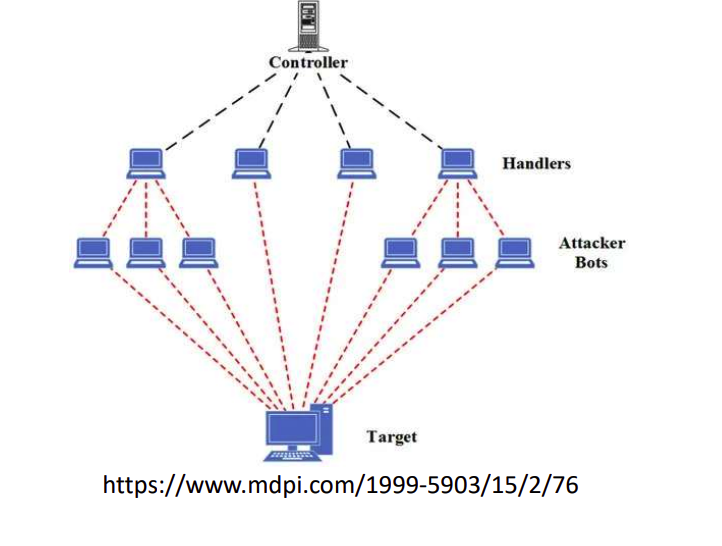
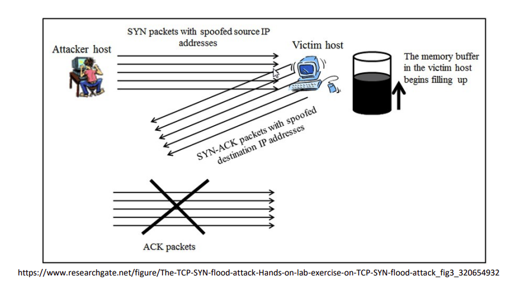
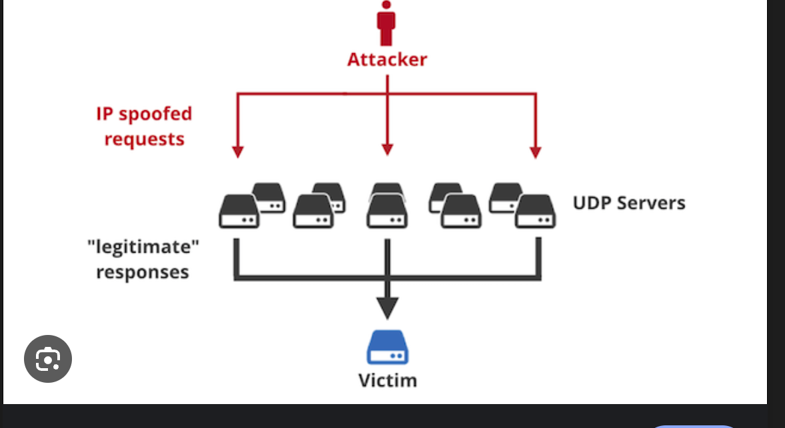
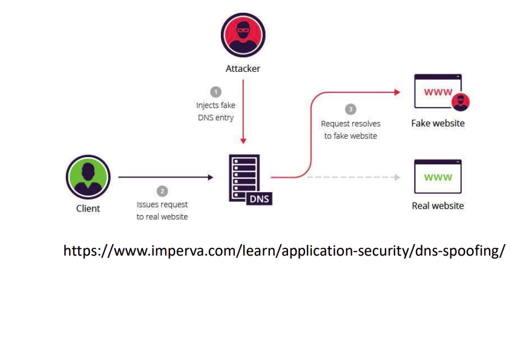
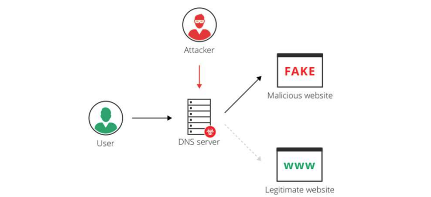
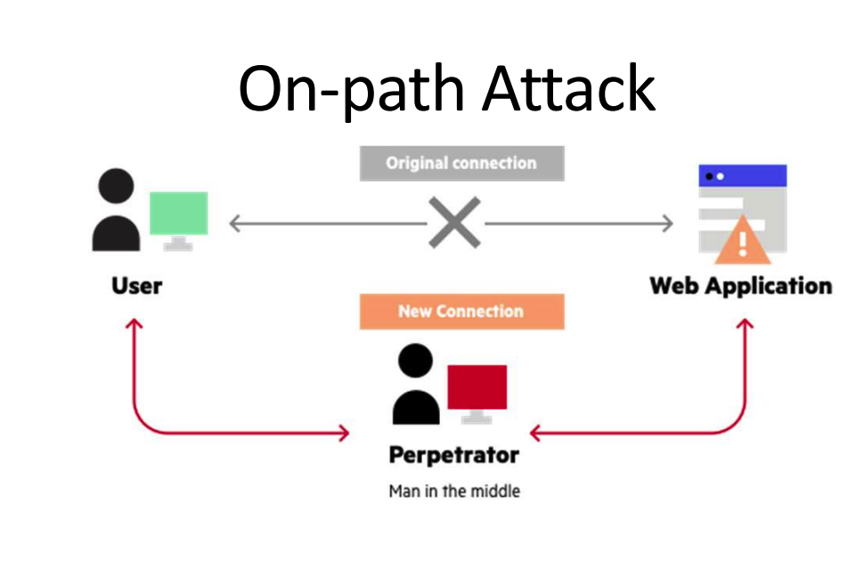
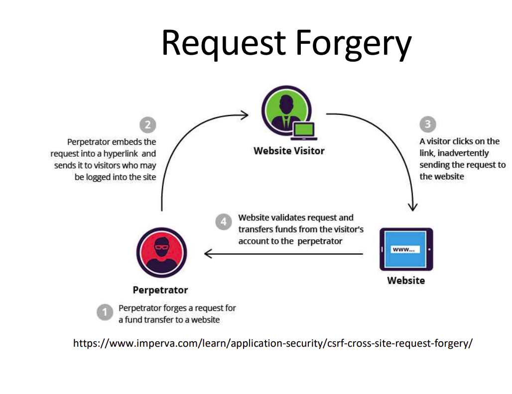

## VIRUS

- A virus is a type of malicious software (malware) designed to spread to other computers.
- It typically attaches itself to legitimate software and executes its code when the host software runs
- Propagation: Unlike worms, which can spread across networks on their own, viruses usually require some form of user action to replicate, such as opening a file or running a program

Infection Mechanisms: 

- File Infector Viruses: These attach themselves to executable files and spread to other executables when the program is run.
- Macro Viruses: These are written in the macro language of applications (like Microsoft Word) and are spread through documents.
- Boot Sector Viruses: They infect the master boot record of a hard drive, ensuring they are executed when the computer boots up.

Detection and Removal: 

- Antivirus Software: Uses signatures to detect known viruses and heuristics to detect new, unknown viruses.
- Regular Updates
- System Scans

## WORMS
- A worm is a type of malware that replicates itself in order to spread to other computers.
- Unlike a virus, it does not need to attach itself to an existing program or require user intervention to spread.
- Worms typically exploit `vulnerabilities in network services` to propagate across networks.

## TROJANS
- Short for "Trojan horse," is a type of malware that disguises itself as legitimate software or is hidden within legitimate software.
- Named after the ancient Greek story of the deceptive wooden horse that led to the fall of the city of Troy.
- Trojan often tricks users into loading and executing it on their systems. 

## RANSOMWARE
- A type of malicious software designed to block access to a computer system or encrypt files until a sum of money is paid, typically in the form of cryptocurrency. 
- It's a direct threat to the `availability of data and the normal operation of businesses and personal computing use.`
Ransomware Characteristics: 
- Encryption
- Payment Demand

Distribution Methods: 
- Ransomware can spread through phishing emails
- malicious web advertisements
- vulnerabilities in software and networks.

## SPYWARE
- A type of malware that is designed to gather data from a user or organization without their knowledge or consent.
- It can monitor and collect various types of personal and sensitive information, such as internet usage data, login credentials, and confidential information.

Characteristics of Spyware: 
- Data Collection: It can log keystrokes, capture screen images, record browsing history, and access files. 
- Surveillance: Some spyware can activate
cameras and microphones to surveil the physical environment. 
- Stealth: Spyware typically runs hidden in the background and may be disguised as legitimate software. 
- Communication: Collected data is usually transmitted to a third party, often a
cybercriminal.
## ROOKIT
- A rootkit is a clandestine computer
program designed to `provide continued privileged access to a computer` while actively hiding its presence from
administrators and other system users. 
- Rootkits can be installed by a malicious intruder after gaining access to a system or can piggyback on other software installations.

## LOGICBOMBS
- A piece of code intentionally inserted into a software system that will set off a malicious function when specified conditions are met. 
- Unlike viruses, logic bombs do not replicate themselves.
- They are dormant until triggered by a specific event, such as a date/time, the launch of a program, the deletion of a user account, or a certain command.

Characteristics of Logic Bombs:
- Condition-based Trigger  
- Malicious Intent
- Stealth
- Insider Threat: Often, logic bombs are deployed by `disgruntled employees with legitimate access to the system.`

## KEYLOGGERS
- A type of surveillance software or hardware that, once installed on a system, has the
capability to record every keystroke made on that system.
- The primary purpose of a keylogger is to
covertly monitor and log all the key presses made by a user, which can include sensitive data like usernames, passwords, credit card numbers, and personal messages.

Keyloggers can be software-based or hardware-based: 
- Software Keyloggers: These are programs that get installed on the user's computer. They can be part of a malicious software package, like a virus or a Trojan. 
- Hardware Keyloggers: These are small
physical devices that can be plugged into a computer, usually between the keyboard and the PC, to capture keystrokes.
## Bloatware
- Refers to unwanted software that comes pre-installed on a device, typically by the manufacturer, or is included in other software installations.
- It is not inherently malicious like malware, but bloatware can slow down systems, take up `valuable disk space, and at times, can include vulnerabilities` that might be exploited by malicious actors.

Characteristics of Bloatware:
- Pre-installed Applications
- Resource Consumption
- Difficult to Remove
- Potential Security Risks

## Distributed denial-ofservice
A malicious attempt to disrupt the normal traffic of a targeted server, service, or network by overwhelming the target or its surrounding infrastructure with a flood of Internet traffic.
- They utilize multiple compromised
computer systems as sources of attack traffic.
- These systems can include computers and other networked resources such as IoT devices.
### Network Based DDOS
- A perpetrator uses multiple compromised systems, often infected with a Trojan, to launch a single massive attack. These systems form a network called a botnet.

## UDP Floods
- The attacker overwhelms random ports on the targeted host with IP packets containing UDP datagrams. The aim is to flood the network with enough UDP packets to slow down or crash the targeted system
## SYN Floods
- A SYN Flood is a type of Denial-of-Service (DoS) attack that targets the TCP (Transmission Control Protocol) connection sequence, known as the TCP three-way handshake. 
This attack exploits the way TCP connections are established and can overwhelm a system, rendering it unable to respond to legitimate traffic. 

### Amplification Attacks
- These attacks exploit the characteristics of certain
protocols to magnify the amount of traffic that is sent to a target, causing a denial of service. 
- Uses protocols such as DNS or IP Addressing
### Reflected DDOS
- Characterized by its use of reflection, meaning the `attacker forces third-party servers to direct traffic to the victim`, often without the third party's knowledge. ◦ IP Spoofing is one way of doing this. 

## DNS ATTACKS
### DNS SPOOFING
- DNS Spoofing (or Cache Poisoning): This attack involves corrupting the DNS cache with false information. 
- An attacker can redirect traffic from a legitimate website to a
fraudulent one without the user's knowledge. This is often used for phishing attacks by poisioning the dns cache on localmachine.

## DNS Amplification Attacks
- These are a type of DDoS attack where the attacker exploits publicly-accessible DNS servers to flood a target with DNS response traffic.
## DNS Tunneling
- DNS tunneling involves encoding the `sensitive data of other programs or protocols` in DNS queries and responses. It can be used for legitimate purposes (like bypassing network security controls) but is often used maliciously to exfiltrate data from a compromised system.
## DNS Hijacking
- In this attack, the attacker diverts queries to a malicious DNS server, leading users to fraudulent websites or intercepting internet traffic.
- This can be done by compromising the DNS server itself.

## On Path Attack
- On-path AttackIn IT security, the term "On-path" refers to a type of attack where the attacker positions themselves in the communication path between two parties.
- This type of attack was previously known as a "Man-in-the-Middle" (MitM) attack. 

- Intercepting Communication: The attacker intercepts the data traffic flowing between two parties (such as a user and a website). This can be achieved through various means like compromising network equipment, exploiting unsecured Wi-Fi networks, or using `ARP spoofing` in a local
network.
- Eavesdropping: In its simplest form, an on-path attack allows the attacker to passively listen to the
communication, gaining access to any transmitted information, such as login credentials, personal
information, or corporate data.

Here’s how an on-path attack works:
- Session Hijacking: The attacker can hijack sessions, such as web sessions, by stealing session tokens, allowing them to impersonate the victim and gain unauthorized access to systems or information.
- Data Manipulation: More
sophisticated on-path attackers can alter the communication. They can modify the data being sent between the parties, inject malicious content, or redirect users to fraudulent sites.
- SSL Stripping: In this form of on-path attack, the attacker downgrades a `secure HTTPS connection to an unencrypted HTTP connection`,
enabling them to view and modify the data exchanged.
### Mitigation Strategies:
- Encryption: Using end-to-end
encryption (like HTTPS) makes it
difficult for an on-path attacker to read or modify the data. 
- Secure Protocols: Protocols like SSL/TLS and SSH provide secure channels, even over an unsecured network.
- VPN (Virtual Private Network): Using a VPN can provide a secure tunnel for data transmission, reducing the risk of on-path attacks.
- Awareness and Training

## Privilege Escalation
There are two main types of privilege escalation:
- **Vertical Privilege Escalation**: This occurs when an attacker gains a
higher level of privilege than they are supposed to have. For instance, a regular user gaining administrative access. This type is also known as "privilege elevation."
- **Horizontal Privilege Escalation**: This involves an attacker expanding their control across a network at the `same level of privileges.` For example, an attacker with restricted user permissions accessing other user accounts at the same level.
## Credential replay
- An attack where an attacker
captures and reuses credentials
(such as usernames and passwords) to gain unauthorized access to a system.
- This attack exploits scenarios where authentication credentials are
transmitted over a network or
stored in a way that allows an
attacker to intercept and reuse
them. 
- Credential Capture: The attacker first needs to capture the credentials. This can be done through various methods, such as using keyloggers, phishing attacks, network sniffers (in cases where credentials are sent over unsecured or poorly secured networks), or through database breaches.
- Replay the Credentials: Once the
credentials are obtained, the attacker attempts to use them to log into the system or service for which they are valid

### Mitigation Strategies: 
- Encryption
- Two-Factor Authentication (2FA)
- Regular Password Changes and Strong Password Policies
## Request Forgery
- A type of cyber attack where the attacker tricks a user's browser or application into performing an
unwanted action on a trusted site where the user is authenticated. 
- The most common forms of request forgery are Cross-Site Request
Forgery (CSRF) and Server-Side
Request Forgery (SSRF).
### Cross-Site Request Forgery (CSRF)
- In a CSRF attack, the attacker forces a logged-in victim's browser to send a forged request (like changing a password or transferring funds) to a web application. 
- The application, unable to distinguish between legitimate requests and forged requests, processes the request. 
- CSRF attacks usually exploit the trust that a web application has in the user's browser. For example, if a user is logged into their bank's website and unknowingly visits a malicious site in the same browser, the malicious site could send a request to the bank's site to
transfer money without the user's
consent.

### Server-Side Request Forgery (SSRF)
- In an SSRF attack, the attacker
manipulates a server to make a
request to internal services within the organization or to external thirdparty systems.
- This is achieved by exploiting a
vulnerable application on the server, which then sends a request to an unintended location.
- SSRF attacks can be used to bypass firewalls, access sensitive data, and conduct port scanning of internal networks.
### Mitigation Strategies:
#### For CSRF: 
- Implement anti-CSRF tokens in applications. 
- These tokens ensure that the requests are generated by the actual user, not by a third party. 
- Use of custom headers and checking the 'Referer' header can also help in validating requests.
#### For SSRF: 
- Validate and sanitize user input, especially URL inputs that might be used in requests. 
- Apply the principle of least privilege to restrict what internal resources can be accessed by the server. 
- Use firewalls and network segmentation to limit the reach of requests from webfacing servers.

## Impossible Travel
 - Impossible travel refers to a situation where a user's account is accessed from geographically distant locations in a timeframe that is impossible by normal travel means, suggesting unauthorized access or account compromise.