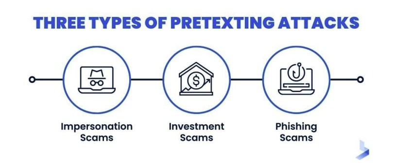

## Phising
Phishing attacks typically have one or more of the following objectives: - Credential Theft 
- Financial Fraud
- Malware Distribution
- Identity Theft
Here are several steps and measures that are typically taken: 
-  User Education
- Email Filtering
- Two-Factor Authentication (2FA) 
### Vishing
- Malicious actors use phone calls to
impersonate trusted entities or organizations with the primary goal of manipulating individuals into disclosing sensitive information or taking actions that compromise security. 
- Voice Communication: 
    - Unlike traditional phishing, vishing relies on `spoken communication through phone calls`.
#### Key Characteristics
- Urgent or Coercive Language: Vishing calls often employ urgency, fear, or intimidation to manipulate victims into immediate
compliance. 
- Spoofed Caller IDs: Attackers may manipulate caller IDs to display legitimate-sounding numbers or organizations, increasing their credibility. 
- Requests for Sensitive Information: Vishing calls frequently involve requests for (PINs), passwords, credit card details, or other sensitive data.

### Smishing
- Smishing, short for "SMS phishing," is a
cyberattack technique where malicious
actors use text messages to impersonate trusted entities or organizations.
- Deceptive Messages: Smishing messages are designed to appear as if they are from
legitimate sources.
- Requests for Information 
- Spoofed Sender Information

### Spear Phishing
- A targeted form of phishing where the attacker customizes their attack emails, messages, or communications to appeal to `specific victims`.
Unlike general phishing attacks, spear phishing is tailored to `particular
individuals, often using `personal or
organizational information` to appear more legitimate

## Disinformation
- Deliberate: Disinformation campaigns are carried out with the intention to deceiveor manipulate, often for political, financial, or competitive gains. 
- Malicious Intent
- Targeted and Coordinated

## Impersonation
- Use of Stolen Credentials: Often involves the use of credentials obtained through phishing attacks, keyloggers, or social engineering.
- Deception and Manipulation: Attackers may use social engineering tactics 
- Difficult to Detect

## Pretexting
- Definition Involves creating a fabricated story or scenario (the pretext) to deceive a target into divulging sensitive information. 
- The attacker often conducts extensive research to make the story as convincing as possible.
- Pretexting often involves the attacker pretending to be someone they are not, like a trusted authority figure, to gain the
victim's trust.

- Use of Elaborate False Scenarios: Attackers create believable stories or pretexts to justify their requests for information.
- Targeting Personal or Sensitive Information
- High Level of Customization: The scenarios are usually tailored to the specific target to increase their effectiveness.
#### Pretexting vs Impersonation
- While both pretexting and impersonation involve deception and trust manipulation, pretexting typically relies on a fabricated scenario to extract information. Pretexting often involves more interaction between the attacker and the victim, with the attacker playing a role that suits the pretext.
- Impersonation directly assumes the identity of another person, often using stolen credentials or identities. 
- It's less about building a story and more about leveraging the existing trust associated with the assumed identity.
## Watering Hole:
- Watering Hole: A targeted cyber attack strategy where the attacker seeks to compromise a specific group of end users by infecting websites they are known to frequently visit. 
- The goal is to infect a user's computer and gain access to the network at the user's place of employment.
- Targeting Specific User Groups: `The attacker chooses websites that are popular among a particular group, often related to their work, interests`, or geographical location. 
- Exploiting Website Vulnerabilities: The attacker infects these websites with malware, often by exploiting security weaknesses.
- Drive-by Downloads or Malicious Redirects: The attack is often executed through `drive-by downloads or redirecting users to a
malicious site` which then installs malware on their device without their knowledge.

## Brand Impersonation
This is a type of cyber attack where an attacker mimics or impersonates the brand identity of a reputable company to deceive victims, usually for the purpose of stealing sensitive information or spreading malware. 
- This can occur via emails, websites, social media, or other digital platforms.
## Typosquatting
- A form of cyber attack where attackers register domain names that are `misspellings of popular websites or mimic well-known domain names.`
- The aim is to deceive internet userswho make typographical errors when entering a URL into their browser, leading them to a malicious or deceptive website.
- Similar or Misspelled Domain Names: The core of typosquatting is the use of domain names that are slight misspellings or variations of legitimate domain names (e.g., 'googgle.com' instead of 'google.com').
- Fake Websites or Redirects: Typosquatted domains often host websites that `mimic the design of the intended site` or redirect users to other malicious sites