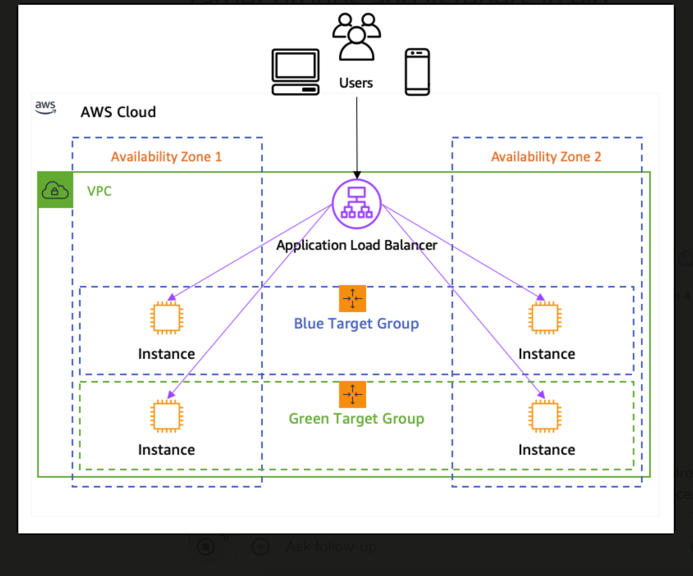

## AWS Elastic Load Balancer and Elastic IP Overview

### **Elastic IP**
- static ip 
- Only one network interface
- IP4 Address 
- 5 Elastic IP per region 
## ELB AND SUBNETS:
### Subnet Requirements for ELBs
1. **Public Subnets for Application Load Balancers (ALBs)**:
   - ALBs must be associated with at least **two public subnets** across different Availability Zones. 
2. **Routing Traffic**:
   - The ALB routes incoming traffic from the internet to EC2 instances located in **private subnets**. 
   - The public subnets are used for the ALB itself, while the private subnets house the backend instances that handle the requests.

3. **Classic Load Balancers**:
   - Classic Load Balancers can operate with a single subnet but are generally recommended to be placed in multiple subnets for redundancy and availability. 
   - They do not enforce the same two-subnet rule as ALBs.

### **Subnets**

- **Public Subnet**: attached internete gateway
- **Private Subnet**: uses NAT Gateway in public subnet

### **Kinds of Load Balancers**


#### **Application Load Balancer (ALB)**
- **Components**:
  - **Listeners**: Check for connection requests based on configured protocol/port.
  - **Rules**: 
  - **Target Groups**: 
- **Features**:
  - Layer 7 (HTTP/HTTPS).
  - Supports **WebSockets and HTTP/2**.
  - `IPv6` support.
  - Path-based and host-based routing.
  - Integration with AWS WAF.
  - `Sticky sessions`.

#### **Network Load Balancer (NLB)**
- **Handles**: TCP and UDP traffic.
- **Features**:
  - sub milli second latency
  - whitelist ip using this
  - Layer 4.
  - Preserves the source IP address of the client.

#### **Gateway Load Balancer (GWLB)**
- **Purpose**: third-party virtual appliances like firewalls.
- **Features**:
  - Layer 3 (network layer).
  - Uses the `GENEVE protocol` on port 6081.
  - Acts as a `single entry and exit point`.

#### **Classic Load Balancer (CLB)**
- **Legacy**: An older type of load balancer that supports both Layer 4 and Layer 7 traffic.
- No web socket support and http2 support
- WAF is not compatible with this.

### **Key Concepts and Features**

#### **Connection Draining**
- Allows existing connections to quit gracefully 
- while preventing new connections to instances that are deregistering.

#### **Cross-Zone Load Balancing**
- **Definition**: Distributes traffic evenly across all registered targets in all enabled AZ.

#### **Sticky Sessions**
- same target using cookies to track sessions.
- special cookie (AWSALB) to track the instance. 
- load balancer checks for this cookie. 
- If present, the request is routed to the specified instance. If absent, the load balancer selects an instance based on the load balancing algorithm.

#### **Integration with Auto Scaling**
- **Definition**: Automatically adds or removes instances from the load balancer's target group as the Auto Scaling group scales in or out.

### **Security Measures**

- **SSL/TLS Termination**: Offloads the SSL/TLS encryption and decryption to the load balancer.
- **Integration with AWS WAF**: 
- **Security Groups and ACLs**:

### **Challenges and Optimization Strategies**

#### **Challenges**
- Configuring health checks correctly.
- Managing security settings.
- Handling sudden traffic spikes.

#### **Optimization Strategies**
- Using the appropriate type of load balancer for your needs.
- Monitoring usage and scaling down when necessary.
- Considering Reserved Instances for cost savings.

### **Setting Up a Highly Available Architecture Using ELB**

1. **Deploy Application Across Multiple Availability Zones**: Ensures high availability and fault tolerance.
2. **Create an ELB**: 
3. **Enable Cross-Zone Load Balancing**:
4. **Set Up Health Checks**: 
5. **Integrate with Auto Scaling**: 

### **Algorithms for Load Balancers**

| Algorithm          | How It Works                                    | Benefits                                  | Drawbacks                              | Use Cases                                   |
|--------------------|-------------------------------------------------|-------------------------------------------|----------------------------------------|---------------------------------------------|
| **Round Robin**    | Cyclically distributes requests to servers      | Simple, even distribution if servers are similar | Assumes identical server capacity      | Environments with similar server performance|
| **Least Connections** | Directs requests to the server with the fewest active connections | Prevents server overload, dynamic adaptation | Ignores server capacity, more complex | Varying server loads and capacities         |
| **IP Hash**        | Uses client's IP address to determine server assignment | Provides session persistence              | Can lead to uneven load distribution   | Applications requiring consistent server assignment |

### **Path-Based and Host-Based Routing**

- **Path-Based Routing**: Routes requests based on the URL path.
  - **Listener Rules**: Define path patterns to match.
  - **Target Groups**: Each path pattern is associated with a specific target group.
  - **Use Case**: Hosting multiple microservices behind a single ALB.

- **Host-Based Routing**: Routes requests based on the host header in the HTTP request.
  - **Listener Rules**: Define host conditions.
  - **Target Groups**: Each host condition is associated with a specific target group.
  - **Use Case**: Hosting multiple applications or services on different subdomains.

### **Availability Zones**

- **Definition**: Distinct locations within an AWS region engineered to be isolated from failures in other Availability Zones.
- **Typical Count**: 3 to 6 AZs per region.
## **Application Load Balancer (ALB) vs. Network Load Balancer (NLB) Security Comparison**

### **Security Features**

**Application Load Balancer (ALB)**
  - **SSL Termination**: ALB can terminate SSL/TLS connections, This can simplify certificate management and reduce the computational load on backend instances.
  - **Web Application Firewall (WAF)**: 
  - **Authentication**: ALB supports user authentication using Amazon Cognito.
  - **Advanced Routing**: Using host and path based routing.

**Network Load Balancer (NLB)**
- **Security Features**:
  - **TLS Termination**: NLB can also terminate TLS connections
  - **Static IP**: NLB provides a static IP address for the load balancer, which can simplify firewall configurations.
  - **DDoS Protection**: NLB is integrated with AWS Shield
  - **Flow Hash Algorithm**: NLB uses a flow hash algorithm to distribute traffic, which can help in maintaining session persistence and ensuring secure and consistent routing of traffic.

### **Comparison Table**

| Feature                     | ALB (Application Load Balancer) | NLB (Network Load Balancer) |
|-----------------------------|----------------------------------|-----------------------------|
| **OSI Layer**               | Layer 7 (Application)            | Layer 4 (Transport)         |
| **Protocols Supported**     | HTTP, HTTPS, gRPC                | TCP, UDP, TLS               |
| **SSL/TLS Termination**     | Yes                              | Yes                         |
| **Web Application Firewall**| Yes (AWS WAF integration)        | No                          |
| **User Authentication**     | Yes (Amazon Cognito, OIDC)       | No                          |
| **Static IP**               | No                               | Yes                         |
| **DDoS Protection**         | Yes (AWS Shield)                 | Yes (AWS Shield)            |
| **Routing**                 | Content-based routing            | Flow hash algorithm         |


### **Health Check Configuration**

- **Health Check Path**: The URL path that the ALB uses to perform health checks on the targets. For example, `/health` or `/status`.
- **Health Check Interval**:
- **Timeout**: The amount of time to wait for a response before marking the health check as failed.
- **Healthy Threshold**: 
- **Unhealthy Threshold**:

### **Example Configuration**

```hcl
resource "aws_lb_target_group" "example" {
  name     = "example-tg"
  port     = 80
  protocol = "HTTP"
  vpc_id   = aws_vpc.main.id

  health_check {
    path                = "/health"
    interval            = 30
    timeout             = 5
    healthy_threshold   = 3
    unhealthy_threshold = 2
  }
}
```


### **Checking Health Status**

You can check the health status of your targets using the AWS Management Console, AWS CLI, or AWS SDKs. For example, using the AWS CLI:

```sh
aws elbv2 describe-target-health --target-group-arn <target-group-arn>
```


- **ALB** is ideal for web applications that require advanced routing, user authentication, and integration with AWS WAF. It terminates SSL/TLS at the application layer, providing features like content-based routing and the `X-Forwarded-Proto` header.

## **Key Metrics to Monitor**

### **Application Load Balancer (ALB) Metrics**
1. **Request Count**: Number of requests handled by the load balancer.
2. **Target Response Time**: Time taken for targets to respond to requests.
3. **HTTP 4xx and 5xx Errors**: Count of client and server errors.
4. **HealthyHostCount**: Number of healthy targets.
5. **UnHealthyHostCount**: Number of unhealthy targets.
6. **Request Count per Target**: Number of requests received by each target.
7. **Target Connection Errors**: Number of connection errors to targets.

### **Network Load Balancer (NLB) Metrics**
1. **Active Flow Count**: Number of active flows.
2. **New Flow Count**: Number of new flows.
3. **Processed Bytes**: Number of bytes processed by the load balancer.
4. **HealthyHostCount**: Number of healthy targets.
5. **UnHealthyHostCount**: Number of unhealthy targets.
6. **TLS Negotiation Error Count**: Number of TLS negotiation errors.

## **Setting Up CloudWatch Monitoring**

### **Viewing Metrics**
1. **Using the AWS Management Console**:
   - Open the **Amazon EC2 console**.
   - Navigate to **Load Balancers** or **Target Groups**.
   - Select your load balancer or target group and go to the **Monitoring** tab to view metrics.

2. **Using the CloudWatch Console**:
   - Open the **CloudWatch console**.
   - Navigate to **Metrics**.
   - Select the **ApplicationELB** or **NetworkELB** namespace.
   - Filter metrics by load balancer, target group, or availability zone as needed.

### **Creating Alarms**
1. **Using the AWS Management Console**:
   - Open the **CloudWatch console**.
   - Navigate to **Alarms** and choose **Create Alarm**.
   - Select the relevant ELB metric (e.g., Latency, UnHealthyHostCount).
   - Configure the alarm threshold, evaluation period, and actions (e.g., sending notifications via SNS).

2. **Using the AWS CLI**:
   - Set up an SNS topic for notifications.
   - Use the `put-metric-alarm` command to create an alarm:
     ```sh
     aws cloudwatch put-metric-alarm --alarm-name "HighLatencyAlarm" \
       --metric-name Latency --namespace AWS/ApplicationELB \
       --statistic Average --period 60 --threshold 0.1 \
       --comparison-operator GreaterThanThreshold \
       --dimensions Name=LoadBalancerName,Value=my-load-balancer \
       --evaluation-periods 3 --alarm-actions arn:aws:sns:region:account-id:my-topic
     ```

## **Analyzing Logs**

### **Access Logs**
- Logs are stored in an Amazon S3 bucket and can be analyzed using tools like Amazon Athena or third-party log management solutions.

### **CloudTrail Logs**
- Logs are stored in an S3 bucket and can be analyzed to audit changes and troubleshoot issues.


## **Using CloudWatch Dashboards**
- Create customizable dashboards in CloudWatch to monitor ELB metrics in a single view.
- Dashboards can include graphs, alarms, and log insights widgets.


### **Types of Load Balancers and Their Logs**

1. **Application Load Balancer (ALB)**
2. **Network Load Balancer (NLB)**
3. **Classic Load Balancer (CLB)**

### **Enabling Access Logs**

#### **Step-by-Step Guide**

1. **Create an S3 Bucket**
2. **Set Bucket Policy**
   - Grant Elastic Load Balancing permission to write to the bucket.
   - Example bucket policy:
     ```json
     {
       "Version": "2012-10-17",
       "Statement": [
         {
           "Effect": "Allow",
           "Principal": {
             "Service": "elasticloadbalancing.amazonaws.com"
           },
           "Action": "s3:PutObject",
           "Resource": "arn:aws:s3:::your-bucket-name/AWSLogs/your-aws-account-id/*"
         }
       ]
     }
     ```

3. **Enable Access Logs for ALB**

4. **Enable Access Logs for NLB**

5. **Enable Access Logs for CLB**

## TROUBLESHOOTING LOAD BALANCER IS DOWN


### **Impact of ALB Downtime**

1. **Service Interruption**:
   - When the ALB is down, it cannot route incoming traffic to the backend instances, leading to a service interruption.

## **AWS Mitigations and Best Practices**

### **High Availability Configuration**

1. **Multi-AZ Deployment**:
2. **Automatic Replacement**:
   - If an individual ALB instance fails, AWS automatically replaces it.

### **DNS and Health Checks**

1. **DNS Failover**:
   - The ALB uses DNS to distribute traffic across multiple instances. 
    - If an instance fails, the DNS is updated to route traffic to healthy instances. 
       - The DNS (TTL) is set to a low value (typically 60 seconds).

2. **Route 53 Health Checks**:
   - Amazon Route 53 health checks and DNS failover features. Route 53 can detect if the ALB is unhealthy and reroute traffic to a healthy endpoint.

### **Troubleshooting and Recovery**

1. **Troubleshooting Tools**:
2. **Monitoring and Alerts**:
   -This includes monitoring metrics like `HealthyHostCount` and `UnHealthyHostCount`.

### **Best Practices**
1. **Use Multiple ALBs**:
2. **Pre-Warming**:
3. **Regular Testing**:

### METRICS IN ALB:

- `RequestCount`
- `ProcessedBytes`
- `HealthyHostCount`
- `UnHealthyHostCount`
- `TargetResponseTime`

## Target Groups and Listeners in AWS Elastic Load Balancers

### Target Groups

A target group is a collection of resources (such as EC2 instances, IP addresses, or Lambda functions) that are registered to receive traffic from a load balancer.

#### Example Configuration:
```yaml
apiVersion: elbv2
kind: TargetGroup
metadata:
  name: my-target-group
spec:
  targetType: instance
  protocol: HTTP
  port: 80
  healthCheckProtocol: HTTP
  healthCheckPort: 80
  healthCheckPath: /health
  healthCheckIntervalSeconds: 30
  healthCheckTimeoutSeconds: 5
  healthyThresholdCount: 5
  unhealthyThresholdCount: 2
```

### Listeners

A listener is a process that checks for connection requests using the protocol and port you configure. Listeners are essential for your load balancer to receive traffic from clients.

#### Key Features of Listeners:

1. **Protocols and Ports**:
   - **Protocols**: HTTP, HTTPS, TCP, SSL
   - **Ports**: 1-65535

2. **Listener Rules**:
   - Rules determine how the load balancer routes requests to the targets.
   - Each rule consists of a priority, conditions, and actions.

3. **Action Types**:
   - **Forward**: Forwards requests to target groups.
   - **Redirect**: Redirects requests from one URL to another.
   - **Fixed Response**: Returns a custom HTTP response.

4. **SSL/TLS Termination**:
   - HTTPS listeners can offload the work of encryption and decryption to the load balancer.
   - You must deploy at least one SSL server certificate on the listener.

#### Example Configuration:
```yaml
apiVersion: elbv2
kind: Listener
metadata:
  name: my-listener
spec:
  loadBalancerARN: arn:aws:elasticloadbalancing:region:account-id:loadbalancer/app/my-load-balancer/50dc6c495c0c9188
  protocol: HTTPS
  port: 443
  sslPolicy: ELBSecurityPolicy-2016-08
  certificates:
    - certificateARN: arn:aws:acm:region:account-id:certificate/12345678-1234-1234-1234-123456789012
  defaultActions:
    - type: forward
      targetGroupARN: arn:aws:elasticloadbalancing:region:account-id:targetgroup/my-targets/73e2d6bc24d8a067
```
## ALB VS CLB
- **CLB** operates at both Layer 4 (TCP) and Layer 7 (HTTP)
- **ALB** operates at Layer 7 (HTTP) only.
- **CLB** supports TCP, SSL/TLS, HTTP, HTTPS
- **ALB** supports HTTP, HTTPS, WebSocket.
- ALB can do host and path based routing also.
- ALB Can support Lambda functions also but not CLB.
You are correct that there are significant differences in SSL certificate support between the Classic Load Balancer (CLB) and the Application Load Balancer (ALB).
- The CLB supports only **one SSL certificate** per listener. 
  - This means that if you need to serve multiple domains or applications with different SSL certificates, you would typically have to use a wildcard certificate or a multi-domain (SAN) certificate, which can introduce security risks.
  - The ALB supports **multiple SSL certificates** on a single listener using **Server Name Indication (SNI)**. 
  - This feature allows the ALB to serve multiple secure applications, each with its own SSL certificate, behind the same load balancer. 
  - The ALB automatically selects the appropriate certificate based on the hostname provided by the client during the SSL handshake. You can associate up to **25 certificates** with an ALB listener.

## SERVER NAME INDICATION

Server Name Indication (SNI) is an extension to the TLS protocol that allows a client to specify the `hostname it is trying to connect to at the start of the TLS handshake.` This enables the server to present the appropriate SSL/TLS certificate based on the requested hostname, even if multiple domains are served from the same IP address.

1. **Client Hello**: When a client initiates a TLS connection, it sends a "Client Hello" message that includes the SNI extension, specifying the hostname it wants to connect to.

2. **Server Hello**: The server receives the Client Hello message and checks the SNI extension to determine which SSL/TLS certificate to use for the connection. 
  - If a matching certificate is found, the server sends a "Server Hello" message with the selected certificate.

3. **Certificate Verification**: The client verifies the server's certificate against the hostname it was trying to connect to. 
- If the certificate is valid and trusted, the TLS handshake continues.

4. **Encrypted Communication**: Once the TLS handshake is complete, the client and server can communicate securely using the established encrypted connection.

SNI allows servers to host multiple SSL/TLS certificates for different domains on the same IP address, eliminating the need for a unique IP address for each domain. This is particularly useful for hosting companies, CDNs, and cloud-based services that serve content for multiple domains.

### Security Risks and SNI

1. **Lack of Encryption**: The SNI field is sent in plain text during the TLS handshake, which means that anyone monitoring the network can see the hostname being requested. 

2. **Potential for Man-in-the-Middle (MITM) Attacks**: Due to the plaintext nature of the SNI field, attackers could perform MITM attacks, where they intercept and alter communications between the client and server.

3. **Compatibility Issues**: Not all browsers and servers support SNI, particularly older systems. 
# To map multiple domains in an Application Load Balancer (ALB) on AWS

### Step 1: Set Up the Application Load Balancer
1. **Create an ALB**: If you haven't already created an ALB, go to the EC2 dashboard and create one.
2. **Add at least one listener**: Typically, this will be HTTP (port 80) or HTTPS (port 443).

### Step 2: Configure Domain Names
1. **Domain Registration**: Ensure your domains are registered and point to Route 53 or another DNS provider.
2. **Route 53 Hosted Zones**: If using Route 53, create or import hosted zones for each domain.

### Step 3: Create Target Groups
1. **Create Target Groups**: For each application or service behind the ALB, create a target group.
2. **Register Instances/Targets**: Register your EC2 instances, ECS services, or Lambda functions in the respective target groups.

### Step 4: Configure Listener Rules
1. **Access ALB Listeners**:
   - Go to the EC2 Dashboard.
   - Select "Load Balancers" and choose your ALB.
   - Click on the "Listeners" tab.

2. **Create Listener Rules**:
   - Select your listener (e.g., HTTP 80 or HTTPS 443).
   - Click on "View/edit rules".

3. **Add Rules for Each Domain**:
   - **Rule Conditions**: Add a new rule with a condition based on the host header.
     - For example, `Host header is example1.com` and `Host header is example2.com`.
   - **Rule Actions**: Forward the traffic to the corresponding target group for each domain.

### Example Rule Configuration:
- **Rule for example1.com**:
  - Condition: Host header is `example1.com`
  - Action: Forward to target group `target-group-1`

- **Rule for example2.com**:
  - Condition: Host header is `example2.com`
  - Action: Forward to target group `target-group-2`

### Step 5: Update DNS Records
1. **Route 53 Alias Records**: Create alias records in Route 53 pointing to your ALB.
   - For `example1.com`, create an A or CNAME record pointing to the ALB DNS name.
   - Repeat for `example2.com`.

### Step 6: Verify Configuration
1. **Test Access**: Open a browser and navigate to each domain (e.g., `http://example1.com` and `http://example2.com`).
2. **Check Routing**: Ensure each domain routes to the correct target group/application.

### Detailed Example
Here is a more detailed example of setting up listener rules using the AWS Management Console:

1. **Navigate to ALB Listeners**:
   - In the EC2 Dashboard, select "Load Balancers".
   - Choose your ALB and click on "Listeners".

2. **Edit Listener**:
   - For the HTTP or HTTPS listener, click on "View/edit rules".
   - Add a rule by clicking on the `+` icon.

3. **Configure Rule for `example1.com`**:
   - **Condition**: Add a condition for "Host header" and set it to `example1.com`.
   - **Action**: Add an action to "Forward to" and select the target group for `example1.com`.

4. **Configure Rule for `example2.com`**:
   - **Condition**: Add a condition for "Host header" and set it to `example2.com`.
   - **Action**: Add an action to "Forward to" and select the target group for `example2.com`.

5. **Save Rules**: Save the rules to apply the changes.

### Notes:
- **SSL Certificates**: If using HTTPS, ensure you have SSL certificates for each domain. You can use AWS Certificate Manager (ACM) to manage these certificates and attach them to your ALB.
- **Wildcard Domains**: If you have subdomains, you can use wildcard rules (e.g., `*.example.com`).
Here's a textual representation to help you visualize the setup:

```
+----------------------------------------+
|            Route 53                    |
|  +----------------------+  +-----------+|
|  |example1.com          |  |example2.com|
|  +----------------------+  +-----------+|
|           |                        |    |
|           v                        v    |
+----------------------------------------+
                     |
                     v
+---------------------------------------------------+
|               Application Load Balancer (ALB)     |
|  +----------------------------------------------+ |
|  | Listener: HTTP/HTTPS                         | |
|  |  +----------------------+  +----------------+| |
|  |  | Host header:         |  | Host header:   || |
|  |  | example1.com         |  | example2.com   || |
|  |  +----------------------+  +----------------+| |
|  |  | Action: Forward to   |  | Action: Forward|| |
|  |  | target-group-1       |  | to target-group|| |
|  |  +----------------------+  | -2             || |
|  |                                      |      || |
|  +----------------------------------------------+ |
|                  |                               | |
|                  v                               v |
|        +--------------------+         +--------------------+|
|        | Target Group 1     |         | Target Group 2     ||
|        | +----------------+ |         | +----------------+ ||
|        | | EC2 Instances  | |         | | EC2 Instances  | ||
|        | +----------------+ |         | +----------------+ ||
|        +--------------------+         +--------------------+ |
+---------------------------------------------------+
```

### Steps to Set Up:

1. **Route 53 Configuration**:
   - Create DNS records for `example1.com` and `example2.com`, pointing them to the ALB.

2. **ALB Listener Rules**:
   - Configure listener rules to forward traffic based on the host header.
   - Rule 1: If `Host header is example1.com`, forward to `target-group-1`.
   - Rule 2: If `Host header is example2.com`, forward to `target-group-2`.

3. **Target Groups**:
   - Create two target groups, `target-group-1` and `target-group-2`.
   - Register EC2 instances or other services with these target groups.

### DNS Setup:
- **example1.com**: Points to the ALB.
- **example2.com**: Points to the ALB.

This configuration ensures that traffic to `example1.com` is directed to `target-group-1` and traffic to `example2.com` is directed to `target-group-2`, allowing for effective routing based on domain names.
