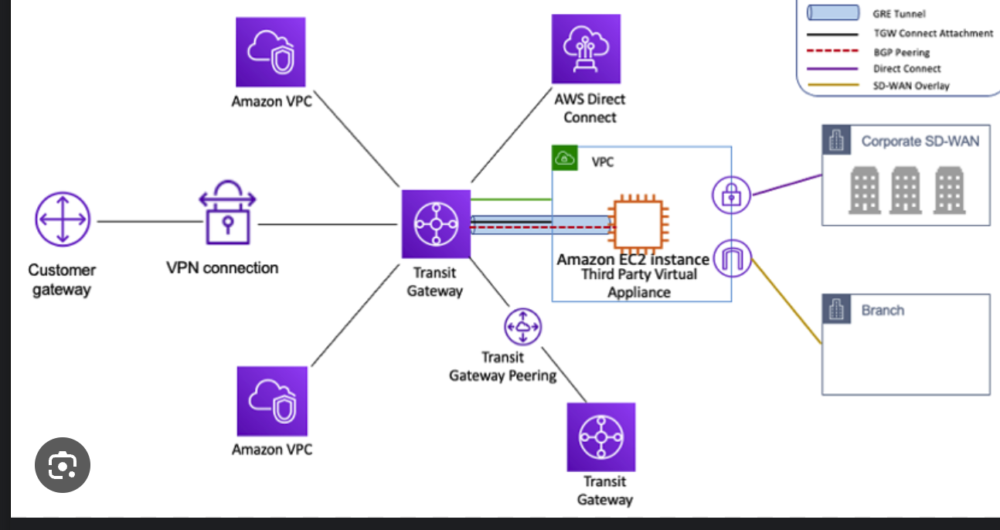

## **Amazon Virtual Private Cloud (VPC) and Related Components**

### **Amazon VPC**
### HOW TO IDENTIFY PUBLIC AND PRIVATE SUBNETS:
1. **Public Subnet**: 
   - A subnet is classified as public if its route table has a route that directs traffic to an **Internet Gateway** (IGW). 
   - Specifically, you will see a route entry for `0.0.0.0/0` pointing to `igw-xxxxxxxxxxxxxxxxx` in the route table.

2. **Private Subnet**: 
   - Conversely, a subnet is considered private if its route table does not have a route to an Internet Gateway. 
   - Instead, it may route to a **NAT Gateway** or simply have no route for `0.0.0.0/0`, meaning it cannot directly access the internet.
#### **Key Features**
- **Subnets**: A subnet is a range of IP addresses in your VPC. 
  - Each **subnet must reside in a single Availability Zone**.
- **IP Addressing**: You can assign both IPv4 and IPv6 addresses to your VPCs and subnets.
- **Routing**: Route tables determine where network traffic from your subnet or gateway is directed.
- **Gateways and Endpoints**: Gateways connect your VPC to another network, such as the internet or AWS services.
- **Peering Connections**: Route traffic between resources in two VPCs.
- **Traffic Mirroring**: Copy network traffic from network interfaces for inspection.
- **Transit Gateways**: Central hub to route traffic between VPCs, VPN connections, and AWS Direct Connect connections.
- **VPC Flow Logs**: Capture information about IP traffic going to and from network interfaces in your VPC.
- **VPN Connections**: Connect your VPCs to on-premises networks using AWS VPN.

### **VPC Endpoint**

A VPC endpoint enables you to privately connect your VPC to supported AWS services without requiring an internet gateway, NAT device, VPN connection, or AWS Direct Connect connection. 
- Traffic between your VPC and the service does not leave the Amazon network.

#### **Types of VPC Endpoints**
- **Interface Endpoints**: Use AWS PrivateLink to connect to supported AWS services and services hosted by other AWS customers and partners.
- **Gateway Endpoints**: Used for services like Amazon S3 and DynamoDB. 
  - They are configured in the route table of your VPC.

### NACL VS SECURITY GROUP:
- The default NACL allows everything outbound and everything inbound
- We define one NACL per subnet, new subnets are assigned the default NACL
- Rules have a number (1 - 32766) which defines the precedence
- Rules with lower number have higher precedence
- Last rule is has the precedence of **asterisk (*)** and denies all the requests. This rule is not editable
- **AWS recommends adding rules by increment of 100**

### **Security Groups**
   - Security groups are stateful. 
     - This means that if an inbound request is allowed, the response is automatically allowed.
   - Only support `"allow"`rules. 
   - By default, all inbound traffic is denied, and all outbound traffic is allowed.
   - Changes to security group rules take effect immediately.


### **Comparison Table**

| Feature                  | Security Groups                              | Network ACLs                              |
|--------------------------|----------------------------------------------|-------------------------------------------|
| **Level of Operation**   | Instance level                               | Subnet level                              |
| **Statefulness**         | Stateful                                     | Stateless                                 |
| **Rules**                | Only "allow" rules                           | Both "allow" and "deny" rules             |
| **Default Behavior**     | Deny all inbound, allow all outbound         | Allow all inbound and outbound by default |
| **Rule Evaluation**      | All rules are evaluated collectively         | Rules are evaluated in numerical order    |
| **Use Cases**            | Granular control at instance level           | Broad control at subnet level             |
| **Configuration**        | Immediate effect, based on IP, protocol, port| Immediate effect, based on IP, protocol, port |


### **Internet Gateway**

- horizontally scaled, redundant, and highly available VPC component. 
- It supports IPv4 and IPv6 traffic

#### **Key Functions**
- **Outbound Traffic**: Allows instances in public subnets to connect to the internet.
- **Inbound Traffic**: Allows resources on the internet to connect to instances in your VPC using public IP addresses.
- **NAT for IPv4**: Performs network address translation for IPv4 traffic.

### **NAT Gateway**

A NAT gateway is a managed service that allows instances in a private subnet to connect to the internet or other AWS services while preventing the internet from initiating connections with those instances.
- There are two types of NAT gateways: public and private.

#### **Key Functions**
- **Public NAT Gateway**: Allows instances in private subnets to **connect to the internet using an Elastic IP address**.
- **Private NAT Gateway**: Allows instances in private subnets to connect to **other VPCs or on-premises networks without using an Elastic IP address**.

### **VPC Flow Logs**

VPC Flow Logs capture information about the IP traffic going to and from network interfaces in your VPC. 
- Flow log data can be published to Amazon CloudWatch Logs, Amazon S3, or Amazon Kinesis Data Firehose.

### **VPC Monitoring**

#### **Amazon CloudWatch**
- **Metrics**:
- **Alarms**: .
- **Dashboards**: 

#### **AWS CloudTrail**

#### **VPC Flow Logs**
- **Traffic Analysis**: Use flow logs to analyze traffic patterns and troubleshoot issues.

## **VPC Endpoint Types, CIDR Ranges in VPC, and Secondary CIDRs**

### **VPC Endpoint Types**

#### **1. Interface Endpoints**
- **Description**: Interface endpoints use AWS PrivateLink to connect.
- **Components**: Consist of one or more elastic network interfaces with **private IP addresses**.
- **Supported Services**: Many AWS managed services, including Amazon S3, DynamoDB, and others.
- **Cost**: Charged based on the number of endpoints and data transfer.

#### **2. Gateway Endpoints**
- **Description**: Gateway endpoints are used to connect to specific AWS services, such as Amazon S3 and DynamoDB, **by adding entries to the route table**.
- **Components**: Targets specific IP routes in a VPC route table using prefix lists.
- **Supported Services**: Only Amazon S3 and DynamoDB.
- **Cost**: No additional cost.

### **CIDR Ranges in VPC**
- A VPC must have an associated IPv4 CIDR block, and optionally, an IPv6 CIDR block.

#### **IPv4 CIDR Blocks**
- **Private IP Ranges**: Typically fall within the private IP address ranges specified in RFC 1918:
  - 10.0.0.0/8
  - 172.16.0.0/12
  - 192.168.0.0/16
- **Public IP Ranges**: Can also use publicly routable CIDR blocks, but direct internet access requires an internet gateway.

#### **IPv6 CIDR Blocks**
- **Format**: Eight groups of four hexadecimal digits, separated by colons, followed by a double colon and a number from 1 to 128 (e.g., 2001:db8:1234:1a00::/56).
- **Global Uniqueness**: IPv6 addresses are globally unique and can be configured to remain private or reachable over the internet.

### **Secondary CIDRs**
#### **Configuration**
- **Restrictions**: Ensure that secondary CIDR blocks do not overlap with existing CIDR blocks in the VPC or peered VPCs.

### **Example Configuration for Adding Secondary CIDR**

```sh
aws ec2 associate-vpc-cidr-block --vpc-id vpc-12345678 --cidr-block 10.1.0.0/16
```

## **How Many CIDR Blocks Can Be Attached to a VPC?**


### **Primary and Secondary CIDR Blocks**

1. **Primary CIDR Block**:
   - When you create a VPC, you must specify a primary IPv4 CIDR block.
   - This primary CIDR block cannot be changed after the VPC is created.

2. **Secondary CIDR Blocks**:
   - You can associate additional (secondary) IPv4 CIDR blocks with your VPC.
   - Upto 5 for IPV6 and IPV4

## **Public and Private NAT Gateways in AWS**


### **Public NAT Gateway**

**Description**:
- A Public NAT Gateway enables instances in private subnets to connect to the internet.
- It resides in a public subnet and requires an Elastic IP address.
- Traffic from instances in private subnets is routed to the NAT gateway, which then forwards it to the internet gateway.
**Use Cases**:
- **Software Updates**: 
- **Accessing External APIs**:

**Configuration Steps**:
1. **Create a Public Subnet**:
2. **Create a NAT Gateway**: NAT Gateways and create a new NAT gateway in the public subnet, associating it with an Elastic IP address.
3. **Update Route Tables**:

### **Private NAT Gateway**

**Description**:
- A Private NAT Gateway enables instances in private subnets to connect to **other VPCs or on-premises networks**.
- It resides in a **private subnet** and does not require an Elastic IP address.
- Traffic from instances in private subnets is routed to the NAT gateway, which then forwards it to a transit gateway.

**Key Characteristics**:
- **No Internet Access**: Used for communication between VPCs or with on-premises networks.
- **Private IP Address**: Uses a private IP address for outbound traffic.


### **Comparison Table**

| Feature                   | Public NAT Gateway                              | Private NAT Gateway                             |
|---------------------------|--------------------------------------------------|-------------------------------------------------|
| **Subnet**                | Public Subnet                                    | Private Subnet                                  |
| **Elastic IP**            | Required                                         | Not Required                                    |
| **Internet Access**       | Yes (Outbound only)                              | No                                              |
| **Use Case**              | Accessing the internet from private subnets      | Communication between VPCs or with on-premises  |
| **Traffic Routing**       | Routes to internet gateway                       | Routes to transit gateway or virtual private gateway |
| **Security**              | Prevents unsolicited inbound connections         | Enhanced security for non-internet communication |

## **AWS Transit Gateway and Elastic IP Address**

### **AWS Transit Gateway**

**Overview**:
AWS Transit Gateway is a networking service that connects Amazon Virtual Private Clouds (VPCs) and on-premises networks through a central hub.

**Key Features**:
- **Centralized Hub**: Acts as a central hub for connecting multiple VPCs, AWS accounts, and on-premises networks.
- **Inter-Region Peering**: Supports encrypted **inter-region peering, allowing VPCs**.
- **Multicast Support**: Supports multicast applications without the need for specialized hardware.


**Use Cases**:
- **Global Application Delivery**: Deploy and manage applications across multiple VPCs and regions without complex peering configurations.
- **Rapid Scaling**: Quickly add VPCs, AWS accounts, VPN capacity, or AWS Direct Connect gateways to meet demand.
- **Multicast Applications**: Host multicast applications that scale based on demand.

**How It Works**:
- **Hub-and-Spoke Model**: Connects VPCs and on-premises networks to a central hub, simplifying network management.
- **Routing**: Uses route tables to determine the next hop for traffic based on destination IP addresses.

### **Elastic IP Address**

**Overview**:
An Elastic IP address is a static IPv4 address

**Key Characteristics**:
- **Static IP**: Does not change over time, providing a consistent IP address for your resources.
- **Public IPv4 Address**: Reachable from the internet, enabling **communication with instances that do not have a public IP address**.
- **Region-Specific**: Elastic IP addresses are specific to a region.
  - 5 per region.

**Use Cases**:
- **DNS Configuration**: Use the Elastic IP address in DNS records to ensure your domain points to the correct instance.

**Pricing**:
- **Charges**: 
  - AWS charges for Elastic IP addresses that are not associated with running instances. 
  - There is no charge for Elastic IP addresses associated with running instances.
- No, you cannot attach the same Elastic IP address to multiple Amazon EC2 instances simultaneously. Each Elastic IP (EIP) can only be associated with one instance or network interface at a time. 
- If you need multiple instances to share a single public IP address, you can use a Network Address Translation (NAT) gateway or a load balancer.
