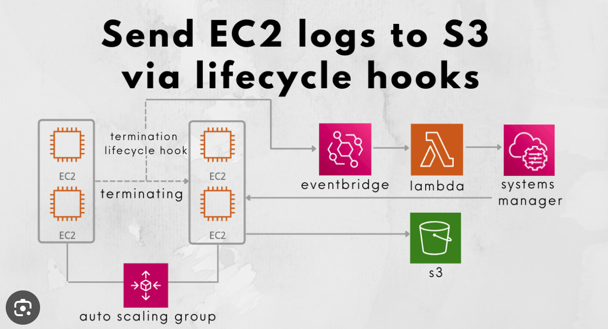

## **Auto Scaling Groups (ASGs) in AWS**

### **Purpose of Auto Scaling Groups**
- **Scale Out**: Add more EC2 instances to match increased load.
- **Scale In**: Remove EC2 instances to match decreased load.
- **Automatic Registration**: Automatically register new instances to a load balancer.

### **ASG Attributes**
- **Launch Configuration**: Consists of:
  - AMI + Instance Type
  - EC2 User Data
  - EBS Volumes
  - Security Groups
  - SSH Key Pair
- **Size Settings**: Min size, max size, initial capacity.
- **Load Balancer Information**: Details about the load balancer.
- **Scaling Policies**: Define what triggers a scale out/scale in.

### **Auto Scaling Alarms**
- **CloudWatch Alarms**: Scale an ASG based on CloudWatch alarms.
  - **Metrics Monitored**: Metrics such as Average CPU.
  - **Overall Metrics**: Metrics are computed for the overall ASG instances.
- **Types of Policies**:
  - **Scale-out Policies**
  - **Scale-in Policies**
- **SQS Integration**: Use queue length metrics for scaling.
- **Custom Metrics**: For CPU and memory utilization, install a CloudWatch agent on EC2 instances.

### **Auto Scaling New Rules**
- **Target Tracking Scaling**: Define rules based on average CPU usage, number of requests on the ELB per instance, average network in/out.
- **Ease of Setup**: These rules are easier to set up and reason about.

### **Auto Scaling Based on Custom Metrics**
- **Custom Metric Scaling**:
  1. Send a custom metric request to CloudWatch (PutMetric API).
  2. Create a CloudWatch alarm to react to metric values.
  3. Use the CloudWatch alarm as a scaling policy for ASG.

### **ASG Scaling Policies**
- **Target Tracking Scaling**:
  - Simple and easy to set up.
  - Example: Maintain average ASG CPU around 40%.
- **Simple/Step Scaling**:
  - Example: Add 2 units if average CPU > 70%, remove 1 unit if average CPU < 30%.
- **Scheduled Actions**:
  - Anticipate scaling based on known usage patterns.
  - Example: Increase min capacity to 10 at 5 PM on Fridays.

### **Scaling Cool-downs**
- **Cool-down Period**: Ensures ASG doesn’t launch or terminate additional instances before the previous scaling activity takes effect.
- default is 5 minutes, maximum is 60 minutes.

### **Suspend and Resume Scaling Processes**
- **Suspend/Resume**: Suspend and resume scaling processes for troubleshooting or making changes.
- **Standby State**: Move an instance to standby state for updates/changes without health checks or replacement instances.

### **ASG for Solutions Architects**
- **Default Termination Policy**:
  - Find the **AZ with the most instances**.
  - Delete the instance with the **oldest launch configuration** if multiple instances are available.
- **Lifecycle Hooks**:
  - Perform extra steps before an instance goes in service or before termination.

### **Launch Templates vs. Launch Configurations**
- **Launch Configurations**:
  - Specify AMI, instance type
    - key pair, security groups, and other parameters.
  - Must be recreated every time.
  - This is not reusable and must be created every time.
  - Cannot provision spot instances.
- **Launch Templates**:
  - Allow multiple versions.
  - configuration reuse and inheritance.
  - Provision both On-Demand and Spot instances.
  - Recommended by AWS.
