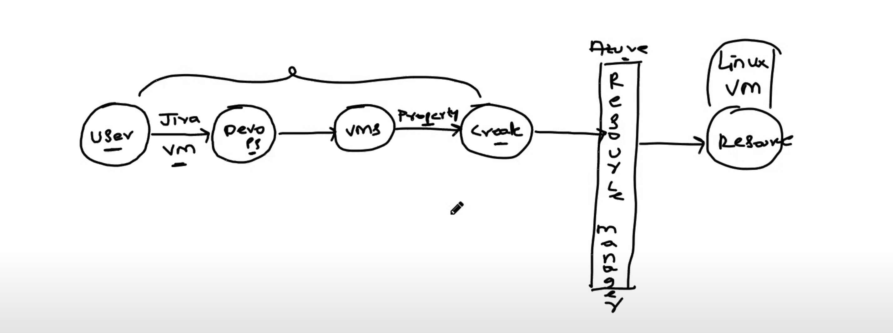

## Azure Resource Manager (ARM)

Azure Resource Manager is the deployment and management service for Azure. 
- It provides a management layer that enables users to create, update, and delete resources in their Azure account. ARM ensures that all requests to Azure services pass through a consistent API, providing uniform results across different tools such as the Azure portal, PowerShell, Azure CLI, REST APIs, and client SDKs.

### Key Features of ARM

- **Consistent Management Layer**: ARM ensures that all requests to Azure services are handled through a consistent API, providing uniform results and capabilities across different tools[1][2].
- **Template-Driven Deployment**: ARM supports infrastructure as code through ARM templates, which are JSON files that define the resources needed for applications. These templates allow for consistent, repeatable deployments[5][7].
- **Access Control and Security**: ARM integrates with Azure Active Directory to provide role-based access control (RBAC), allowing granular control over who can perform actions on resources. It also supports resource locks to prevent accidental deletions or modifications[2][7].
- **Resource Tagging**: Users can apply tags to resources to categorize them for management tasks such as billing and monitoring[2][12].

## Resource Groups

- Resource and Resouce group are one to one mapping always.

### Key Features of Resource Groups

- **Lifecycle Management**: Resources that share the same lifecycle can be grouped together, making it easier to deploy, update, and delete them as a single unit[3][13].
- **Organizational Flexibility**: Resource groups can be organized based on what makes the most sense for the organization, such as by department, application, or environment (e.g., development, staging, production)[13][14].
- **Metadata Storage**: The resource group stores metadata about the resources, and the location of the resource group determines where this metadata is stored[3][15].
- **Access Control**: Resource groups support RBAC, allowing users to manage permissions at the group level. This simplifies the management of access to multiple resources[3][14].
- **Tagging and Locking**: Users can apply tags to resource groups for better organization and apply locks to prevent accidental changes[3][12].

### Example Use Case

Consider a web application that requires a virtual machine, a storage account, and a SQL database. These resources can be grouped into a single resource group, allowing them to be managed together. Different environments (e.g., development, staging, production) can have their own resource groups, each containing the necessary resources for that environment[13].

### Best Practices

- **Group by Lifecycle**: Organize resources that share the same lifecycle into the same resource group to simplify management.
- **Use Tags**: Apply tags to resources and resource groups to categorize them by project, environment, or cost center.
- **Implement RBAC**: Use role-based access control to manage permissions and ensure that only authorized users can modify resources.
- **Apply Locks**: Use resource locks to prevent accidental deletion or modification of critical resources.
Azure Resource Manager offers two types of locks that can be applied to resources to prevent accidental or unauthorized modifications:

## Types of Azure Resource Manager Locks

1. **ReadOnly Lock**
   - **Description**: This lock type allows users to read the resource but prevents any modifications or deletions.
   - **Use Case**: Useful for ensuring that critical resources remain unchanged while still allowing access to their data.
   - **Effect**: 
     - Users can read the resource.
     - Users cannot modify or delete the resource.
     - Example: If a ReadOnly lock is applied to a storage account, users can still access and read the data, but they cannot change the configuration or delete the storage account[2][4][8].

2. **CanNotDelete (Delete) Lock**
   - **Description**: This lock type allows users to modify the resource but prevents its deletion.
   - **Use Case**: Useful for protecting resources from accidental deletion while still allowing updates and configuration changes.
   - **Effect**: 
     - Users can modify the resource.
     - Users cannot delete the resource.
     - Example: If a CanNotDelete lock is applied to a virtual machine, users can still update the VM settings or configurations, but they cannot delete the VM[2][4][8].

## Applying and Managing Locks

Locks can be applied at different scopes, including subscriptions, resource groups, and individual resources. The most restrictive lock within the inheritance hierarchy takes precedence. For example, if a resource group has a ReadOnly lock, all resources within that group inherit the ReadOnly lock.

### Methods to Apply Locks

- **Azure Portal**: Navigate to the resource, resource group, or subscription, select the "Locks" option from the settings menu, and add a new lock by specifying its type and name[4][8].
- **Azure PowerShell**: Use the `New-AzResourceLock` cmdlet to create a lock. Specify the lock name, lock level (ReadOnly or CanNotDelete), and the target resource[1][4].
- **Azure CLI**: Use the `az lock create` command to create a lock. Provide the lock name, lock type, and target resource[6].
- **REST API**: Use the appropriate API endpoint to create or manage locks programmatically[1].

### Considerations

- **Permissions**: Only users with appropriate permissions (e.g., Owner or User Access Administrator roles) can create, modify, or delete locks.
- **Inheritance**: Locks are inherited by child resources. 
- For instance, a lock applied at the subscription level will affect all resource groups and resources within that subscription[8].
- **Impact**: Applying a ReadOnly lock can block operations that require write access, such as scaling or updating configurations. 
- A CanNotDelete lock prevents deletion but allows other modifications.
