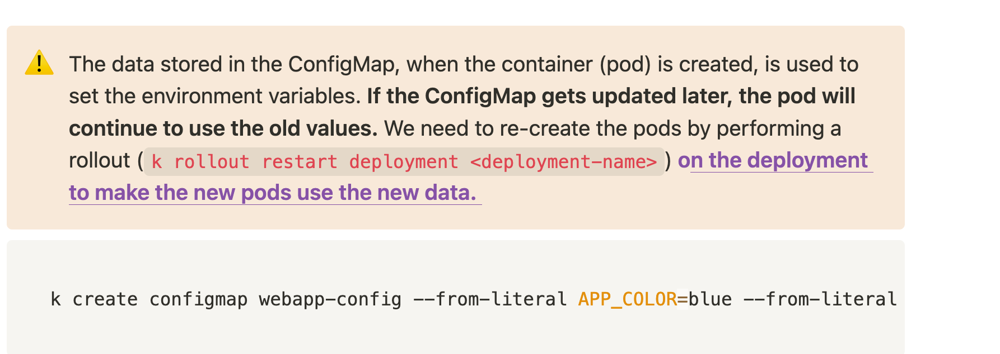

- Centrally managed configuration data that can be **passed to the containers as environment variables** (key-value pairs).
- Storing **config data along with the pod/deployment definition file is not a good idea because as the application grows,** managing them would become difficult.
- We can use the key and value pairs also as well as the JSON FILE as the data.
- Should be used to **store parameters that are not secrets**




```bash
k create configmap webapp-config --from-literal APP_COLOR=blue --from-literal ORACLE_VERSION=12C
```

### ConfigMap definition file

```yaml
apiVersion: v1
kind: ConfigMap
metadata:
	name: app-config
data:
	USERNAME: tanuj
	PASSWORD: 12345
```

### Using ConfigMap in Pods

- Passing the entire ConfigMap of key-value pairs to ENV
    
    ```yaml
    apiVersion: v1
    kind: Pod
    metadata:
      labels:
        name: app
    spec:
      containers:
    	  - name: nginx
    	    image: nginx
    			envFrom:
    				- configMapRef:
    					  name: app-config
    ```
    
- Passing a single key-value pair from the ConfigMap to ENV
    
    ```yaml
    apiVersion: v1
    kind: Pod
    metadata:
      labels:
        name: app
    spec:
      containers:
    	  - name: nginx
    	    image: nginx
    			env:
    				- name: USERNAME
    					valueFrom:
    						configMapKeyRef:
    							name: app-config
    							key: USERNAME
    ```
    
- Passing a config file as ConfigMap (eg. `nginx.conf`) by mounting the ConfigMap as a volume
    
    ```yaml
    apiVersion: v1
    kind: Pod
    metadata:
      labels:
        name: app
    spec:
      containers:
    	  - name: nginx
    	    image: nginx
    			volumeMounts:
            - name: nginx-config-volume
              mountPath: /etc/nginx/conf.d/
      volumes:
        - name: nginx-config-volume
          configMap:
            name: nginx-config
    ```