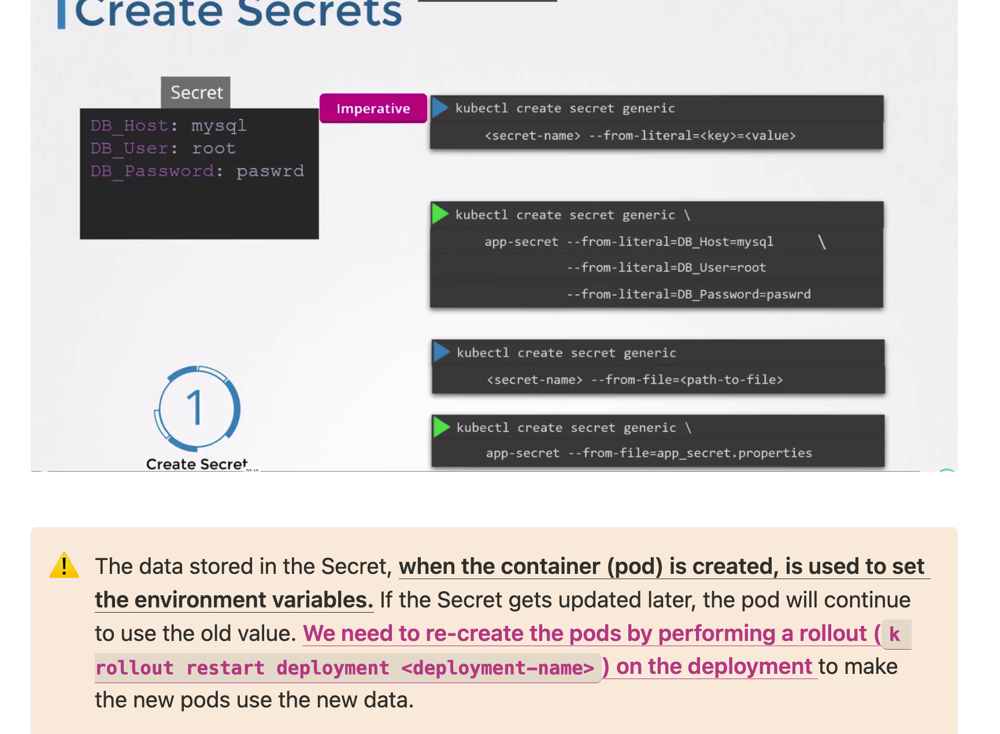
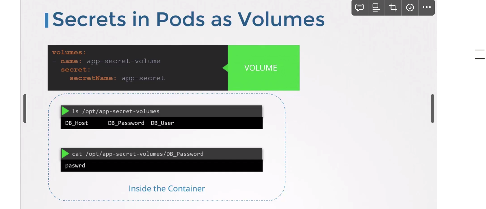

- Stores the data in `base64` encoded format
    
    To encode a base64 string - `echo -n '<string>' | base64`    
- Encryption at rest is not enabled by default. Storing secrets in 3rd-party secrets store provided by cloud providers is another good option.
- Secrets are not encrypted they are just encoded and can be decoded back
    - Do not check in Secret Objects to SCM with the code.
    - We can just decode them and see the secret.
- None of the data in the ETCD is encrypted, so we can use Encrypting Secret Data at Rest.
- One who can create a pod/deployment in the namespace they can see the secrets easily
    - Configure the role based access control for the secrets
    - We can use third party options like AWS Vault, HASHICORP VAULT.



<aside>
⚠️ The data stored in the Secret, **when the container (pod) is created, is used to set the environment variables.** If the Secret gets updated later, the pod will continue to use the old value. **We need to re-create the pods by performing a rollout (`k rollout restart deployment <deployment-name>`) on the deployment** to make the new pods use the new data.

</aside>



### Secret definition file

Same as [ConfigMap](https://www.notion.so/ConfigMap-9f55290c5ef141298140a28d80222c19?pvs=21) except the `kind` and the base64 encoded values.

```yaml
apiVersion: v1
kind: Secret
metadata:
	name: app-secret
data:
	USERNAME: adfcfe==
	PASSWORD: asdgfgv==
```

<aside>
💡 To view the secrets along with their encoded values, run
`k get secret <secret-name> -o yaml`

</aside>

### Using Secrets in Pods

- Passing the entire Secret of key-values pairs to ENV
    
    ```yaml
    apiVersion: v1
    kind: Pod
    metadata:
      labels:
        name: app
    spec:
      containers:
    	  - name: httpd
    	    image: httpd:2.4-alpine
    			envFrom:
    				- secretRef:
    					 name: app-secret
    ```
    
- Passing a single key-value pair of the secret to ENV
    
    ```yaml
    apiVersion: v1
    kind: Pod
    metadata:
      labels:
        name: app
    spec:
      containers:
    	  - name: httpd
    	    image: httpd:2.4-alpine
    			env:
    				- name: PASSWORD
    					valueFrom:
    						secretKeyRef:
    							name: app-secret
    							key: PASSWORD
    ```
    
- Passing a file as Secret by mounting the Secret as a volume
- Each Secret then is created as a separate file under the volume
    
    ```yaml
    apiVersion: v1
    kind: Pod
    metadata:
      labels:
        name: app
    spec:
      containers:
    	  - name: nginx
    	    image: nginx
    			volumeMounts:
            - name: nginx-secret-volume
              mountPath: /etc/nginx/conf.d/
      volumes:
        - name: nginx-secret-volume
          secret:
            name: nginx-secret
    ```
    


Also the way kubernetes handles secrets. Such as:

- `A secret is only sent to a node if a pod on that node requires it.`
- Kubelet stores the secret into a `tmpfs` so that the secret is not written to disk storage.
- Once the Pod that depends on the secret is deleted, `kubelet will delete its local copy of the secret data as well`.

Kubernetes Secrets are a mechanism to store and manage sensitive information such as passwords, tokens, and keys within a Kubernetes cluster. There are several types of Secrets, each designed for specific use cases. Here is a detailed overview of the different types of Secrets in Kubernetes:

## **Types of Kubernetes Secrets**

### **1. Opaque Secrets**
- **Description**: Opaque Secrets are the most generic type and can store arbitrary key-value pairs.
- **Use Cases**: Storing sensitive information like passwords, API keys, and other arbitrary data.
- **Example**:
  ```yaml
  apiVersion: v1
  kind: Secret
  metadata:
    name: my-opaque-secret
  type: Opaque
  data:
    username: YWRtaW4=  # base64 encoded 'admin'
    password: cGFzc3dvcmQ=  # base64 encoded 'password'
  ```

### **2. Service Account Tokens**
- **Description**: These Secrets store tokens that are used to identify service accounts and provide access to the Kubernetes API.
- **Use Cases**: Authenticating Pods to access Kubernetes resources.
- **Type**: `kubernetes.io/service-account-token`
- **Example**:
  ```yaml
  apiVersion: v1
  kind: Secret
  metadata:
    name: my-service-account-token
    annotations:
      kubernetes.io/service-account.name: my-service-account
  type: kubernetes.io/service-account-token
  ```

### **3. SSH Authentication Secrets**
### **4. TLS Secrets**

### **5. Basic Authentication Secrets**
### **6. Docker Configuration Secrets**

### **8. External Secrets**
- **Description**: These Secrets are stored in external secret management systems and synchronized with Kubernetes.

