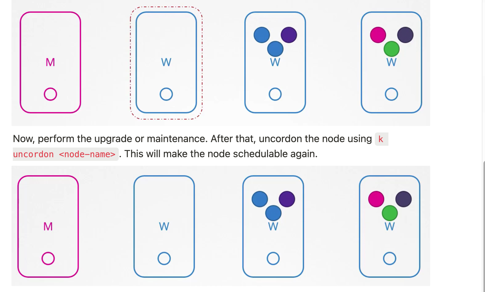
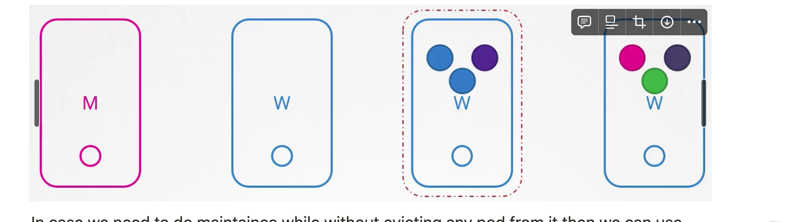

To perform OS upgrade or maintenance on a node, first drain it using `k drain <node-name>`. This will terminate the running pods on the node, spawn them on other nodes and mark the node as **cordon**, **meaning no pods can be scheduled on it.** 

if the node is down for more than 5 minutes, if the pods are part of replica set then they are spawned on the other node itself

- When the node comes back after the pod eviction time it comes back up as an empty node and nothing is scheduled on it.
- When we drain a node and the nodes are gracefully terminated on the current node and then transferred to another node, this makes the downtime less frequent for the application.
- We need to take care of the PDB's.

- Pods which moved to another node due to upgrade do not come back on the same node after the upgrade but if any new pod is created then it can be scheduled on this node.

The above command will not work **if there are pods on the node that are not associated with any replicaset, as these pods will not be spawned on any other node. We’ll have to use `--force` option to terminate such pods forcefully.**

Now, perform the upgrade or maintenance. After that, uncordon the node using `k uncordon <node-name>`. This will make the node schedulable again. 
- Only daemonSets will be spawned here as they have the toleration of unschedulable.
### Drain vs Cordon
We can manually cordon a node to prevent new pods from being scheduled on it by running `k cordon <node-name>`. This does not remove already running pods on the node.

In case we need to do maintaince while without evicting any pod from it then we can use cordon command.
- When we run the drain command an Eviction object is created and this type of eviction is called API Eviction.