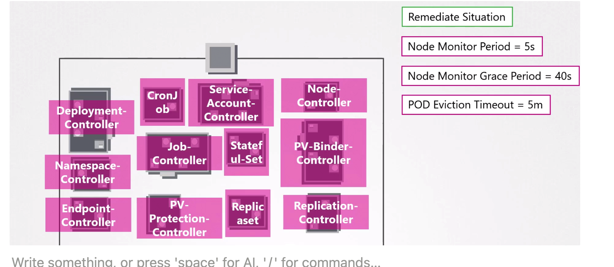

Controller is a process in k8s which runs in the background and monitors the resource config in **`etcd` for state changes**. 
- When the state of the resource changes, it makes necessary changes to the cluster to match the new state.

All of the k8s resource types have controllers that monitor their state in the `etcd` and make necessary changes to the cluster. 
- If a request to modify something in the cluster is approved by the `kube-apiserver`, the changes are written to the `etcd` store. 

## Node Controller
It does that with the help of the API Server
- Checks the status of the nodes every `5 seconds`
    - Node monitor grace period is `40 seconds`
    - POD Eviction Timeout is `5 minutes` following the backoff exponential algorithm.
- Removes the pods from the node and assign them to the replica set node.

## Deployment Controller

- If a pod dies then it creates another one.
- When a deployment is created, **updated or deleted in K8s, the up-to-date manifest is stored in the `etcd` database.** 
- The deployment controller continuously monitors the state of the deployment objects in the `etcd` store. When the deployment is first created, the deployment controller creates a object in the `etcd`
- First deployment controller creates the deployment object in the 'etcd` store and then the replica set controller creates the pod objects in the etcd`
after which the ReplicaSet controller creates the necessary Pod objects in the `etcd`.
