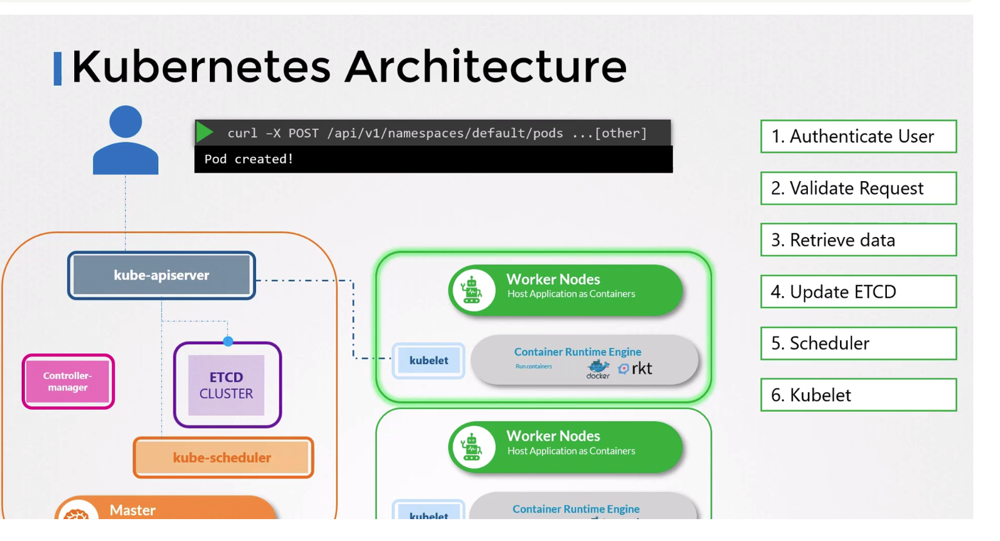

- KubeAPI server is a process running on **master nodes** that manages the cluster. 
- The `kubelet` services running on each node communicate with the `kube-apiserver` to share information about each node in the cluster.

### Responsibility:
- Responsible for Authentication
- Responsible for Validating Request
- Responsible for Updating the ETCD
- Responsible for talking to the scheduler
- Kubelet services talks to the API Server itself.
- **It is the only component of the cluster that directly interacts with `etcd`**.
- All the other components of the cluster (eg. `scheduler` or `kubelet`) use API server to interact with the cluster.

```bash
kubectl get pods -n kubesystem
```



### Installation

- When we interact with the cluster using `kubectl` tool, it sends **API requests to KubeAPI server which then authenticates the request, checks if the user is authorized to perform the required action** and then saves the state in `etcd`.
- When setting up the cluster from scratch, download the `kube-api` binary and run it as a service.
- If the cluster is set up using **KubeAdmin**, the kube-api server is automatically deployed as a static pod in the `kube-system` namespace on the master node.
- The config is present at `/etc/kubernetes/manifests/kube-apiserver.yaml`