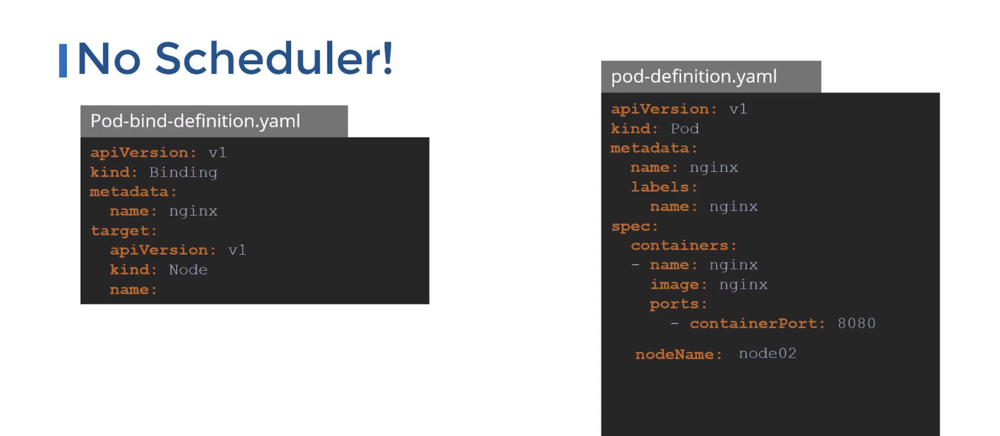

- Kube Scheduler decides on which node the pod should be scheduled.
    - It doesn’t create the pod on the required node. 
    - **That is the job of `kubelet` service.**
    - It only decides which node the pod will go to.

### Scheduling Algorithm

The scheduler goes through 2 phases when searching for the correct node:

- 1st phase is in which the scheduler filters out the worker nodes which are not suitable.
- 2nd phase: Scheduler ranks the nodes , it uses a priority function which assigns the score to the pod(Score calculated while keeping in mind how much resources this node would have after we place this pod here)
- It looks for pods that don’t have `nodeName` property set (usually every pod) and uses its scheduling algorithm to set the `nodeName` property. 
- Once the `nodeName` property is set, the `kubelet` service running on that node requests the container runtime to create the pod.
    
    ```yaml
    apiVersion: v1
    kind: Pod
    metadata:
      labels:
        name: frontend
    spec:
      containers:
    	  - name: httpd
    	    image: httpd:2.4-alpine
    	nodeName: node02
    ```
    
- If the cluster doesn’t have a scheduler, and the `nodeName` property is not set manually, the pod will remain in pending state.

### Installation:

- When setting up the cluster from scratch, download the `kube-scheduler` binary and run it as a service.
- If the cluster is set up using **KubeAdmin**, the `kube-scheduler` is automatically deployed as a static pod in the `kube-system` namespace on the master node.
- The config is present at `/etc/kubernetes/manifests/kube-scheduler.yaml`

## Manual Scheduling

If the cluster doesn’t have `kube-scheduler`, we can manually schedule a pod to a node by setting the **`nodeName` property.**
- To schedule a pod on another node, recreate the pod.

- Create a new Binding object to manually schedule a pod on it.

```yaml
apiVersion: v1
kind: Pod
metadata:
  labels:
    name: frontend
spec:
  containers:
	  - name: httpd
	    image: httpd:2.4-alpine
	nodeName: node02
```

## Scheduling Plugin
The scheduler has 4 phases, each having a set of plugins that operate at that phase.

- **Scheduling Queue**: pod are queued based on their priority
- **Filtering**: nodes that don’t satisfy the pod requirements are discarded
- **Scoring**: filtered nodes are scored based on various factors like the amount of resources present after scheduling the pod and whether or not the container image is already present on that node
